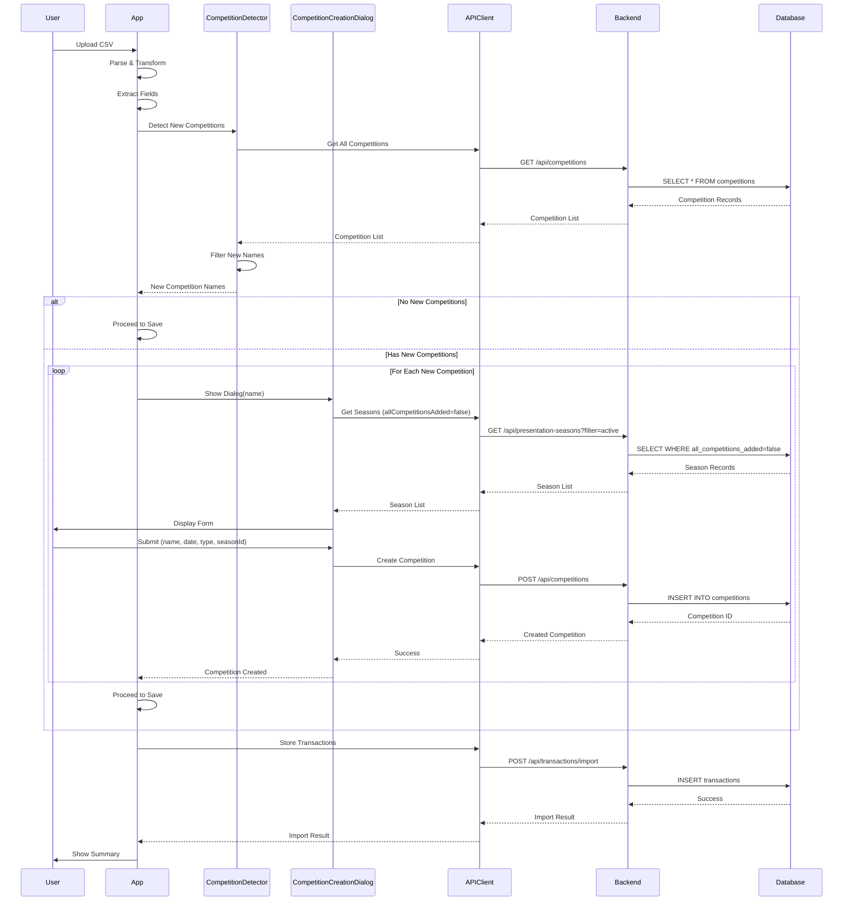

# Design Document: Auto-Create Competitions from Transactions

## Overview

This feature enhances the transaction CSV import workflow by automatically detecting competition names that don't exist in the database and prompting users to create them before completing the import. This eliminates the manual step of creating competitions separately and ensures data integrity by preventing transactions from referencing non-existent competitions.

The solution integrates seamlessly into the existing import workflow between the field extraction step and the "Save to Database" step. When new competition names are detected, the system presents a modal dialog for each competition, allowing users to provide required metadata (date, type, season). Once all competitions are created, the import proceeds normally with transactions properly linked to their competitions.

### Key Design Decisions

1. **Sequential Dialog Presentation**: Present one dialog at a time for multiple competitions rather than a batch form, providing clear focus and reducing cognitive load
2. **Workflow Integration Point**: Insert detection and creation between field extraction and database save to leverage existing validation logic
3. **Database Schema Extension**: Add `all_competitions_added` boolean field to `presentation_seasons` table to support season filtering
4. **Frontend-Driven Detection**: Perform competition detection in the frontend to minimize backend changes and leverage existing client-side data structures
5. **Cancellation Aborts Import**: If user cancels any competition creation, abort the entire import to maintain data consistency

## Architecture

### Component Interaction Flow



### System Context

The feature operates within the existing transaction import workflow:

1. **Existing Flow**: CSV Upload → Parse → Transform → Extract Fields → **[NEW: Detect & Create Competitions]** → Validate Chronology → Check Duplicates → Save to DB → Show Summary
2. **Integration Point**: Between field extraction and chronological validation
3. **Affected Components**: app.js (main workflow), APIClient, new CompetitionDetector, new CompetitionCreationDialog

## Components and Interfaces

### 1. CompetitionDetector (New Component)

**Purpose**: Detect competition names in transaction records that don't exist in the database

**Location**: `competitionDetector.js` (frontend)

**Interface**:
```javascript
class CompetitionDetector {
  constructor(apiClient)
  
  /**
   * Detect new competition names from enhanced records
   * @param {EnhancedRecord[]} records - Transaction records with extracted fields
   * @returns {Promise<string[]>} - Array of new competition names
   */
  async detectNewCompetitions(records)
}
```

**Responsibilities**:
- Extract unique competition names from Sale/Refund transactions
- Filter out empty/null competition fields
- Query database for existing competitions
- Return list of competition names that don't exist

**Dependencies**: APIClient

### 2. CompetitionCreationDialog (New Component)

**Purpose**: Modal dialog for creating a single competition with required metadata

**Location**: `competitionCreationDialog.js` (frontend)

**Interface**:
```javascript
class CompetitionCreationDialog {
  constructor(apiClient)
  
  /**
   * Show dialog for creating a competition
   * @param {string} competitionName - Pre-populated competition name
   * @returns {Promise<Competition|null>} - Created competition or null if cancelled
   */
  async show(competitionName)
  
  /**
   * Close and cleanup dialog
   */
  close()
}
```

**Responsibilities**:
- Display modal with pre-populated competition name
- Load and display seasons where allCompetitionsAdded = false
- Validate required fields (name, date, type, seasonId)
- Handle duplicate name errors with retry option
- Create competition via API
- Handle cancellation

**Dependencies**: APIClient

**UI Elements**:
- Competition name input (pre-populated, editable)
- Date picker (required)
- Type selector: singles/doubles (required)
- Season dropdown (filtered, required)
- Submit button
- Cancel button
- Error message display

### 3. Modified app.js Workflow

**Changes to handleSaveToDatabase()**:

```javascript
async function handleSaveToDatabase() {
  // ... existing validation ...
  
  // NEW: Detect new competitions
  const competitionDetector = new CompetitionDetector(apiClient);
  const newCompetitionNames = await competitionDetector.detectNewCompetitions(enhancedRecords);
  
  // NEW: If new competitions exist, show creation dialogs
  if (newCompetitionNames.length > 0) {
    const createdCompetitions = await showCompetitionCreationFlow(newCompetitionNames);
    
    // If user cancelled, abort import
    if (createdCompetitions === null) {
      showError('Import cancelled. No data was saved.', 'warning');
      return;
    }
  }
  
  // Continue with existing chronological validation
  const validationResult = await chronologicalValidator.validate(enhancedRecords);
  // ... rest of existing flow ...
}
```

### 4. Backend API Extensions

#### New Endpoint: GET /api/presentation-seasons (with filter)

**Purpose**: Retrieve seasons filtered by allCompetitionsAdded status

**Request**:
```
GET /api/presentation-seasons?allCompetitionsAdded=false
```

**Response**:
```json
[
  {
    "id": 1,
    "name": "Season: Winter 23-Summer 24",
    "startYear": 2023,
    "endYear": 2024,
    "isActive": true,
    "allCompetitionsAdded": false,
    "createdAt": "2024-01-01T00:00:00Z",
    "updatedAt": "2024-01-01T00:00:00Z"
  }
]
```

#### Modified Endpoint: PATCH /api/presentation-seasons/:id

**Purpose**: Update season including allCompetitionsAdded flag

**Request**:
```json
{
  "allCompetitionsAdded": true
}
```

**Response**:
```json
{
  "id": 1,
  "name": "Season: Winter 23-Summer 24",
  "allCompetitionsAdded": true,
  "updatedAt": "2024-01-15T10:30:00Z"
}
```

### 5. Modified competitionManagerUI.js

**New UI Elements in Manage Competitions View**:

```html
<div class="season-management-section">
  <h3>Presentation Seasons</h3>
  <table class="seasons-table">
    <thead>
      <tr>
        <th>Season Name</th>
        <th>Status</th>
        <th>All Competitions Added</th>
      </tr>
    </thead>
    <tbody id="seasons-list-body">
      <!-- Dynamically populated -->
    </tbody>
  </table>
</div>
```

**New Methods**:
```javascript
async renderSeasons() {
  // Load all seasons
  // Display with toggle for allCompetitionsAdded
}

async handleToggleAllCompetitionsAdded(seasonId, newValue) {
  // Update season via API
  // Refresh display
}
```

## Data Models

### Database Schema Changes

#### Add Column to presentation_seasons Table

```sql
-- Migration: 005_add_all_competitions_added.sql
ALTER TABLE presentation_seasons 
  ADD COLUMN IF NOT EXISTS all_competitions_added BOOLEAN NOT NULL DEFAULT false;

-- Index for filtering
CREATE INDEX IF NOT EXISTS idx_presentation_seasons_all_competitions_added 
  ON presentation_seasons (all_competitions_added);
```

**Rollback**:
```sql
-- Migration: 005_add_all_competitions_added.rollback.sql
DROP INDEX IF EXISTS idx_presentation_seasons_all_competitions_added;
ALTER TABLE presentation_seasons DROP COLUMN IF EXISTS all_competitions_added;
```

### Updated TypeScript Interfaces

```typescript
// backend/src/types/index.ts

export interface PresentationSeason {
  id: number;
  name: string;
  startYear: number;
  endYear: number;
  isActive: boolean;
  allCompetitionsAdded: boolean;  // NEW
  createdAt: Date;
  updatedAt: Date;
}

export interface UpdateSeasonDTO {
  name?: string;
  startYear?: number;
  endYear?: number;
  isActive?: boolean;
  allCompetitionsAdded?: boolean;  // NEW
}
```

### Frontend Data Structures

```javascript
// EnhancedRecord (existing, no changes)
interface EnhancedRecord {
  date: string;
  time: string;
  till: string;
  type: string;  // "Sale", "Refund", "Topup"
  member: string;
  player: string;
  competition: string;  // Extracted competition name
  total: string;
  sourceRowIndex: number;
  isComplete: boolean;
}

// Competition (existing, no changes)
interface Competition {
  id: number;
  name: string;
  date: string;
  type: 'singles' | 'doubles';
  seasonId: number;
  createdAt: Date;
  updatedAt: Date;
}

// CompetitionCreationData (new)
interface CompetitionCreationData {
  name: string;
  date: string;
  type: 'singles' | 'doubles';
  seasonId: number;
}
```

## Correctness Properties

*A property is a characteristic or behavior that should hold true across all valid executions of a system—essentially, a formal statement about what the system should do. Properties serve as the bridge between human-readable specifications and machine-verifiable correctness guarantees.*

### Property Reflection

After analyzing all acceptance criteria, I identified the following redundancies:
- Properties 6.2, 6.3, and 6.4 (preserve existing behavior) are subsumed by Property 4.4 (maintain existing validation)
- Properties 1.2 and 1.3 can be combined into a single property about detecting non-existent competitions
- Properties 5.2 and 5.6 both test immediate persistence and can be combined
- Properties 5.3 and 5.4 both test the relationship between database state and UI display

After consolidation, the following properties provide unique validation value:

### Property 1: Competition Name Extraction from Sales and Refunds

*For any* collection of transaction records, extracting competition names should return only unique, non-empty competition names from records where type is "Sale" or "Refund"

**Validates: Requirements 1.1, 1.5**

### Property 2: New Competition Detection

*For any* set of extracted competition names and any database state, the detector should return exactly those competition names that do not exist in the database

**Validates: Requirements 1.2, 1.3**

### Property 3: Dialog Pre-population

*For any* detected competition name, when the creation dialog is shown, the name field should contain that exact competition name

**Validates: Requirements 2.2**

### Property 4: Required Field Validation

*For any* competition creation attempt, the system should reject submissions that are missing date, type, or seasonId fields

**Validates: Requirements 2.3, 2.4, 2.5**

### Property 5: Season Filtering

*For any* presentation season where allCompetitionsAdded is true, that season should not appear in the competition creation dialog's season dropdown

**Validates: Requirements 2.5, 5.4**

### Property 6: Sequential Dialog Presentation

*For any* list of N new competition names (where N > 1), the system should present exactly N dialogs in sequence, one for each competition

**Validates: Requirements 2.6**

### Property 7: Competition Creation Round-Trip

*For any* valid competition data (name, date, type, seasonId), submitting the creation dialog should result in a database record with matching field values

**Validates: Requirements 3.1**

### Property 8: Sequential Creation Workflow

*For any* list of new competitions, after successfully creating competition at index i, if index i+1 exists, the system should show the dialog for competition i+1

**Validates: Requirements 3.2**

### Property 9: Season Validation on Creation

*For any* competition creation attempt with a seasonId where allCompetitionsAdded is true, the system should reject the creation

**Validates: Requirements 3.5**

### Property 10: Transaction-Competition Linking

*For any* transaction record with a non-empty competition name, after import completion, querying that transaction should show it linked to the competition with the matching name

**Validates: Requirements 4.2**

### Property 11: Existing Validation Preservation

*For any* transaction import, the system should still apply chronological validation and duplicate checking, rejecting invalid data as before

**Validates: Requirements 4.4, 6.2, 6.3, 6.4**

### Property 12: Success Message Accuracy

*For any* successful import, the success message should contain counts that match the actual number of transactions imported and competitions created

**Validates: Requirements 4.5**

### Property 13: Season Flag Toggle Round-Trip

*For any* presentation season, toggling the allCompetitionsAdded flag should immediately update the database, and querying the season should return the new flag value

**Validates: Requirements 5.2, 5.5, 5.6**

### Property 14: Season Flag Display Consistency

*For any* presentation season, the displayed allCompetitionsAdded status in the UI should match the current database value

**Validates: Requirements 5.3**

## Error Handling

### Competition Detection Errors

**Scenario**: API fails to retrieve existing competitions

**Handling**:
- Display error message: "Failed to check existing competitions. Please try again."
- Abort import workflow
- Log error details to console
- Allow user to retry import

### Competition Creation Errors

#### Duplicate Name Error

**Scenario**: Competition name already exists (race condition or user modified name to existing one)

**Handling**:
- Display error message: "Competition name '{name}' already exists. Please choose a different name."
- Keep dialog open with current values
- Allow user to modify name and retry
- Provide cancel option

#### Season Validation Error

**Scenario**: Selected season has allCompetitionsAdded = true

**Handling**:
- Display error message: "Selected season is marked as complete. Please choose a different season."
- Keep dialog open with current values
- Reload season dropdown (in case it changed)
- Allow user to select different season and retry

#### Network/Database Error

**Scenario**: API request fails due to network or database issues

**Handling**:
- Display error message: "Failed to create competition: {error message}"
- Keep dialog open with current values
- Provide retry and cancel options
- Log error details to console

### Season Toggle Errors

**Scenario**: Failed to update allCompetitionsAdded flag

**Handling**:
- Display error message: "Failed to update season status. Please try again."
- Revert toggle to previous state in UI
- Log error details to console
- Allow user to retry

### Import Cancellation

**Scenario**: User cancels competition creation dialog

**Handling**:
- Close all dialogs
- Display message: "Import cancelled. No data was saved."
- Return to file selection state
- Clear any partially created competitions (none should exist due to sequential creation)

## Testing Strategy

### Unit Testing

Focus on specific components and edge cases:

**CompetitionDetector**:
- Empty transaction list returns empty array
- Transactions with null/empty competition fields are excluded
- Only Sale and Refund types are processed
- Duplicate competition names are deduplicated
- Existing competitions are filtered out correctly

**CompetitionCreationDialog**:
- Dialog renders with pre-populated name
- Required field validation works
- Season dropdown only shows seasons with allCompetitionsAdded=false
- Cancel button closes dialog and returns null
- Duplicate name error displays and allows retry

**Workflow Integration**:
- Import with no new competitions proceeds directly to save
- Import with new competitions shows dialogs before save
- Cancelling any dialog aborts entire import
- All competitions created before transactions are saved

**Season Management**:
- Toggle updates database immediately
- Toggle state persists across page refreshes
- Seasons with allCompetitionsAdded=true don't appear in creation dialog

### Property-Based Testing

Use fast-check library for JavaScript property-based testing. Each test should run minimum 100 iterations.

**Configuration**:
```javascript
import fc from 'fast-check';

// Example property test structure
describe('CompetitionDetector Property Tests', () => {
  it('Property 1: Competition Name Extraction from Sales and Refunds', () => {
    fc.assert(
      fc.property(
        fc.array(transactionRecordArbitrary()),
        (records) => {
          const detector = new CompetitionDetector(mockApiClient);
          const extracted = detector.extractCompetitionNames(records);
          
          // All extracted names should be from Sale or Refund records
          const validTypes = ['Sale', 'Refund'];
          const expectedNames = new Set(
            records
              .filter(r => validTypes.includes(r.type) && r.competition)
              .map(r => r.competition)
          );
          
          expect(new Set(extracted)).toEqual(expectedNames);
        }
      ),
      { numRuns: 100 }
    );
  });
});
```

**Property Test Tags**:
Each property test must include a comment tag referencing the design property:

```javascript
// Feature: auto-create-competitions-from-transactions, Property 1: Competition Name Extraction from Sales and Refunds
```

**Generators**:
```javascript
// Transaction record generator
const transactionRecordArbitrary = () => fc.record({
  date: fc.date().map(d => d.toISOString().split('T')[0]),
  time: fc.tuple(fc.integer(0, 23), fc.integer(0, 59))
    .map(([h, m]) => `${h.toString().padStart(2, '0')}:${m.toString().padStart(2, '0')}:00`),
  type: fc.oneof(fc.constant('Sale'), fc.constant('Refund'), fc.constant('Topup')),
  competition: fc.option(fc.string({ minLength: 1, maxLength: 50 }), { nil: '' }),
  // ... other fields
});

// Competition data generator
const competitionDataArbitrary = () => fc.record({
  name: fc.string({ minLength: 1, maxLength: 255 }),
  date: fc.date().map(d => d.toISOString().split('T')[0]),
  type: fc.oneof(fc.constant('singles'), fc.constant('doubles')),
  seasonId: fc.integer({ min: 1, max: 100 })
});

// Season generator
const seasonArbitrary = () => fc.record({
  id: fc.integer({ min: 1, max: 100 }),
  name: fc.string({ minLength: 1, maxLength: 50 }),
  allCompetitionsAdded: fc.boolean()
});
```

### Integration Testing

Test complete workflows end-to-end:

**Scenario 1: Import with New Competitions**
1. Upload CSV with transactions referencing 2 new competitions
2. Verify detection identifies both competitions
3. Complete both creation dialogs
4. Verify competitions created in database
5. Verify transactions saved and linked correctly
6. Verify summary view displays

**Scenario 2: Import with Existing Competitions**
1. Pre-create competitions in database
2. Upload CSV with transactions referencing only existing competitions
3. Verify no dialogs shown
4. Verify transactions saved and linked correctly
5. Verify summary view displays

**Scenario 3: Import Cancellation**
1. Upload CSV with transactions referencing new competition
2. Cancel the creation dialog
3. Verify no competitions created
4. Verify no transactions saved
5. Verify appropriate message displayed

**Scenario 4: Season Management**
1. Create season with allCompetitionsAdded=false
2. Toggle to true
3. Verify database updated
4. Start import with new competition
5. Verify season doesn't appear in dropdown
6. Toggle back to false
7. Verify season appears in dropdown

**Scenario 5: Duplicate Name Handling**
1. Upload CSV with new competition
2. In dialog, change name to existing competition
3. Submit
4. Verify error message
5. Change to unique name
6. Verify successful creation

### Manual Testing Checklist

- [ ] Upload CSV with no new competitions - proceeds directly to save
- [ ] Upload CSV with 1 new competition - shows 1 dialog
- [ ] Upload CSV with 3 new competitions - shows 3 dialogs sequentially
- [ ] Cancel first dialog - aborts import, no data saved
- [ ] Cancel middle dialog - aborts import, previous competitions not created
- [ ] Submit dialog with missing date - shows validation error
- [ ] Submit dialog with missing type - shows validation error
- [ ] Submit dialog with missing season - shows validation error
- [ ] Submit dialog with duplicate name - shows error, allows retry
- [ ] Complete all dialogs - transactions saved and linked correctly
- [ ] Toggle season flag on - updates immediately, persists on refresh
- [ ] Toggle season flag off - updates immediately, persists on refresh
- [ ] Season with flag=true doesn't appear in creation dialog
- [ ] Season with flag=false appears in creation dialog
- [ ] Existing chronological validation still works
- [ ] Existing duplicate checking still works
- [ ] Transaction summary view displays correctly after import
- [ ] Success message shows correct counts

## Implementation Notes

### Frontend Implementation Order

1. **Database Migration**: Add allCompetitionsAdded column to presentation_seasons
2. **Backend API**: Extend presentation-seasons endpoints to support filtering and updating the new field
3. **CompetitionDetector**: Implement detection logic
4. **CompetitionCreationDialog**: Implement modal dialog component
5. **Workflow Integration**: Modify app.js handleSaveToDatabase() to integrate detection and creation
6. **Season Management UI**: Add toggle controls to competitionManagerUI.js
7. **Testing**: Implement unit tests, property tests, and integration tests

### Backward Compatibility

- Existing imports without new competitions work unchanged
- Existing competition creation through Manage Competitions still works
- Existing transaction flagging functionality unaffected
- Database migration sets default allCompetitionsAdded=false for existing seasons

### Performance Considerations

- Competition detection runs client-side on already-loaded data (no additional API calls for transaction data)
- Single API call to fetch existing competitions
- Single API call per season to fetch filtered list
- Dialog presentation is sequential but non-blocking (async/await)
- Database queries use existing indexes on competitions.name

### Security Considerations

- Competition names sanitized to prevent XSS
- Season filtering enforced server-side (not just client-side)
- Duplicate name validation enforced at database level (unique constraint)
- User cannot bypass dialogs to save transactions with non-existent competitions

### Accessibility

- Dialog keyboard navigation (Tab, Shift+Tab, Escape)
- ARIA labels on all form controls
- Focus management (dialog receives focus on open, returns to trigger on close)
- Error messages announced to screen readers
- Required fields marked with aria-required
- Toggle controls have clear labels and state indicators
