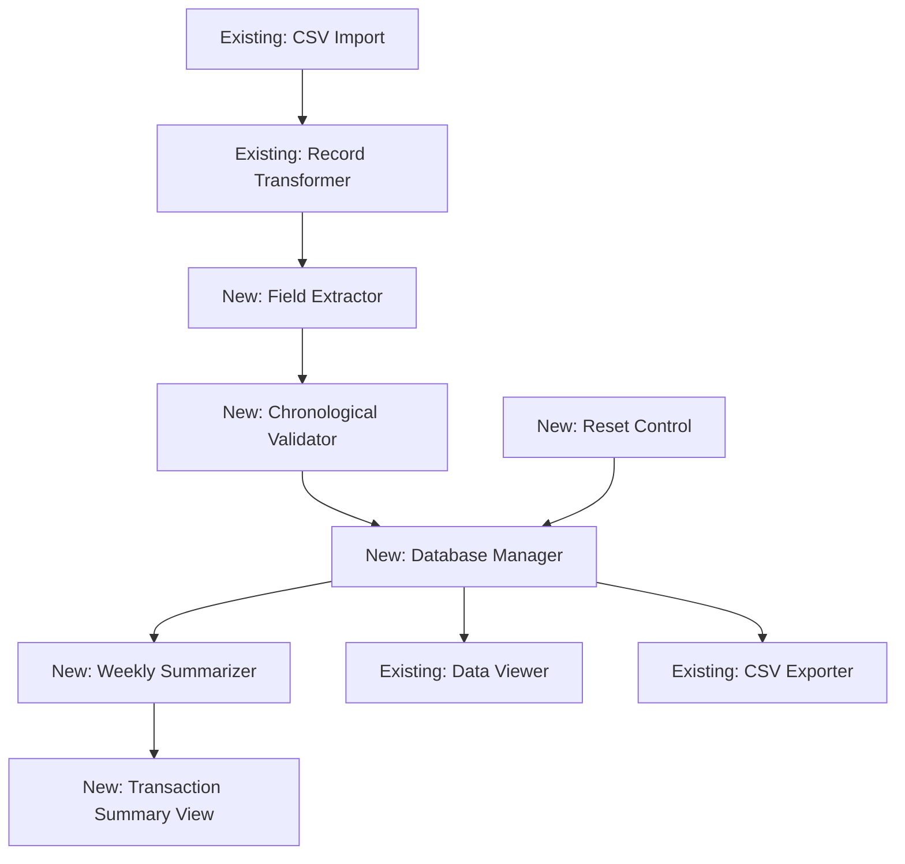

# Design Document: Competition Account Management

## Overview

This system extends the existing competition-csv-import functionality by adding persistent storage and financial account management capabilities. The architecture follows an extended pipeline: CSV Import → Record Transformation → **Field Extraction → Database Storage → Weekly Summarization** → Multiple Views (Individual Records + Weekly Summaries).

The system runs entirely in the browser using IndexedDB for persistent storage, enabling historical data access across sessions. The core challenge is maintaining chronological data integrity during imports, accurately calculating rolling weekly balances, and ensuring auditability of all financial calculations.

Key design decisions:
- IndexedDB for browser-based persistence (no backend required)
- Weekly periods defined as Monday 00:00:00 to Sunday 23:59:59
- Dual account tracking: Competition Purse (member money) and Competition Pot (club money)
- Chronological validation prevents out-of-order imports
- Database reset capability for iterative refinement during initial deployment

## Architecture

### System Components



### Component Responsibilities

**Field Extractor** (New)
- Parses Member field for Player and Competition information
- Applies extraction rules based on presence of "&" and ":" delimiters
- Returns enhanced records with Player and Competition fields

**Chronological Validator** (New)
- Queries database for latest existing transaction timestamp
- Compares against earliest timestamp in new import batch
- Rejects imports that would create chronological inconsistencies
- Allows all imports when database is empty

**Database Manager** (New)
- Manages IndexedDB connection and schema
- Stores and retrieves Summarised_Period_Transaction records
- Provides query interface for date range filtering
- Handles database reset operations

**Weekly Summarizer** (New)
- Groups transactions into Monday-Sunday weekly periods
- Calculates all financial summary columns
- Handles rolling balance calculations (week N start = week N-1 end)
- Generates complete weekly summaries including weeks with zero transactions

**Transaction Summary View** (New)
- Renders weekly financial summaries in tabular format
- Formats monetary values with currency symbols
- Displays tooltips for placeholder columns
- Updates automatically when new data is imported

**Reset Control** (New)
- Provides UI button/control for database reset
- Confirms user intent before clearing data
- Triggers database clear and view refresh

## Components and Interfaces

### Field Extractor Interface

```typescript
interface FieldExtractor {
  extract(record: TransformedRecord): EnhancedRecord
}

interface EnhancedRecord extends TransformedRecord {
  player: string
  competition: string
}
```

**Extraction Algorithm:**

```
Function extractFields(record: TransformedRecord) -> EnhancedRecord:
  memberValue = record.member
  
  // Check if both delimiters are present
  hasAmpersand = memberValue.includes('&')
  hasColon = memberValue.includes(':')
  
  If hasAmpersand AND hasColon:
    // Find positions
    ampersandPos = memberValue.indexOf(' &')
    colonPos = memberValue.indexOf(':')
    
    // Extract player (before " &")
    If ampersandPos >= 0:
      player = memberValue.substring(0, ampersandPos).trim()
    Else:
      player = ""
    
    // Extract competition (after "& " and before ":")
    If ampersandPos >= 0 AND colonPos > ampersandPos:
      startPos = ampersandPos + 2  // Skip "& "
      competition = memberValue.substring(startPos, colonPos).trim()
    Else:
      competition = ""
    
    // Clear member field
    member = ""
  Else:
    // Keep member as-is, set others to empty
    player = ""
    competition = ""
    member = memberValue
  
  Return {
    ...record,
    member: member,
    player: player,
    competition: competition
  }
```

### Chronological Validator Interface

```typescript
interface ChronologicalValidator {
  validate(newRecords: EnhancedRecord[]): ValidationResult
}

type ValidationResult = 
  | { valid: true }
  | { valid: false; error: string; earliestNew: DateTime; latestExisting: DateTime }

interface DateTime {
  date: string
  time: string
  timestamp: number  // Unix timestamp for comparison
}
```

**Validation Algorithm:**

```
Function validateChronology(newRecords: EnhancedRecord[]) -> ValidationResult:
  // Get earliest timestamp from new records
  If newRecords is empty:
    Return { valid: true }
  
  earliestNew = findEarliestTimestamp(newRecords)
  
  // Query database for latest existing timestamp
  latestExisting = await database.getLatestTimestamp()
  
  If latestExisting is null:
    // Database is empty, allow any import
    Return { valid: true }
  
  If earliestNew.timestamp < latestExisting.timestamp:
    Return {
      valid: false,
      error: "Import rejected: New data contains transactions dated before existing data",
      earliestNew: earliestNew,
      latestExisting: latestExisting
    }
  
  Return { valid: true }

Function findEarliestTimestamp(records: EnhancedRecord[]) -> DateTime:
  earliest = null
  For each record in records:
    timestamp = parseDateTime(record.date, record.time)
    If earliest is null OR timestamp < earliest.timestamp:
      earliest = { date: record.date, time: record.time, timestamp: timestamp }
  Return earliest

Function parseDateTime(date: string, time: string) -> number:
  // Parse date and time strings into Unix timestamp
  // Handle various date formats (DD/MM/YYYY, YYYY-MM-DD, etc.)
  // Return milliseconds since epoch
```

### Database Manager Interface

```typescript
interface DatabaseManager {
  initialize(): Promise<void>
  store(records: EnhancedRecord[]): Promise<StoreResult>
  getAll(): Promise<EnhancedRecord[]>
  getByDateRange(startDate: Date, endDate: Date): Promise<EnhancedRecord[]>
  getLatestTimestamp(): Promise<DateTime | null>
  clearAll(): Promise<void>
}

type StoreResult = {
  stored: number
  errors: StorageError[]
}

interface StorageError {
  record: EnhancedRecord
  message: string
}
```

**IndexedDB Schema:**

```typescript
// Database name: "CompetitionAccountDB"
// Version: 1
// Object Store: "summarised_period_transactions"

interface DBSchema {
  summarised_period_transactions: {
    key: number  // Auto-incrementing primary key
    value: {
      date: string
      time: string
      till: string
      type: string
      member: string
      player: string
      competition: string
      price: string
      discount: string
      subtotal: string
      vat: string
      total: string
      sourceRowIndex: number
      isComplete: boolean
    }
    indexes: {
      'by-date': string  // Index on date field for range queries
      'by-datetime': [string, string]  // Compound index on [date, time]
    }
  }
}
```

**Database Operations:**

```
Function initialize():
  request = indexedDB.open("CompetitionAccountDB", 1)
  
  request.onupgradeneeded = (event):
    db = event.target.result
    
    If not db.objectStoreNames.contains("summarised_period_transactions"):
      store = db.createObjectStore("summarised_period_transactions", 
        { keyPath: "id", autoIncrement: true })
      
      store.createIndex("by-date", "date", { unique: false })
      store.createIndex("by-datetime", ["date", "time"], { unique: false })
  
  Await request completion
  Return db connection

Function store(records: EnhancedRecord[]):
  transaction = db.transaction(["summarised_period_transactions"], "readwrite")
  store = transaction.objectStore("summarised_period_transactions")
  
  errors = []
  stored = 0
  
  For each record in records:
    Try:
      store.add(record)
      stored++
    Catch error:
      errors.push({ record, message: error.message })
  
  Await transaction completion
  Return { stored, errors }

Function getLatestTimestamp():
  transaction = db.transaction(["summarised_period_transactions"], "readonly")
  store = transaction.objectStore("summarised_period_transactions")
  index = store.index("by-datetime")
  
  // Open cursor in reverse order to get latest
  request = index.openCursor(null, "prev")
  
  If cursor exists:
    record = cursor.value
    Return { date: record.date, time: record.time, timestamp: parseDateTime(record.date, record.time) }
  Else:
    Return null

Function clearAll():
  transaction = db.transaction(["summarised_period_transactions"], "readwrite")
  store = transaction.objectStore("summarised_period_transactions")
  store.clear()
  Await transaction completion
```

### Weekly Summarizer Interface

```typescript
interface WeeklySummarizer {
  generateSummaries(records: EnhancedRecord[]): WeeklySummary[]
}

interface WeeklySummary {
  fromDate: Date          // Monday 00:00:00
  toDate: Date            // Sunday 23:59:59
  
  // Competition Purse (member money)
  startingPurse: number
  purseApplicationTopUp: number
  purseTillTopUp: number
  competitionEntries: number
  competitionRefunds: number
  finalPurse: number
  
  // Competition Pot (club money)
  startingPot: number
  winningsPaid: number      // Placeholder: 0
  competitionCosts: number  // Placeholder: 0
  finalPot: number
}
```

**Weekly Summarization Algorithm:**

```
Function generateSummaries(records: EnhancedRecord[]) -> WeeklySummary[]:
  If records is empty:
    Return []
  
  // Find date range
  earliestDate = findEarliestDate(records)
  latestDate = findLatestDate(records)
  
  // Generate all weekly periods between earliest and latest
  weeklyPeriods = generateWeeklyPeriods(earliestDate, latestDate)
  
  // Group records by week
  recordsByWeek = groupRecordsByWeek(records, weeklyPeriods)
  
  // Calculate summaries
  summaries = []
  previousPurseFinal = 0
  previousPotFinal = 0
  
  For each period in weeklyPeriods:
    weekRecords = recordsByWeek[period] || []
    
    // Calculate Competition Purse components
    purseAppTopUp = sumWhere(weekRecords, r => r.till === "" && r.type === "Topup (Competitions)")
    purseTillTopUp = sumWhere(weekRecords, r => r.till === "Till 1" && r.type === "Topup (Competitions)")
    entries = sumWhere(weekRecords, r => r.type === "Sale")
    refunds = sumWhere(weekRecords, r => r.type === "Refund")
    
    // NOTE: Refunds are stored as NEGATIVE values (e.g., -10.00), so we SUBTRACT them
    // Subtracting a negative adds to the purse (money returned to members)
    finalPurse = previousPurseFinal + purseAppTopUp + purseTillTopUp - entries - refunds
    
    // Calculate Competition Pot components
    winningsPaid = 0  // Placeholder
    costs = 0         // Placeholder
    // NOTE: Refunds are stored as NEGATIVE values (e.g., -10.00), so we ADD them
    // Adding a negative reduces the pot (money leaving club to return to members)
    finalPot = previousPotFinal + entries + refunds - winningsPaid - costs
    
    summary = {
      fromDate: period.start,
      toDate: period.end,
      startingPurse: previousPurseFinal,
      purseApplicationTopUp: purseAppTopUp,
      purseTillTopUp: purseTillTopUp,
      competitionEntries: entries,
      competitionRefunds: refunds,
      finalPurse: finalPurse,
      startingPot: previousPotFinal,
      winningsPaid: winningsPaid,
      competitionCosts: costs,
      finalPot: finalPot
    }
    
    summaries.push(summary)
    
    // Update for next iteration
    previousPurseFinal = finalPurse
    previousPotFinal = finalPot
  
  Return summaries

Function generateWeeklyPeriods(startDate: Date, endDate: Date) -> Period[]:
  periods = []
  current = getMondayOfWeek(startDate)
  end = getSundayOfWeek(endDate)
  
  While current <= end:
    periodStart = setTime(current, 0, 0, 0)  // Monday 00:00:00
    periodEnd = setTime(addDays(current, 6), 23, 59, 59)  // Sunday 23:59:59
    
    periods.push({ start: periodStart, end: periodEnd })
    current = addDays(current, 7)  // Move to next Monday
  
  Return periods

Function groupRecordsByWeek(records: EnhancedRecord[], periods: Period[]) -> Map<Period, EnhancedRecord[]>:
  grouped = new Map()
  
  For each period in periods:
    grouped.set(period, [])
  
  For each record in records:
    recordDate = parseDate(record.date, record.time)
    
    For each period in periods:
      If recordDate >= period.start AND recordDate <= period.end:
        grouped.get(period).push(record)
        Break
  
  Return grouped

Function sumWhere(records: EnhancedRecord[], predicate: Function) -> number:
  sum = 0
  For each record in records:
    If predicate(record):
      sum += parseFloat(record.total)
  Return sum
```

### Transaction Summary View Interface

```typescript
interface TransactionSummaryView {
  render(summaries: WeeklySummary[]): void
  clear(): void
}
```

**UI Design:**

The view displays a table with 12 columns organized into three logical groups:

1. Date Range (2 columns): From Date, To Date
2. Competition Purse - Member Money (6 columns): Starting Balance, Application Top Up, Till Top Up, Entries, Refunds, Final Balance
3. Competition Pot - Club Money (4 columns): Starting Balance, Winnings Paid, Costs, Final Balance

**HTML Structure:**
```html
<div id="transaction-summary-container">
  <h1>Aquarius Golf-Competition Transaction Summary</h1>
  
  <div id="controls">
    <button id="reset-database-btn">Reset Database</button>
  </div>
  
  <table id="weekly-summary-table">
    <thead>
      <tr>
        <th colspan="2">Period</th>
        <th colspan="6">Competition Purse (Member Money)</th>
        <th colspan="4">Competition Pot (Club Money)</th>
      </tr>
      <tr>
        <th>From Date</th>
        <th>To Date</th>
        <th>Starting Balance</th>
        <th>Application Top Up</th>
        <th>Till Top Up</th>
        <th>Entries</th>
        <th>Refunds</th>
        <th>Final Balance</th>
        <th>Starting Balance</th>
        <th>Winnings Paid</th>
        <th>Costs <span class="tooltip" title="Presentation Night Winnings, Trophy Engravings, Stationary etc">ⓘ</span></th>
        <th>Final Balance</th>
      </tr>
    </thead>
    <tbody id="summary-body">
      <!-- Rows inserted dynamically -->
    </tbody>
  </table>
  
  <div id="empty-state" style="display: none;">
    No transaction data available. Please import a CSV file.
  </div>
</div>
```

**Rendering Logic:**
```
Function render(summaries: WeeklySummary[]):
  tbody = document.getElementById('summary-body')
  tbody.innerHTML = ''
  
  If summaries is empty:
    Show empty state
    Return
  
  For each summary in summaries:
    row = createTableRow()
    
    // Date columns
    row.addCell(formatDate(summary.fromDate))
    row.addCell(formatDate(summary.toDate))
    
    // Competition Purse columns
    row.addCell(formatCurrency(summary.startingPurse))
    row.addCell(formatCurrency(summary.purseApplicationTopUp))
    row.addCell(formatCurrency(summary.purseTillTopUp))
    row.addCell(formatCurrency(summary.competitionEntries))
    row.addCell(formatCurrency(-summary.competitionRefunds))  // Negative display
    row.addCell(formatCurrency(summary.finalPurse))
    
    // Competition Pot columns
    row.addCell(formatCurrency(summary.startingPot))
    row.addCell(formatCurrency(summary.winningsPaid))
    row.addCell(formatCurrency(summary.competitionCosts))
    row.addCell(formatCurrency(summary.finalPot))
    
    tbody.appendChild(row)

Function formatCurrency(value: number) -> string:
  Return "£" + value.toFixed(2)

Function formatDate(date: Date) -> string:
  Return date.toLocaleDateString('en-GB', { 
    day: '2-digit', 
    month: '2-digit', 
    year: 'numeric' 
  })
```

### Reset Control Interface

```typescript
interface ResetControl {
  onReset(callback: () => Promise<void>): void
  confirmReset(): Promise<boolean>
}
```

**Reset Flow:**
```
Function handleResetClick():
  confirmed = await confirmReset()
  
  If not confirmed:
    Return
  
  Try:
    await databaseManager.clearAll()
    transactionSummaryView.clear()
    dataViewer.clear()
    showSuccessMessage("Database cleared successfully")
  Catch error:
    showErrorMessage("Failed to clear database: " + error.message)

Function confirmReset() -> boolean:
  Return window.confirm(
    "Are you sure you want to delete all stored transaction data? This cannot be undone."
  )
```

## Data Models

### Enhanced Record Structure

```typescript
interface EnhancedRecord {
  // Original fields from TransformedRecord
  date: string
  time: string
  till: string
  type: string
  member: string          // Modified: cleared if extraction occurs
  price: string
  discount: string
  subtotal: string
  vat: string
  total: string
  sourceRowIndex: number
  isComplete: boolean
  
  // New extracted fields
  player: string          // Extracted from Member field
  competition: string     // Extracted from Member field
}
```

### Weekly Summary Structure

```typescript
interface WeeklySummary {
  // Period definition
  fromDate: Date          // Monday 00:00:00
  toDate: Date            // Sunday 23:59:59
  
  // Competition Purse (member money held for competitions)
  startingPurse: number
  purseApplicationTopUp: number
  purseTillTopUp: number
  competitionEntries: number
  competitionRefunds: number
  finalPurse: number
  
  // Competition Pot (club money for prizes/expenses)
  startingPot: number
  winningsPaid: number      // Currently 0 (placeholder)
  competitionCosts: number  // Currently 0 (placeholder)
  finalPot: number
}
```

### Data Flow

```
Existing Flow:
  CSV File → CSV Parser → Record Transformer → TransformedRecord[]

Extended Flow:
  TransformedRecord[] 
    → Field Extractor 
    → EnhancedRecord[]
    → Chronological Validator
    → (if valid) Database Manager
    → IndexedDB Storage
    → Weekly Summarizer
    → WeeklySummary[]
    → Transaction Summary View
```

### Date/Time Handling

**Date Parsing Strategy:**
- Support multiple date formats: DD/MM/YYYY, YYYY-MM-DD, DD-MM-YYYY
- Use browser Date API for parsing
- Convert to Unix timestamps for comparison
- Store original string format in database

**Time Parsing Strategy:**
- Support formats: HH:MM:SS, HH:MM, H:MM AM/PM
- Normalize to 24-hour format for comparison
- Store original string format in database

**Week Boundary Calculation:**
```
Function getMondayOfWeek(date: Date) -> Date:
  dayOfWeek = date.getDay()  // 0 = Sunday, 1 = Monday, etc.
  
  If dayOfWeek === 0:  // Sunday
    daysToSubtract = 6
  Else:
    daysToSubtract = dayOfWeek - 1
  
  monday = new Date(date)
  monday.setDate(date.getDate() - daysToSubtract)
  monday.setHours(0, 0, 0, 0)
  
  Return monday

Function getSundayOfWeek(date: Date) -> Date:
  monday = getMondayOfWeek(date)
  sunday = new Date(monday)
  sunday.setDate(monday.getDate() + 6)
  sunday.setHours(23, 59, 59, 999)
  
  Return sunday
```


## Correctness Properties

*A property is a characteristic or behavior that should hold true across all valid executions of a system—essentially, a formal statement about what the system should do. Properties serve as the bridge between human-readable specifications and machine-verifiable correctness guarantees.*

### Field Extraction Properties

**Property 1: Player and Competition extraction when delimiters present**
*For any* TransformedRecord where the Member field contains both " &" and ":" substrings, extracting fields should produce a Player field equal to the substring before " &", a Competition field equal to the substring between "& " and ":", and an empty Member field.
**Validates: Requirements 1.1, 1.2, 1.3**

**Property 2: No extraction when delimiters absent**
*For any* TransformedRecord where the Member field does NOT contain both " &" and ":" substrings, extracting fields should preserve the Member field unchanged and set both Player and Competition fields to empty strings.
**Validates: Requirements 1.4**

### Database Storage Properties

**Property 3: Database storage round-trip**
*For any* EnhancedRecord, storing it to the database and then retrieving it should produce a record with all fields (Date, Time, Till, Type, Member, Player, Competition, Price, Discount, Subtotal, VAT, Total, sourceRowIndex, isComplete) equal to the original values and data types.
**Validates: Requirements 2.3, 2.4, 8.3**

**Property 4: Date range query correctness**
*For any* date range (startDate, endDate) and any set of stored records, querying by that date range should return only records where the transaction date/time falls within the range (inclusive).
**Validates: Requirements 2.5**

**Property 5: Database clear removes all records**
*For any* database state, calling clearAll should result in an empty database where subsequent queries return zero records.
**Validates: Requirements 10.1, 10.2, 10.3**

### Chronological Validation Properties

**Property 6: Earliest timestamp identification**
*For any* non-empty set of EnhancedRecords, determining the earliest transaction should return the record with the minimum date/time value when compared chronologically.
**Validates: Requirements 3.1**

**Property 7: Latest timestamp identification**
*For any* non-empty database, determining the latest transaction should return the record with the maximum date/time value when compared chronologically.
**Validates: Requirements 3.2**

**Property 8: Chronological validation rejects out-of-order imports**
*For any* non-empty database with latest timestamp T1, and any new import batch with earliest timestamp T2, validation should reject the import if and only if T2 < T1.
**Validates: Requirements 3.3**

**Property 9: Failed validation prevents storage**
*For any* import batch that fails chronological validation, the database state after validation should be identical to the database state before validation (no records added).
**Validates: Requirements 3.4**

### Weekly Period Properties

**Property 10: Weekly periods span Monday to Sunday**
*For any* generated weekly period, the start date should be a Monday at 00:00:00 and the end date should be the following Sunday at 23:59:59.
**Validates: Requirements 4.1**

**Property 11: Transaction assignment to correct week**
*For any* transaction with a given date/time, it should be assigned to the weekly period where the transaction date/time falls between the period's start (inclusive) and end (inclusive).
**Validates: Requirements 4.2**

**Property 12: Complete weekly period coverage**
*For any* set of transactions spanning multiple weeks, the generated summaries should include one row for every weekly period from the Monday of the earliest transaction's week through the Sunday of the latest transaction's week, with no gaps.
**Validates: Requirements 4.3**

**Property 13: Weekly summaries are chronologically ordered**
*For any* generated list of weekly summaries, each summary's fromDate should be later than or equal to all previous summaries' fromDates.
**Validates: Requirements 4.4**

### Financial Calculation Properties

**Property 14: Rolling balance consistency**
*For any* sequence of weekly summaries with at least two weeks, each week's Starting Competition Purse should equal the previous week's Final Competition Purse, and each week's Starting Competition Pot should equal the previous week's Final Competition Pot.
**Validates: Requirements 5.1, 6.1, 8.1**

**Property 15: Transaction filtering and summing correctness**
*For any* weekly period and transaction set, the calculated sum for a given filter criteria (Till value and Type value) should equal the manual sum of Total fields for all transactions matching those exact criteria within that week.
**Validates: Requirements 5.3, 5.4, 5.5, 5.6**

**Property 16: Competition Purse calculation formula**
*For any* weekly summary, the Final Competition Purse should equal: Starting Competition Purse + Application Top Up + Till Top Up - Entries + Refunds.
**Validates: Requirements 5.7**

**Property 17: Competition Pot calculation formula**
*For any* weekly summary, the Final Competition Pot should equal: Starting Competition Pot + Entries + Refunds - Winnings Paid - Costs.
**Validates: Requirements 6.5**

### View Display Properties

**Property 18: Monetary value formatting**
*For any* monetary value displayed in the Transaction Summary View, the rendered string should include a currency symbol and exactly two decimal places.
**Validates: Requirements 7.2**

**Property 19: Refunds displayed as negative**
*For any* weekly summary where Competition Refunds is non-zero, the displayed value should be negative (prefixed with minus sign or shown in parentheses).
**Validates: Requirements 7.3**

### Integration Properties

**Property 20: Import pipeline completeness**
*For any* successfully imported CSV file, the system should execute all steps in sequence: transformation → field extraction → chronological validation → database storage → weekly summarization → view update, with each step receiving the output of the previous step.
**Validates: Requirements 9.1, 9.2**

### Error Handling Properties

**Property 21: Storage errors are graceful**
*For any* batch of records where some fail to store, the Database Manager should continue processing remaining records and return information about both successful stores and failures.
**Validates: Requirements 11.2**

**Property 22: Validation errors include context**
*For any* chronological validation failure, the error message should include both the earliest new transaction date/time and the latest existing transaction date/time.
**Validates: Requirements 11.3**

**Property 23: Calculation errors preserve last valid state**
*For any* weekly summary calculation that encounters an error, the Transaction Summary View should continue displaying the most recent successfully calculated summaries.
**Validates: Requirements 11.4**

## Error Handling

### Error Categories

**Field Extraction Errors:**
- Malformed Member field (unexpected delimiter patterns)
- Null or undefined Member values
- Edge cases: delimiters at string boundaries

**Database Errors:**
- IndexedDB initialization failure (browser compatibility, quota exceeded)
- Storage quota exceeded during record insertion
- Transaction conflicts or locks
- Corrupted database state

**Chronological Validation Errors:**
- New data predates existing data
- Invalid or unparseable date/time formats
- Missing date/time fields

**Weekly Summarization Errors:**
- Invalid date ranges
- Numeric parsing failures in Total fields
- Missing or corrupted transaction data

**UI Rendering Errors:**
- DOM manipulation failures
- Large dataset rendering performance issues

### Error Handling Strategy

**Field Extractor:**
- Wrap extraction logic in try-catch
- Return original Member value if extraction fails
- Set Player and Competition to empty on error
- Log extraction errors for debugging

**Database Manager:**
- Check IndexedDB support on initialization
- Display clear error if IndexedDB unavailable
- Wrap all database operations in try-catch
- Collect storage errors and continue processing batch
- Provide detailed error messages with record context

**Chronological Validator:**
- Validate date/time parsing before comparison
- Return structured error with both timestamps
- Display error in modal or prominent alert
- Prevent any database writes on validation failure

**Weekly Summarizer:**
- Validate numeric parsing for all Total fields
- Handle missing or null values gracefully
- Log calculation errors with week context
- Return partial results if some weeks fail

**Transaction Summary View:**
- Wrap rendering in try-catch
- Display error state if rendering fails
- Provide fallback for missing data
- Show loading state during calculation

### Error Messages

- Field extraction failure: "Warning: Unable to extract Player/Competition from Member field for {count} records"
- Database unavailable: "Database storage is not available in this browser. Please use a modern browser with IndexedDB support."
- Storage quota exceeded: "Storage quota exceeded. Please clear old data or free up browser storage."
- Chronological validation failure: "Import rejected: New data contains transactions from {earliestNew} which is before the latest existing transaction at {latestExisting}"
- Calculation error: "Unable to calculate weekly summary for period {fromDate} to {toDate}: {error}"
- Reset confirmation: "Are you sure you want to delete all stored transaction data? This cannot be undone."

## Testing Strategy

### Dual Testing Approach

This feature requires both unit tests and property-based tests for comprehensive coverage:

**Unit Tests** focus on:
- Specific examples of field extraction with known Member field patterns
- Database initialization and schema creation
- Specific chronological validation scenarios
- UI rendering with known summary data
- Edge cases: empty database, single week, first week initialization
- Error conditions: invalid dates, storage failures, validation rejections
- Integration points: CSV import → database storage → view update

**Property-Based Tests** focus on:
- Universal properties that hold across all inputs
- Randomized transaction data with varying dates, types, and values
- Comprehensive input coverage through generation
- Invariants that must always hold (rolling balances, calculation formulas)

### Property-Based Testing Configuration

**Library Selection:**
- JavaScript: Use **fast-check** library for property-based testing
- Minimum 100 iterations per property test
- Each test must reference its design document property

**Test Tagging Format:**
```javascript
// Feature: competition-account-management, Property 1: Player and Competition extraction when delimiters present
test('Player and Competition extraction when delimiters present', () => {
  fc.assert(
    fc.property(
      enhancedRecordWithDelimitersGen,
      (record) => {
        // Test implementation
      }
    ),
    { numRuns: 100 }
  );
});
```

### Test Coverage Requirements

**Field Extractor:**
- Unit: Test specific Member field patterns (with examples from requirements)
- Unit: Test edge cases (delimiters at boundaries, multiple delimiters)
- Property: Test extraction correctness across random Member values
- Property: Test no-extraction case across random values without delimiters

**Database Manager:**
- Unit: Test database initialization and schema creation
- Unit: Test storage of specific record examples
- Property: Test round-trip preservation across random records
- Property: Test date range queries across random data sets
- Property: Test clearAll removes all data

**Chronological Validator:**
- Unit: Test specific validation scenarios (valid, invalid, empty database)
- Property: Test earliest/latest timestamp identification across random data
- Property: Test validation logic across random timestamp pairs
- Property: Test atomicity (failed validation prevents storage)

**Weekly Summarizer:**
- Unit: Test specific week calculations with known transaction sets
- Unit: Test first week initialization (starting balances = 0)
- Property: Test period generation completeness across random date ranges
- Property: Test transaction assignment across random dates
- Property: Test rolling balance consistency across random transaction sequences
- Property: Test calculation formulas across random transaction values
- Property: Test filtering and summing across random transaction types

**Transaction Summary View:**
- Unit: Test rendering with specific summary data
- Unit: Test empty state display
- Unit: Test tooltip presence and content
- Property: Test monetary formatting across random values
- Property: Test refund negative display across random refund values

**Integration:**
- Unit: Test complete pipeline with specific CSV files
- Property: Test pipeline completeness across random imports
- Property: Test view updates after storage

### Generator Strategies

**Enhanced Record Generator:**
```javascript
// Generate records with various Member field patterns
const memberWithDelimitersGen = fc.string().chain(player =>
  fc.string().chain(competition =>
    fc.string().map(suffix =>
      `${player} & ${competition}: ${suffix}`
    )
  )
);

const memberWithoutDelimitersGen = fc.oneof(
  fc.string().filter(s => !s.includes('&')),
  fc.string().filter(s => !s.includes(':')),
  fc.constant('')
);

const enhancedRecordGen = fc.record({
  date: fc.date().map(d => d.toISOString().split('T')[0]),
  time: fc.integer({ min: 0, max: 23 }).chain(h =>
    fc.integer({ min: 0, max: 59 }).map(m =>
      `${h.toString().padStart(2, '0')}:${m.toString().padStart(2, '0')}:00`
    )
  ),
  till: fc.oneof(fc.constant(''), fc.constant('Till 1')),
  type: fc.oneof(
    fc.constant('Topup (Competitions)'),
    fc.constant('Sale'),
    fc.constant('Refund')
  ),
  member: fc.oneof(memberWithDelimitersGen, memberWithoutDelimitersGen),
  price: fc.float({ min: 0, max: 1000 }).map(n => n.toFixed(2)),
  discount: fc.float({ min: 0, max: 100 }).map(n => n.toFixed(2)),
  subtotal: fc.float({ min: 0, max: 1000 }).map(n => n.toFixed(2)),
  vat: fc.float({ min: 0, max: 200 }).map(n => n.toFixed(2)),
  total: fc.float({ min: 0, max: 1200 }).map(n => n.toFixed(2)),
  sourceRowIndex: fc.integer({ min: 0, max: 10000 }),
  isComplete: fc.boolean()
});
```

**Weekly Transaction Set Generator:**
```javascript
// Generate transactions spanning multiple weeks
const weeklyTransactionSetGen = fc.integer({ min: 1, max: 10 }).chain(numWeeks =>
  fc.array(enhancedRecordGen, { minLength: 0, maxLength: 50 }).map(records => {
    // Distribute records across weeks
    const startDate = new Date('2024-01-01');  // Start on a Monday
    return records.map((record, i) => {
      const weekOffset = i % numWeeks;
      const dayOffset = Math.floor(Math.random() * 7);
      const date = new Date(startDate);
      date.setDate(date.getDate() + weekOffset * 7 + dayOffset);
      
      return {
        ...record,
        date: date.toISOString().split('T')[0]
      };
    });
  })
);
```

**Chronological Timestamp Pair Generator:**
```javascript
// Generate pairs of (existing latest, new earliest) for validation testing
const timestampPairGen = fc.record({
  existingLatest: fc.date({ min: new Date('2024-01-01'), max: new Date('2024-12-31') }),
  newEarliest: fc.date({ min: new Date('2024-01-01'), max: new Date('2024-12-31') })
});
```

### Edge Cases to Test

**Field Extraction:**
- Member field with only "&" (no ":")
- Member field with only ":" (no "&")
- Member field with multiple "&" or ":" characters
- Member field with delimiters at start or end
- Empty Member field
- Member field with "&" but no space before it

**Database Operations:**
- Empty database queries
- Single record storage and retrieval
- Large batch storage (100+ records)
- Concurrent storage operations
- Storage after database reset

**Chronological Validation:**
- Empty database (should allow any import)
- New data exactly at boundary (same timestamp as latest)
- New data with mixed timestamps (some before, some after)
- Invalid date formats in new data

**Weekly Summarization:**
- Single transaction in single week
- Multiple weeks with no transactions in middle weeks
- Transactions spanning year boundary
- Week with only one transaction type
- First week in system (starting balances = 0)
- Negative refund values

**Transaction Summary View:**
- Zero-value monetary fields
- Very large monetary values
- Empty summary list
- Single week summary
- Many weeks (50+) for scrolling behavior
