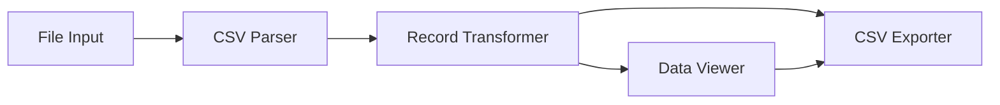

# Design Document: Competition CSV Import

## Overview

This system provides a browser-based CSV transformation tool for golf competition transaction data. The architecture follows a pipeline pattern: CSV Import → Record Transformation → Data Viewing → CSV Export. The system runs entirely in the browser with no backend dependencies, using client-side JavaScript for all processing.

The core challenge is identifying and flattening tiered CSV records where financial data appears 2 rows below the transaction header. The system must handle three transaction types (Topup, Sale, Refund) with different transformation rules while maintaining data integrity and providing clear error feedback.

## Architecture

### System Components



### Component Responsibilities

**CSV Parser**
- Reads file from browser File API
- Parses CSV text into 2D array structure
- Validates basic structure (minimum 10 columns)
- Returns structured data or error

**Record Transformer**
- Iterates through parsed rows
- Identifies records matching retention criteria
- Applies transformation rules based on transaction type
- Handles missing data and edge cases
- Returns array of transformed records

**Data Viewer**
- Renders transformed records in HTML table
- Provides visual feedback for empty states
- Displays column headers and formatted data

**CSV Exporter**
- Converts transformed records to CSV format
- Handles proper escaping and quoting
- Triggers browser download with generated file

## Components and Interfaces

### CSV Parser Interface

```typescript
interface CSVParser {
  parse(file: File): Promise<ParseResult>
}

type ParseResult = 
  | { success: true; rows: string[][] }
  | { success: false; error: string }

interface ParsedRow {
  cells: string[]
  rowIndex: number
}
```

**Implementation Strategy:**
- Use browser FileReader API to read file as text
- Split on newlines, then parse each line respecting quoted fields
- Use existing CSV parsing library (e.g., PapaParse) for robust handling of edge cases
- Validate minimum column count (10 columns)

### Record Transformer Interface

```typescript
interface RecordTransformer {
  transform(rows: string[][]): TransformResult
}

type TransformResult = {
  records: TransformedRecord[]
  errors: TransformError[]
}

interface TransformedRecord {
  date: string          // Column A
  time: string          // Column B
  till: string          // Column C
  type: string          // Column D
  member: string        // Column E
  price: string         // Column F
  discount: string      // Column G
  subtotal: string      // Column H
  vat: string           // Column I
  total: string         // Column J
  sourceRowIndex: number
  isComplete: boolean
}

interface TransformError {
  rowIndex: number
  message: string
  severity: 'warning' | 'error'
}
```

**Transformation Algorithm:**

```
For each row at index i in rows:
  1. Check if Column A (Date) is not null/empty
  2. If false, skip to next row
  
  3. Get transaction type from Column D
  
  4. If type == "Topup Competitions":
     - Create record with columns A-E from current row
     - If row i+2 exists:
       - Copy columns F-J from row i+2
       - Mark as complete
     - Else:
       - Mark as incomplete, log error
     - Add to results
  
  5. Else if type == "Sale":
     - If row i+2 exists AND row[i+2][E] contains "Competition Entry":
       - Create record with columns A-D from current row
       - Concatenate column E: row[i][E] + " & " + row[i+2][E]
       - Copy columns F-J from row i+2
       - Mark as complete
       - Add to results
     - Else:
       - Skip (does not meet retention criteria)
  
  6. Else if type == "Refund":
     - If row i+2 exists AND row[i+2][E] contains "Competition Entry":
       - Create record with columns A-D from current row
       - Concatenate column E: row[i][E] + " & " + row[i+2][E]
       - Copy columns F-J from row i+2
       - Mark as complete
       - Add to results
     - Else:
       - Skip (does not meet retention criteria)
  
  7. Else:
     - Skip (unknown transaction type)

Return all collected records and errors
```

### Data Viewer Interface

```typescript
interface DataViewer {
  render(records: TransformedRecord[]): void
  clear(): void
}
```

**UI Design:**
- HTML table with fixed header row
- Column headers: Date, Time, Till, Type, Member, Price, Discount, Subtotal, VAT, Total
- Alternating row colors for readability
- Empty state message: "No competition records found. Please upload a CSV file."
- Incomplete records highlighted with warning indicator
- Responsive design for various screen sizes

**HTML Structure:**
```html
<div id="data-viewer">
  <table id="records-table">
    <thead>
      <tr>
        <th>Date</th>
        <th>Time</th>
        <th>Till</th>
        <th>Type</th>
        <th>Member</th>
        <th>Price</th>
        <th>Discount</th>
        <th>Subtotal</th>
        <th>VAT</th>
        <th>Total</th>
      </tr>
    </thead>
    <tbody id="records-body">
      <!-- Rows inserted dynamically -->
    </tbody>
  </table>
  <div id="empty-state" style="display: none;">
    No competition records found. Please upload a CSV file.
  </div>
</div>
```

### CSV Exporter Interface

```typescript
interface CSVExporter {
  export(records: TransformedRecord[], filename: string): void
}
```

**Export Strategy:**
- Generate CSV string with header row
- Escape fields containing commas, quotes, or newlines
- Use RFC 4180 CSV format (quoted fields with escaped quotes)
- Create Blob with text/csv MIME type
- Trigger download using anchor element with download attribute
- Default filename: `competition-records-${timestamp}.csv`

**CSV Generation Algorithm:**
```
1. Create header row: "Date,Time,Till,Type,Member,Price,Discount,Subtotal,VAT,Total"
2. For each record:
   - For each field in record:
     - If field contains comma, quote, or newline:
       - Escape internal quotes by doubling them
       - Wrap field in quotes
     - Else:
       - Use field as-is
   - Join fields with commas
   - Add to output lines
3. Join all lines with newlines
4. Create Blob and trigger download
```

## Data Models

### Core Data Structures

**RawCSVData:**
```typescript
type RawCSVData = string[][]
// 2D array where:
// - First dimension: rows
// - Second dimension: columns (cells)
// - Minimum 10 columns per row
```

**TransformedRecord:**
```typescript
interface TransformedRecord {
  date: string          // Column A - original value
  time: string          // Column B - original value
  till: string          // Column C - original value
  type: string          // Column D - original value (Topup/Sale/Refund)
  member: string        // Column E - original or concatenated
  price: string         // Column F - from row+2
  discount: string      // Column G - from row+2
  subtotal: string      // Column H - from row+2
  vat: string           // Column I - from row+2
  total: string         // Column J - from row+2
  sourceRowIndex: number // Original row position in CSV
  isComplete: boolean   // True if all required data present
}
```

**TransformError:**
```typescript
interface TransformError {
  rowIndex: number      // Row where error occurred
  message: string       // Human-readable error description
  severity: 'warning' | 'error'
}
```

### Data Flow

```
File (CSV) 
  → FileReader API 
  → Raw Text String
  → CSV Parser
  → RawCSVData (string[][])
  → Record Transformer
  → TransformedRecord[]
  → Data Viewer (HTML Table)
  → CSV Exporter
  → Downloaded CSV File
```


## Correctness Properties

*A property is a characteristic or behavior that should hold true across all valid executions of a system—essentially, a formal statement about what the system should do. Properties serve as the bridge between human-readable specifications and machine-verifiable correctness guarantees.*

### CSV Parsing Properties

**Property 1: CSV parsing preserves structure**
*For any* valid CSV content with at least 10 columns, parsing the content should produce a 2D array where the number of rows matches the input line count and each row contains the correct cell values in their original positions.
**Validates: Requirements 1.2**

**Property 2: CSV parsing handles malformed input gracefully**
*For any* malformed or invalid CSV content, the parser should return an error result rather than throwing an exception or producing incorrect data.
**Validates: Requirements 1.3, 11.1**

**Property 3: CSV parsing supports wide files**
*For any* CSV file with 10 or more columns, the parser should successfully parse all columns without truncation or data loss.
**Validates: Requirements 1.4**

**Property 4: CSV parsing preserves empty cells**
*For any* CSV content containing empty cells (consecutive commas or empty quoted fields), the parser should preserve these as empty strings in the corresponding array positions.
**Validates: Requirements 1.5**

### Record Transformation Properties

**Property 5: Topup records are correctly identified**
*For any* CSV data, a row should be identified as a Competition_Topup if and only if Column A (Date) is non-empty AND Column D (Type) equals "Topup Competitions".
**Validates: Requirements 2.1**

**Property 6: Only qualifying records are retained**
*For any* CSV data, the transformed output should contain only records that match one of the three criteria: (1) Topup Competitions in Column D, (2) Sale in Column D with "Competition Entry" at row+2 Column E, or (3) Refund in Column D with "Competition Entry" at row+2 Column E.
**Validates: Requirements 2.3, 4.4, 6.4, 8.1, 8.2**

**Property 7: Transformation preserves original columns**
*For any* qualifying record (Topup, Sale, or Refund), the transformed record should preserve the original values from Columns A through D (Date, Time, Till, Type), and for Topup records, Column E (Member) should also be preserved.
**Validates: Requirements 3.1, 5.1, 7.1**

**Property 8: Financial data comes from row+2**
*For any* qualifying record where row+2 exists, Columns F through J (Price, Discount, Subtotal, VAT, Total) in the transformed record should contain the exact values from Columns F through J of the row 2 positions below.
**Validates: Requirements 3.2, 5.3, 7.3**

**Property 9: Member concatenation for Sale and Refund**
*For any* Sale or Refund record where row+2 exists, Column E (Member) in the transformed record should equal the concatenation of the current row's Column E value, the string " & ", and the row+2's Column E value.
**Validates: Requirements 5.2, 7.2**

**Property 10: Record order is preserved**
*For any* CSV data with multiple qualifying records, the relative order of records in the transformed output should match their relative order in the source CSV (if record A appears before record B in the source, A should appear before B in the output).
**Validates: Requirements 8.3**

### Data Viewing Properties

**Property 11: All transformed records are displayed**
*For any* non-empty array of transformed records, rendering the data viewer should produce a table where the number of data rows equals the number of transformed records.
**Validates: Requirements 9.1**

### CSV Export Properties

**Property 12: All transformed records are exported**
*For any* non-empty array of transformed records, the exported CSV should contain exactly one data row for each transformed record (plus one header row).
**Validates: Requirements 10.1**

**Property 13: CSV export handles special characters**
*For any* transformed record containing fields with commas, quotes, or newlines, the exported CSV should properly escape and quote those fields according to RFC 4180 format.
**Validates: Requirements 10.3**

**Property 14: Round-trip preservation**
*For any* valid CSV file containing qualifying competition records, the sequence of parsing → transforming → exporting → parsing should produce a dataset where all qualifying records have the same field values (columns A-J) as in the first transformation.
**Validates: Requirements 1.2, 10.5**

### Error Handling Properties

**Property 15: Export errors are communicated**
*For any* error condition during CSV export (e.g., browser API failure), the exporter should display an error message to the user rather than silently failing.
**Validates: Requirements 11.4**

## Error Handling

### Error Categories

**Parse Errors:**
- Invalid CSV format (unclosed quotes, inconsistent column counts)
- File read failures (permissions, corrupted files)
- Empty or null file content

**Transformation Errors:**
- Missing row+2 for qualifying records (boundary condition)
- Null or undefined values in required columns
- Unexpected data types

**Export Errors:**
- Browser API failures (Blob creation, download trigger)
- Memory constraints for large datasets

### Error Handling Strategy

**CSV Parser:**
- Wrap parsing in try-catch block
- Return structured error result with descriptive message
- Log parse errors to console for debugging
- Display user-friendly error in UI

**Record Transformer:**
- Check row+2 existence before accessing
- Mark records as incomplete when row+2 missing
- Collect all transformation errors in array
- Continue processing remaining rows (fail gracefully)
- Display warning count in UI

**CSV Exporter:**
- Wrap export operations in try-catch
- Display error modal/toast on failure
- Provide retry option
- Log detailed error to console

**UI Error Display:**
```html
<div id="error-container" class="error-message" style="display: none;">
  <span class="error-icon">⚠️</span>
  <span id="error-text"></span>
  <button id="error-dismiss">Dismiss</button>
</div>
```

### Error Messages

- Parse failure: "Unable to parse CSV file. Please ensure the file is a valid CSV format."
- Missing columns: "CSV file must contain at least 10 columns (A through J)."
- No qualifying records: "No competition records found in the uploaded file."
- Incomplete records: "Warning: {count} records are incomplete due to missing data."
- Export failure: "Unable to export CSV file. Please try again."

## Testing Strategy

### Dual Testing Approach

This feature requires both unit tests and property-based tests for comprehensive coverage:

**Unit Tests** focus on:
- Specific examples of each transaction type (Topup, Sale, Refund)
- Edge cases: empty files, single-row files, records at end of file
- Error conditions: malformed CSV, missing columns, invalid data
- UI interactions: file upload, table rendering, download trigger
- Integration between components

**Property-Based Tests** focus on:
- Universal properties that hold across all inputs
- Randomized CSV data with varying structures
- Comprehensive input coverage through generation
- Invariants that must always hold

### Property-Based Testing Configuration

**Library Selection:**
- JavaScript: Use **fast-check** library for property-based testing
- Minimum 100 iterations per property test
- Each test must reference its design document property

**Test Tagging Format:**
```javascript
// Feature: competition-csv-import, Property 1: CSV parsing preserves structure
test('CSV parsing preserves structure', () => {
  fc.assert(
    fc.property(
      fc.array(fc.array(fc.string(), { minLength: 10, maxLength: 15 })),
      (csvData) => {
        // Test implementation
      }
    ),
    { numRuns: 100 }
  );
});
```

### Test Coverage Requirements

**CSV Parser:**
- Unit: Test specific CSV formats (quoted fields, escaped quotes, empty cells)
- Property: Test structure preservation across random CSV data
- Property: Test error handling for malformed inputs

**Record Transformer:**
- Unit: Test each transaction type with specific examples
- Unit: Test boundary conditions (records at end of file)
- Property: Test identification logic across random data
- Property: Test transformation correctness across random qualifying records
- Property: Test order preservation

**Data Viewer:**
- Unit: Test rendering with specific record sets
- Unit: Test empty state display
- Property: Test that all records appear in rendered output

**CSV Exporter:**
- Unit: Test header row generation
- Unit: Test download trigger mechanism
- Property: Test special character escaping
- Property: Test round-trip preservation

### Generator Strategies

**CSV Data Generator:**
```javascript
// Generate random CSV data with configurable rows and columns
const csvDataGen = fc.record({
  rows: fc.integer({ min: 0, max: 100 }),
  cols: fc.integer({ min: 10, max: 20 })
}).chain(({ rows, cols }) => 
  fc.array(
    fc.array(fc.string(), { minLength: cols, maxLength: cols }),
    { minLength: rows, maxLength: rows }
  )
);
```

**Qualifying Record Generator:**
```javascript
// Generate CSV rows that match qualification criteria
const topupRecordGen = fc.record({
  date: fc.string({ minLength: 1 }),
  time: fc.string(),
  till: fc.string(),
  type: fc.constant('Topup Competitions'),
  member: fc.string(),
  // ... financial data 2 rows below
});

const saleRecordGen = fc.record({
  date: fc.string({ minLength: 1 }),
  time: fc.string(),
  till: fc.string(),
  type: fc.constant('Sale'),
  member: fc.string(),
  // ... row+2 with "Competition Entry"
});
```

**Special Character Generator:**
```javascript
// Generate strings with CSV special characters
const specialCharGen = fc.oneof(
  fc.string().filter(s => s.includes(',')),
  fc.string().filter(s => s.includes('"')),
  fc.string().filter(s => s.includes('\n'))
);
```

### Edge Cases to Test

- Empty CSV file
- CSV with only header row
- CSV with fewer than 10 columns
- Qualifying records in last 2 rows (no row+2 available)
- Records with all empty cells
- Records with special characters in all fields
- Very large CSV files (performance testing)
- CSV with inconsistent column counts per row
- Sale/Refund without "Competition Entry" at row+2
- Multiple qualifying records in sequence
