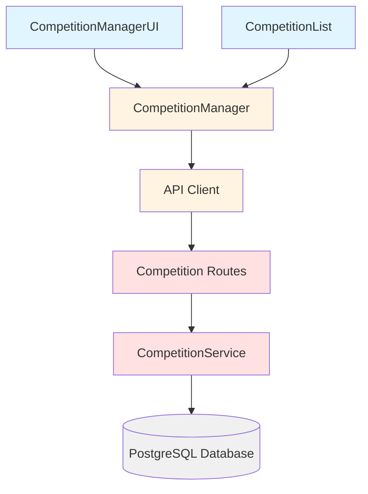

# Design Document: Competition Finished Status

## Overview

This feature introduces a "finished" status for competitions to reduce clutter in the competition management interface. The design follows a soft-delete pattern where finished competitions remain in the database with all their associations intact but are filtered from active workflows by default.

The implementation spans three layers:
1. **Database Layer**: Add a `finished` boolean column to the competitions table
2. **Backend Service Layer**: Update CompetitionService to support finished status in CRUD operations and filtering
3. **Frontend Layer**: Update CompetitionManager, CompetitionManagerUI, and CompetitionList to support toggling and filtering finished competitions

Key design principles:
- **Data Preservation**: Finished competitions retain all associated results and flagged transactions
- **Default Filtering**: Active (unfinished) competitions are shown by default in all user-facing workflows
- **Explicit Retrieval**: Finished competitions can be viewed when explicitly requested via UI toggle
- **Backward Compatibility**: Existing competitions default to unfinished status

## Architecture

### System Components

The feature integrates with existing components:



### Data Flow

**Marking a Competition as Finished:**
1. User clicks "Mark as Finished" button in CompetitionManagerUI
2. CompetitionManager calls `updateFinishedStatus(id, true)`
3. API Client sends PATCH request to `/api/competitions/:id`
4. CompetitionService updates `finished = true` in database
5. UI refreshes to remove competition from active view

**Viewing Finished Competitions:**
1. User toggles "Show Finished" in CompetitionManagerUI
2. CompetitionManager calls `getAll({ finished: true })`
3. API Client sends GET request with `?finished=true` query parameter
4. CompetitionService queries database with `WHERE finished = true`
5. UI displays finished competitions with "Unmark as Finished" option

### Migration Strategy

A new database migration will add the `finished` column:
- Migration file: `011_add_finished_to_competitions.sql`
- Rollback file: `011_add_finished_to_competitions.rollback.sql`
- Default value: `false` for all existing competitions
- Index: Create index on `finished` column for efficient filtering

## Components and Interfaces

### Database Schema Changes

**competitions table modification:**

```sql
ALTER TABLE competitions 
  ADD COLUMN finished BOOLEAN NOT NULL DEFAULT false;

CREATE INDEX idx_competitions_finished ON competitions(finished);
```

The index supports efficient queries filtering by finished status, which will be common in the application.

### Backend API Changes

#### CompetitionService

**New/Modified Methods:**

```typescript
interface UpdateCompetitionDTO {
  name?: string;
  date?: string;
  type?: 'singles' | 'doubles';
  seasonId?: number;
  description?: string;
  prizeStructure?: string;
  finished?: boolean;  // NEW
}

interface GetCompetitionsOptions {
  seasonId?: number;
  finished?: boolean;  // NEW - filter by finished status
}

class CompetitionService {
  // Modified to support finished filter
  async getAllCompetitions(options?: GetCompetitionsOptions): Promise<Competition[]>
  
  // Modified to include finished in response
  async getCompetitionById(id: number): Promise<Competition | null>
  
  // Modified to support finished in updates
  async updateCompetition(id: number, updates: UpdateCompetitionDTO): Promise<Competition>
}
```

**Query Logic:**
- When `finished` is not specified in options, return all competitions (backward compatible)
- When `finished: false`, return only unfinished competitions
- When `finished: true`, return only finished competitions
- The finished status is always included in response objects

#### API Routes

**Modified Endpoints:**

```
GET /api/competitions?finished=true|false
  - Query parameter 'finished' filters by status
  - Omitting parameter returns all competitions
  
PATCH /api/competitions/:id
  - Body can include { finished: boolean }
  - Updates finished status
```

### Frontend Changes

#### CompetitionManager (backend/public/competitionManager.js)

**New Methods:**

```javascript
class CompetitionManager {
  /**
   * Get competitions filtered by finished status
   * @param {Object} options - Filter options
   * @param {boolean} options.finished - Filter by finished status
   * @returns {Promise<Competition[]>}
   */
  async getAll(options = {})
  
  /**
   * Update finished status of a competition
   * @param {number} id - Competition ID
   * @param {boolean} finished - New finished status
   * @returns {Promise<Competition>}
   */
  async updateFinishedStatus(id, finished)
}
```

**Modified Behavior:**
- `getAll()` now accepts optional filter parameter
- Default behavior unchanged (returns all competitions for backward compatibility)
- Competition objects now include `finished` property

#### CompetitionManagerUI (backend/public/competitionManagerUI.js)

**New UI Elements:**

1. **Toggle Control**: Radio buttons or toggle switch to filter view
   - "Active Competitions" (default)
   - "Finished Competitions"

2. **Action Buttons**: Context-sensitive based on current view
   - In Active view: "Mark as Finished" button
   - In Finished view: "Unmark as Finished" button

**New State:**

```javascript
class CompetitionManagerUI {
  constructor(competitionManager, apiClient) {
    // ... existing code ...
    this.showFinished = false;  // NEW - tracks current view
  }
}
```

**New Methods:**

```javascript
class CompetitionManagerUI {
  /**
   * Handle toggle between active/finished view
   */
  async handleViewToggle(showFinished)
  
  /**
   * Handle marking competition as finished
   */
  async handleMarkFinished(competitionId)
  
  /**
   * Handle unmarking competition as finished
   */
  async handleUnmarkFinished(competitionId)
}
```

**Modified Methods:**
- `renderCompetitions()`: Filter based on `this.showFinished` state
- `createCompetitionRow()`: Add appropriate action button based on finished status

#### CompetitionList (backend/public/competitionList.js)

**Modified Behavior:**
- `loadCompetitions()`: Always filter to show only unfinished competitions
- This ensures the competition selector modal (used for flagging transactions) only shows active competitions

**Implementation:**

```javascript
async loadCompetitions(seasonId = null) {
  // ... existing code ...
  
  // Filter to only unfinished competitions
  const options = { finished: false };
  if (seasonId) {
    options.seasonId = seasonId;
  }
  
  this.competitions = await this.apiClient.getAllCompetitions(options);
  
  // ... rest of existing code ...
}
```

## Data Models

### Competition Type Extension

```typescript
export interface Competition {
  id: number;
  name: string;
  date: string;
  type: 'singles' | 'doubles';
  seasonId: number;
  description: string;
  prizeStructure: string;
  finished: boolean;  // NEW
  createdAt: Date;
  updatedAt: Date;
}
```

### Database Schema

**competitions table:**

| Column | Type | Constraints | Description |
|--------|------|-------------|-------------|
| id | SERIAL | PRIMARY KEY | Auto-incrementing ID |
| name | VARCHAR(255) | NOT NULL, UNIQUE | Competition name |
| date | DATE | NOT NULL | Competition date |
| type | VARCHAR(10) | NOT NULL, CHECK | 'singles' or 'doubles' |
| season_id | INTEGER | FOREIGN KEY | Reference to presentation_seasons |
| description | TEXT | | Competition description |
| prize_structure | TEXT | | Prize structure details |
| finished | BOOLEAN | NOT NULL, DEFAULT false | Finished status (NEW) |
| created_at | TIMESTAMP | NOT NULL, DEFAULT NOW() | Creation timestamp |
| updated_at | TIMESTAMP | NOT NULL, DEFAULT NOW() | Last update timestamp |

**Indexes:**
- `idx_competitions_season_id` (existing)
- `idx_competitions_type` (existing)
- `idx_competitions_season_date` (existing)
- `idx_competitions_finished` (NEW)

### Relationships

The finished status does not affect existing relationships:
- **competition_results**: One-to-many relationship preserved
- **flagged_transactions**: One-to-many relationship preserved
- **distribution_assignments**: One-to-many relationship preserved
- **presentation_seasons**: Many-to-one relationship preserved

All associated records remain intact when a competition is marked as finished.


## Correctness Properties

*A property is a characteristic or behavior that should hold true across all valid executions of a system—essentially, a formal statement about what the system should do. Properties serve as the bridge between human-readable specifications and machine-verifiable correctness guarantees.*

### Property 1: Default Finished Status

*For any* newly created competition, the finished status should be false.

**Validates: Requirements 1.1**

### Property 2: Finished Status Persistence

*For any* competition with a finished status, retrieving that competition from the database should return the same finished status value (round-trip property).

**Validates: Requirements 1.3**

### Property 3: Finished Status Toggle Round-Trip

*For any* competition, marking it as finished and then unmarking it should result in finished status being false.

**Validates: Requirements 2.2, 3.2**

### Property 4: Association Preservation When Marking Finished

*For any* competition with associated competition results and flagged transactions, marking the competition as finished should preserve all associated records (the count of results and transactions should remain unchanged).

**Validates: Requirements 2.3, 2.4**

### Property 5: Unfinished Competitions in Active Workflows

*For any* competition that is unmarked as finished (finished=false), querying for unfinished competitions should include that competition in the results.

**Validates: Requirements 3.3**

### Property 6: Selector Excludes Finished Competitions

*For any* set of competitions, when filtering for the competition selector (finished=false), the results should contain only competitions where finished status is false.

**Validates: Requirements 4.1**

### Property 7: Active Competitions Alphabetically Sorted

*For any* set of unfinished competitions, the results should be ordered alphabetically by name in ascending order.

**Validates: Requirements 4.2**

### Property 8: Finished Status in Response

*For any* competition retrieved from the service, the response object should include a finished field with a boolean value.

**Validates: Requirements 5.1**

### Property 9: Filtering by Finished Status

*For any* set of competitions with mixed finished status values, filtering by finished=true should return only competitions where finished is true, and filtering by finished=false should return only competitions where finished is false.

**Validates: Requirements 5.3**

### Property 10: Competition Record Preserved When Finished

*For any* competition, marking it as finished should not delete the competition record (the competition should still be retrievable by ID).

**Validates: Requirements 6.1**

### Property 11: Finished Competitions Retrievable

*For any* competition marked as finished, querying with finished=true filter should include that competition in the results.

**Validates: Requirements 6.4**

### Property 12: UI Toggle State Persistence

*For any* toggle state value (showFinished boolean), setting the state and then reading it back should return the same value during the user session.

**Validates: Requirements 8.7**

## Error Handling

### Database Layer

**Migration Errors:**
- If the migration fails (e.g., due to existing column), the rollback script should restore the previous schema
- Migration should be idempotent using `IF NOT EXISTS` clauses where appropriate

**Constraint Violations:**
- The finished column has a NOT NULL constraint with a default value, preventing null values
- Type validation ensures only boolean values are stored

### Service Layer

**Update Errors:**
- If competition ID does not exist, throw error: "Competition with id {id} not found"
- If finished value is not a boolean, throw error: "Finished status must be a boolean value"
- Database connection errors should be propagated with appropriate error messages

**Query Errors:**
- Invalid filter parameters should be ignored or throw validation errors
- Database query failures should return appropriate HTTP status codes (500 for server errors)

### Frontend Layer

**API Communication Errors:**
- Network failures when updating finished status should display user-friendly error messages
- Failed updates should not change local UI state until confirmed by server
- Retry logic for transient failures

**State Management Errors:**
- If toggle state cannot be persisted to session storage, fall back to default (showFinished=false)
- Invalid state values should reset to default

**User Feedback:**
- Success messages when marking/unmarking competitions
- Error messages when operations fail with actionable guidance
- Loading states during async operations

## Testing Strategy

### Unit Testing

Unit tests will focus on specific examples, edge cases, and integration points:

**Backend Service Tests:**
- Test creating a competition verifies finished defaults to false
- Test updating finished status with valid boolean values
- Test updating finished status with invalid values throws error
- Test filtering returns correct subsets for finished=true, finished=false, and no filter
- Test marking finished competition preserves specific associated records
- Test competition not found error handling
- Test database transaction rollback on errors

**Frontend Manager Tests:**
- Test `updateFinishedStatus()` calls correct API endpoint
- Test `getAll({ finished: true })` passes correct query parameters
- Test error handling for failed API calls
- Test competition objects include finished property

**Frontend UI Tests:**
- Test toggle control switches between active/finished views
- Test "Mark as Finished" button calls correct manager method
- Test "Unmark as Finished" button calls correct manager method
- Test default view shows only unfinished competitions
- Test empty state when no competitions match filter
- Test loading states during async operations

**Edge Cases:**
- Test behavior when all competitions are finished
- Test behavior when no competitions exist
- Test rapid toggling between views
- Test marking already-finished competition as finished (idempotent)
- Test unmarking already-unfinished competition (idempotent)

### Property-Based Testing

Property-based tests will verify universal properties across randomized inputs using a PBT library appropriate for the language (e.g., fast-check for TypeScript/JavaScript). Each test will run a minimum of 100 iterations.

**Backend Service Property Tests:**

```typescript
// Feature: competition-finished-status, Property 1: Default Finished Status
test('newly created competitions have finished=false', async () => {
  // Generate random competition data
  // Create competition
  // Assert finished === false
});

// Feature: competition-finished-status, Property 2: Finished Status Persistence
test('finished status persists across retrieval', async () => {
  // Generate random competition with random finished status
  // Create and retrieve competition
  // Assert retrieved.finished === original.finished
});

// Feature: competition-finished-status, Property 3: Finished Status Toggle Round-Trip
test('marking finished then unmarking results in finished=false', async () => {
  // Generate random competition
  // Mark as finished, then unmark
  // Assert finished === false
});

// Feature: competition-finished-status, Property 4: Association Preservation
test('marking finished preserves all associations', async () => {
  // Generate random competition with random results and transactions
  // Count associations before marking finished
  // Mark as finished
  // Count associations after
  // Assert counts are equal
});

// Feature: competition-finished-status, Property 6: Selector Excludes Finished
test('filtering by finished=false excludes finished competitions', async () => {
  // Generate random set of competitions with mixed finished status
  // Query with finished=false
  // Assert all results have finished === false
});

// Feature: competition-finished-status, Property 7: Alphabetical Sorting
test('unfinished competitions are sorted alphabetically', async () => {
  // Generate random set of unfinished competitions
  // Query for unfinished competitions
  // Assert results are sorted by name ascending
});

// Feature: competition-finished-status, Property 9: Filtering by Finished Status
test('filtering by finished status returns correct subset', async () => {
  // Generate random set of competitions with mixed finished status
  // Query with finished=true
  // Assert all results have finished === true
  // Query with finished=false
  // Assert all results have finished === false
});

// Feature: competition-finished-status, Property 10: Record Preserved
test('marking finished does not delete competition', async () => {
  // Generate random competition
  // Mark as finished
  // Retrieve by ID
  // Assert competition exists
});
```

**Frontend Manager Property Tests:**

```javascript
// Feature: competition-finished-status, Property 8: Finished Status in Response
test('all retrieved competitions include finished field', async () => {
  // Generate random set of competitions
  // Retrieve all competitions
  // Assert each competition has finished property with boolean value
});
```

**Integration Tests:**

Integration tests will verify end-to-end workflows:
- Create competition → verify finished=false → mark finished → verify finished=true → unmark → verify finished=false
- Create competition with results → mark finished → verify results still exist
- Create multiple competitions → filter by finished status → verify correct subset returned
- Toggle UI view → verify correct competitions displayed

### Test Data Generation

For property-based tests, generators will create:
- Random competition names (valid strings, 1-255 characters)
- Random competition types ('singles' or 'doubles')
- Random dates (valid date strings)
- Random season IDs (valid integers)
- Random finished status (boolean)
- Random sets of competitions (arrays of 0-50 competitions)
- Random competition results (arrays of 0-20 results per competition)
- Random flagged transactions (arrays of 0-100 transactions per competition)

Edge cases to include in generators:
- Empty competition lists
- All competitions finished
- All competitions unfinished
- Competitions with no associations
- Competitions with many associations
- Duplicate names (should be rejected by existing validation)
- Very long competition names (up to 255 characters)

