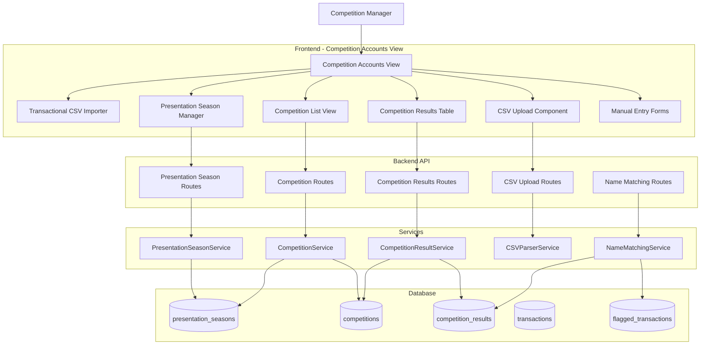
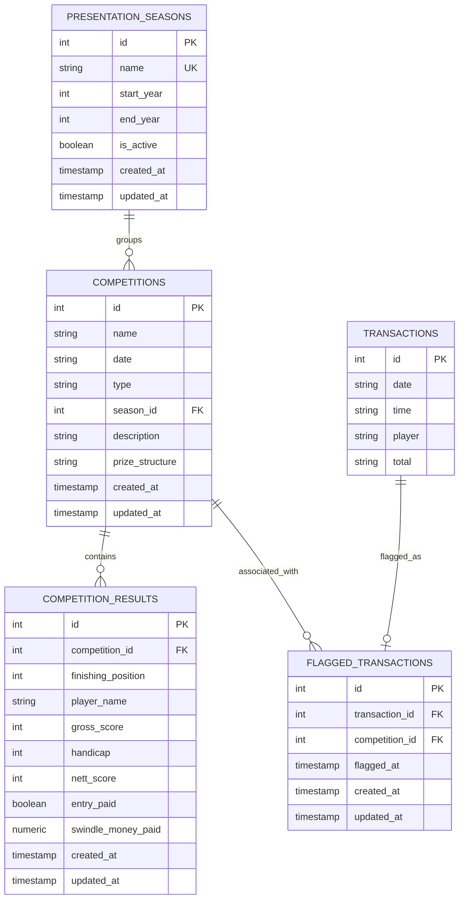
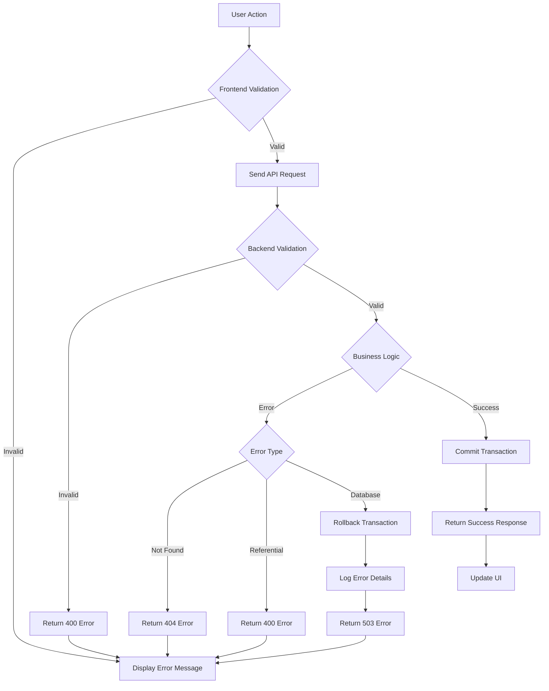

# Competition Results Management - Design Document

## Overview

The Competition Results Management feature extends the Aquarius Golf Competition Account Manager to provide comprehensive competition result tracking and management. This feature consolidates competition management functionality by replacing the current dialogue-based approach with an integrated view that supports approximately 40 competitions per year.

The system enables competition managers to:
- Organize competitions into presentation seasons (e.g., "Season: Winter 25-Summer 26")
- Upload competition results via CSV for both singles and doubles competitions
- Manually enter and edit competition results
- Automatically link prize money payments to competition results
- View and filter competitions by presentation season
- Track entry fees and prize money payments per player

This feature integrates with the existing Transactional CSV Importer within a new "Competition Accounts" view, maintaining all existing financial transaction functionality while adding comprehensive competition result management.

## Architecture

### High-Level Architecture

The system follows a three-tier architecture consistent with the existing Aquarius Golf application:

1. **Frontend Layer** (Vanilla JavaScript)
   - Competition Accounts View (main container)
   - Presentation Season Manager
   - Competition List View with filtering
   - Competition Results Table
   - CSV Upload Component
   - Manual Entry Forms

2. **Backend Layer** (Node.js/TypeScript with Express)
   - REST API endpoints for CRUD operations
   - Service layer for business logic
   - CSV parsing and validation
   - Name matching algorithm for swindle money integration

3. **Data Layer** (PostgreSQL)
   - Presentation seasons table
   - Extended competitions table
   - Competition results table
   - Indexes for performance optimization


### System Context Diagram



### Component Integration

The Competition Results Management feature integrates with existing components:

1. **Transactional CSV Importer**: Remains accessible within the Competition Accounts view
2. **Flagged Transactions**: Swindle money flagged in Transformed Records automatically populates competition results
3. **Competition Manager**: Extended to support presentation seasons and competition types
4. **Database Service**: Reused for all database operations with transaction support


## Components and Interfaces

### Frontend Components

#### 1. CompetitionAccountsView

Main container component that integrates all competition management functionality.

**Responsibilities:**
- Render the Competition Accounts view layout
- Coordinate between Transactional CSV Importer and competition management sections
- Manage view state and navigation

**Interface:**
```javascript
class CompetitionAccountsView {
  constructor(apiClient, transactionalImporter)
  
  // Lifecycle methods
  render()
  show()
  hide()
  
  // Section management
  renderTransactionalSection()
  renderCompetitionSection()
}
```

#### 2. PresentationSeasonManager

Manages presentation season CRUD operations and active season selection.

**Responsibilities:**
- Display list of presentation seasons
- Create new seasons (manual and auto-increment)
- Mark active season
- Validate season format

**Interface:**
```javascript
class PresentationSeasonManager {
  constructor(apiClient)
  
  // CRUD operations
  async createSeason(name)
  async autoIncrementSeason()
  async getAllSeasons()
  async setActiveSeason(seasonId)
  
  // Validation
  validateSeasonFormat(name) // Returns boolean
  
  // UI methods
  render(containerId)
  refresh()
}
```

**Season Format Validation:**
- Pattern: `Season: Winter [YY]-Summer [YY]`
- Winter year must be ≤ Summer year
- Years must be two-digit numbers


#### 3. CompetitionListView

Displays competitions with filtering by presentation season.

**Responsibilities:**
- Display competitions in chronological order
- Filter by presentation season
- Handle competition selection
- Support ~40 competitions per year without performance issues

**Interface:**
```javascript
class CompetitionListView {
  constructor(apiClient, competitionService)
  
  // Data operations
  async loadCompetitions()
  async filterBySeason(seasonId)
  
  // UI methods
  render(containerId)
  refresh()
  
  // Event handlers
  onCompetitionSelected(callback) // Callback receives competition object
}
```

**Display Format:**
- Competition Name
- Date (formatted as DD/MM/YYYY)
- Type (Singles/Doubles)
- Presentation Season
- Result count indicator

#### 4. CompetitionResultsTable

Displays and manages competition results for a selected competition.

**Responsibilities:**
- Display results in tabular format
- Support different column sets for Singles vs Doubles
- Enable inline editing
- Show payment status

**Interface:**
```javascript
class CompetitionResultsTable {
  constructor(apiClient, competitionResultService)
  
  // Data operations
  async loadResults(competitionId)
  async updateResult(resultId, updates)
  async deleteResult(resultId)
  
  // UI methods
  render(containerId, competition)
  refresh()
  
  // Column configuration
  getColumnsForType(competitionType) // Returns array of column definitions
}
```

**Column Definitions:**

Singles Competition:
- Finishing Position (number, required)
- Name (string, required)
- Gross Score (number, optional)
- Handicap (number, optional)
- Nett Score (number, optional)
- Entry Paid (boolean, default false)
- Swindle Money Paid (currency, optional)

Doubles Competition:
- Finishing Position (number, required)
- Name (string, required)
- Nett Score (number, optional)
- Entry Paid (boolean, default false)
- Swindle Money Paid (currency, optional)


#### 5. CSVUploadComponent

Handles CSV file upload and parsing for competition results.

**Responsibilities:**
- File selection and validation
- CSV parsing with error reporting
- Preview parsed results before saving
- Support both Singles and Doubles formats

**Interface:**
```javascript
class CSVUploadComponent {
  constructor(apiClient, csvParserService)
  
  // File handling
  async handleFileSelect(file, competitionId, competitionType)
  async parseCSV(fileContent, competitionType)
  
  // Preview and confirmation
  renderPreview(parsedResults)
  async confirmUpload(competitionId, parsedResults)
  
  // UI methods
  render(containerId)
  showError(message)
  showSuccess(message)
}
```

#### 6. ManualEntryForm

Provides form interface for manual result entry and editing.

**Responsibilities:**
- Render form fields based on competition type
- Validate input data
- Submit new results or updates

**Interface:**
```javascript
class ManualEntryForm {
  constructor(apiClient, competitionResultService)
  
  // Form operations
  renderForCreate(competitionId, competitionType)
  renderForEdit(resultId, existingData, competitionType)
  
  // Validation
  validateForm() // Returns { valid: boolean, errors: string[] }
  
  // Submission
  async submitCreate()
  async submitUpdate()
  
  // UI methods
  show()
  hide()
  reset()
}
```


### Backend Components

#### 1. PresentationSeasonService

Manages presentation season business logic.

**Responsibilities:**
- CRUD operations for presentation seasons
- Season format validation
- Active season management (ensure only one active)
- Auto-increment logic

**Interface:**
```typescript
class PresentationSeasonService {
  constructor(private db: DatabaseService)
  
  async createSeason(dto: CreatePresentationSeasonDTO): Promise<PresentationSeason>
  async getAllSeasons(): Promise<PresentationSeason[]>
  async getActiveSeason(): Promise<PresentationSeason | null>
  async setActiveSeason(seasonId: number): Promise<PresentationSeason>
  async autoIncrementSeason(): Promise<PresentationSeason>
  
  // Validation
  validateSeasonFormat(name: string): boolean
  parseSeasonYears(name: string): { winterYear: number, summerYear: number }
}
```

**Auto-Increment Logic:**
1. Get most recent season by start_year
2. Parse winter and summer years
3. Increment both by 1
4. Format as "Season: Winter [YY]-Summer [YY]"
5. Create new season

#### 2. CompetitionService (Extended)

Extends existing CompetitionService to support presentation seasons and competition types.

**Responsibilities:**
- CRUD operations for competitions
- Association with presentation seasons
- Competition type validation
- Filtering by season

**Interface:**
```typescript
class CompetitionService {
  constructor(private db: DatabaseService)
  
  // Extended create with season and type
  async createCompetition(dto: CreateCompetitionDTO): Promise<Competition>
  async updateCompetition(id: number, updates: UpdateCompetitionDTO): Promise<Competition>
  async deleteCompetition(id: number): Promise<void>
  
  // Query methods
  async getAllCompetitions(): Promise<Competition[]>
  async getCompetitionById(id: number): Promise<Competition | null>
  async getCompetitionsBySeason(seasonId: number): Promise<Competition[]>
  
  // Validation
  validateCompetitionType(type: string): boolean
}
```


#### 3. CompetitionResultService

Manages competition result business logic.

**Responsibilities:**
- CRUD operations for competition results
- Referential integrity with competitions
- Result validation based on competition type
- Batch operations for CSV uploads

**Interface:**
```typescript
class CompetitionResultService {
  constructor(private db: DatabaseService)
  
  // CRUD operations
  async createResult(dto: CreateCompetitionResultDTO): Promise<CompetitionResult>
  async createResultsBatch(dtos: CreateCompetitionResultDTO[]): Promise<CompetitionResult[]>
  async updateResult(id: number, updates: UpdateCompetitionResultDTO): Promise<CompetitionResult>
  async deleteResult(id: number): Promise<void>
  
  // Query methods
  async getResultsByCompetition(competitionId: number): Promise<CompetitionResult[]>
  async getResultById(id: number): Promise<CompetitionResult | null>
  
  // Validation
  validateResultForType(result: CompetitionResult, competitionType: string): ValidationResult
}
```

#### 4. CSVParserService

Parses and validates CSV files for competition results.

**Responsibilities:**
- Parse Singles CSV format
- Parse Doubles CSV format with name splitting
- Validate required columns
- Skip invalid rows (empty names, division headers)
- Format results back to CSV (round-trip)

**Interface:**
```typescript
class CSVParserService {
  // Parsing
  async parseSinglesCSV(fileContent: string): Promise<ParsedResult[]>
  async parseDoublesCSV(fileContent: string): Promise<ParsedResult[]>
  
  // Formatting (for round-trip)
  formatSinglesCSV(results: CompetitionResult[]): string
  formatDoublesCSV(results: CompetitionResult[]): string
  
  // Validation
  validateSinglesColumns(headers: string[]): ValidationResult
  validateDoublesColumns(headers: string[]): ValidationResult
  shouldSkipRow(row: any): boolean
}
```

**Singles CSV Format:**
```
Pos,Name,Gross,Hcp,Nett
1,John SMITH,85,12,73
2,Jane DOE,88,15,73
```

**Doubles CSV Format:**
```
Pos,Name,Nett
1,John SMITH / Jane DOE,73
2,Bob JONES / Alice BROWN,74
```

**Row Skipping Rules:**
- Skip if Name is empty or whitespace only
- Skip if Name matches pattern `Division [0-9]+`
- Trim all field values


#### 5. NameMatchingService

Matches player names from flagged transactions to competition results.

**Responsibilities:**
- Case-insensitive name matching
- Name normalization (handle variations like "A. REID" vs "Alastair REID")
- Find most recent unpaid result for matched player
- Update swindle money paid field

**Interface:**
```typescript
class NameMatchingService {
  constructor(private db: DatabaseService)
  
  // Matching operations
  async matchAndUpdateResult(playerName: string, amount: number): Promise<MatchResult>
  async findMatchingResults(playerName: string): Promise<CompetitionResult[]>
  
  // Normalization
  normalizeName(name: string): string
  namesMatch(name1: string, name2: string): boolean
  
  // Query helpers
  async getMostRecentUnpaidResult(playerName: string): Promise<CompetitionResult | null>
}
```

**Name Matching Algorithm:**

1. **Normalization:**
   - Convert to uppercase
   - Remove extra whitespace
   - Handle initials (e.g., "A." matches "Alastair")

2. **Matching Strategy:**
   - Exact match after normalization (highest priority)
   - Initial + surname match (e.g., "A. REID" matches "Alastair REID")
   - Surname-only match if unique (lowest priority)

3. **Result Selection:**
   - Filter to results where swindle_money_paid IS NULL
   - Order by competition date DESC
   - Select first result (most recent)

4. **Update:**
   - Set swindle_money_paid = transaction amount
   - Update updated_at timestamp

**Example Matching:**
```
Transaction: "A. REID" paid £50
Results:
  - Competition A (2024-01-15): "Alastair REID", swindle_money_paid = NULL ← MATCH
  - Competition B (2024-01-08): "Alastair REID", swindle_money_paid = £30
  - Competition C (2024-01-01): "Andrew REID", swindle_money_paid = NULL

Result: Update Competition A result with £50
```


### Backend API Routes

#### Presentation Season Routes

**Base Path:** `/api/presentation-seasons`

```typescript
// Create presentation season
POST /api/presentation-seasons
Request Body: { name: string }
Response: 201 { season: PresentationSeason }

// Auto-increment season
POST /api/presentation-seasons/auto-increment
Response: 201 { season: PresentationSeason }

// Get all seasons
GET /api/presentation-seasons
Response: 200 { seasons: PresentationSeason[], count: number }

// Get active season
GET /api/presentation-seasons/active
Response: 200 { season: PresentationSeason | null }

// Set active season
PUT /api/presentation-seasons/:id/activate
Response: 200 { season: PresentationSeason }
```

#### Competition Routes (Extended)

**Base Path:** `/api/competitions`

```typescript
// Create competition (extended with season_id and type)
POST /api/competitions
Request Body: {
  name: string,
  date: string,
  type: 'singles' | 'doubles',
  season_id: number,
  description?: string,
  prize_structure?: string
}
Response: 201 { competition: Competition }

// Get competitions by season
GET /api/competitions?season_id={seasonId}
Response: 200 { competitions: Competition[], count: number }

// Update competition
PUT /api/competitions/:id
Request Body: { name?, date?, type?, season_id?, description?, prize_structure? }
Response: 200 { competition: Competition }

// Delete competition (cascades to results)
DELETE /api/competitions/:id
Response: 200 { message: string }

// Get competition by ID
GET /api/competitions/:id
Response: 200 { competition: Competition }
```


#### Competition Result Routes

**Base Path:** `/api/competition-results`

```typescript
// Create single result
POST /api/competition-results
Request Body: {
  competition_id: number,
  finishing_position: number,
  player_name: string,
  gross_score?: number,
  handicap?: number,
  nett_score?: number,
  entry_paid?: boolean,
  swindle_money_paid?: number
}
Response: 201 { result: CompetitionResult }

// Create batch results (for CSV upload)
POST /api/competition-results/batch
Request Body: {
  competition_id: number,
  results: Array<{
    finishing_position: number,
    player_name: string,
    gross_score?: number,
    handicap?: number,
    nett_score?: number
  }>
}
Response: 201 { results: CompetitionResult[], count: number }

// Get results by competition
GET /api/competition-results?competition_id={competitionId}
Response: 200 { results: CompetitionResult[], count: number }

// Update result
PUT /api/competition-results/:id
Request Body: {
  finishing_position?: number,
  player_name?: string,
  gross_score?: number,
  handicap?: number,
  nett_score?: number,
  entry_paid?: boolean,
  swindle_money_paid?: number
}
Response: 200 { result: CompetitionResult }

// Delete result
DELETE /api/competition-results/:id
Response: 200 { message: string }
```

#### CSV Upload Routes

**Base Path:** `/api/csv`

```typescript
// Upload and parse CSV
POST /api/csv/upload
Request Body: FormData {
  file: File,
  competition_id: number,
  competition_type: 'singles' | 'doubles'
}
Response: 200 {
  parsed: ParsedResult[],
  count: number,
  errors: ParseError[]
}

// Confirm and save parsed results
POST /api/csv/confirm
Request Body: {
  competition_id: number,
  results: ParsedResult[]
}
Response: 201 { results: CompetitionResult[], count: number }
```

#### Name Matching Routes

**Base Path:** `/api/name-matching`

```typescript
// Match name and update result
POST /api/name-matching/match
Request Body: {
  player_name: string,
  amount: number
}
Response: 200 {
  matched: boolean,
  result?: CompetitionResult,
  message: string
}

// Find potential matches (for preview)
GET /api/name-matching/search?name={playerName}
Response: 200 { matches: CompetitionResult[] }
```


## Data Models

### Database Schema

#### presentation_seasons Table

```sql
CREATE TABLE presentation_seasons (
  id SERIAL PRIMARY KEY,
  name VARCHAR(50) NOT NULL UNIQUE,
  start_year INTEGER NOT NULL,
  end_year INTEGER NOT NULL,
  is_active BOOLEAN NOT NULL DEFAULT false,
  created_at TIMESTAMP DEFAULT CURRENT_TIMESTAMP,
  updated_at TIMESTAMP DEFAULT CURRENT_TIMESTAMP,
  
  CONSTRAINT check_year_order CHECK (start_year <= end_year),
  CONSTRAINT check_season_format CHECK (name ~ '^Season: Winter [0-9]{2}-Summer [0-9]{2}$')
);

-- Ensure only one active season
CREATE UNIQUE INDEX idx_active_season ON presentation_seasons (is_active) WHERE is_active = true;

-- Index for chronological ordering
CREATE INDEX idx_presentation_seasons_start_year ON presentation_seasons (start_year DESC);
```

#### competitions Table (Extended)

```sql
-- Extend existing competitions table
ALTER TABLE competitions 
  ADD COLUMN type VARCHAR(10) NOT NULL DEFAULT 'singles',
  ADD COLUMN season_id INTEGER REFERENCES presentation_seasons(id) ON DELETE RESTRICT,
  ADD CONSTRAINT check_competition_type CHECK (type IN ('singles', 'doubles'));

-- Index for season filtering
CREATE INDEX idx_competitions_season_id ON competitions (season_id);

-- Index for date ordering
CREATE INDEX idx_competitions_date ON competitions (date DESC);

-- Composite index for season + date queries
CREATE INDEX idx_competitions_season_date ON competitions (season_id, date DESC);
```

Updated schema:
```sql
CREATE TABLE competitions (
  id SERIAL PRIMARY KEY,
  name VARCHAR(255) NOT NULL,
  date VARCHAR(10) NOT NULL,
  type VARCHAR(10) NOT NULL DEFAULT 'singles',
  season_id INTEGER REFERENCES presentation_seasons(id) ON DELETE RESTRICT,
  description TEXT DEFAULT '',
  prize_structure TEXT DEFAULT '',
  created_at TIMESTAMP DEFAULT CURRENT_TIMESTAMP,
  updated_at TIMESTAMP DEFAULT CURRENT_TIMESTAMP,
  
  CONSTRAINT check_competition_type CHECK (type IN ('singles', 'doubles'))
);
```


#### competition_results Table

```sql
CREATE TABLE competition_results (
  id SERIAL PRIMARY KEY,
  competition_id INTEGER NOT NULL REFERENCES competitions(id) ON DELETE CASCADE,
  finishing_position INTEGER NOT NULL,
  player_name VARCHAR(255) NOT NULL,
  gross_score INTEGER,
  handicap INTEGER,
  nett_score INTEGER,
  entry_paid BOOLEAN NOT NULL DEFAULT false,
  swindle_money_paid NUMERIC(10, 2),
  created_at TIMESTAMP DEFAULT CURRENT_TIMESTAMP,
  updated_at TIMESTAMP DEFAULT CURRENT_TIMESTAMP,
  
  CONSTRAINT check_finishing_position CHECK (finishing_position > 0),
  CONSTRAINT check_player_name CHECK (LENGTH(TRIM(player_name)) > 0),
  CONSTRAINT check_swindle_money CHECK (swindle_money_paid IS NULL OR swindle_money_paid >= 0)
);

-- Index for competition queries (most common)
CREATE INDEX idx_competition_results_competition_id ON competition_results (competition_id);

-- Index for name matching queries
CREATE INDEX idx_competition_results_player_name ON competition_results (UPPER(player_name));

-- Composite index for finding unpaid results by name
CREATE INDEX idx_competition_results_name_unpaid 
  ON competition_results (UPPER(player_name), competition_id) 
  WHERE swindle_money_paid IS NULL;

-- Index for ordering results by position
CREATE INDEX idx_competition_results_position 
  ON competition_results (competition_id, finishing_position);
```

### TypeScript Type Definitions

```typescript
// Presentation Season types
export interface PresentationSeason {
  id: number;
  name: string;
  startYear: number;
  endYear: number;
  isActive: boolean;
  createdAt: Date;
  updatedAt: Date;
}

export interface CreatePresentationSeasonDTO {
  name: string;
}

// Competition types (extended)
export interface Competition {
  id: number;
  name: string;
  date: string;
  type: 'singles' | 'doubles';
  seasonId: number;
  description: string;
  prizeStructure: string;
  createdAt: Date;
  updatedAt: Date;
}

export interface CreateCompetitionDTO {
  name: string;
  date: string;
  type: 'singles' | 'doubles';
  seasonId: number;
  description?: string;
  prizeStructure?: string;
}

export interface UpdateCompetitionDTO {
  name?: string;
  date?: string;
  type?: 'singles' | 'doubles';
  seasonId?: number;
  description?: string;
  prizeStructure?: string;
}
```


```typescript
// Competition Result types
export interface CompetitionResult {
  id: number;
  competitionId: number;
  finishingPosition: number;
  playerName: string;
  grossScore: number | null;
  handicap: number | null;
  nettScore: number | null;
  entryPaid: boolean;
  swindleMoneyPaid: number | null;
  createdAt: Date;
  updatedAt: Date;
}

export interface CreateCompetitionResultDTO {
  competitionId: number;
  finishingPosition: number;
  playerName: string;
  grossScore?: number;
  handicap?: number;
  nettScore?: number;
  entryPaid?: boolean;
  swindleMoneyPaid?: number;
}

export interface UpdateCompetitionResultDTO {
  finishingPosition?: number;
  playerName?: string;
  grossScore?: number;
  handicap?: number;
  nettScore?: number;
  entryPaid?: boolean;
  swindleMoneyPaid?: number;
}

// CSV Parsing types
export interface ParsedResult {
  finishingPosition: number;
  playerName: string;
  grossScore?: number;
  handicap?: number;
  nettScore?: number;
}

export interface ParseError {
  row: number;
  field: string;
  message: string;
}

export interface CSVParseResult {
  parsed: ParsedResult[];
  errors: ParseError[];
  count: number;
}

// Name Matching types
export interface MatchResult {
  matched: boolean;
  result?: CompetitionResult;
  message: string;
}

export interface ValidationResult {
  valid: boolean;
  errors: string[];
}
```


### Entity Relationship Diagram




## Correctness Properties

*A property is a characteristic or behavior that should hold true across all valid executions of a system—essentially, a formal statement about what the system should do. Properties serve as the bridge between human-readable specifications and machine-verifiable correctness guarantees.*

Based on the prework analysis, I've identified properties that can be combined or are redundant. After reflection:
- Properties about CSV error handling (5.2, 6.2) can be combined into one comprehensive error reporting property
- Properties about row skipping (5.9, 5.10, 6.8, 6.9) can be combined into one CSV filtering property
- Properties about referential integrity (2.8, 2.9, 10.4, 10.5) can be combined
- Properties about validation (8.5, 12.6) are redundant
- Properties about active season uniqueness (1.7, 10.8) are redundant
- Round-trip properties (5.12, 7.2, 7.3) can be consolidated

### Property 1: Presentation Season Format Validation

*For any* string input, the system SHALL accept it as a valid presentation season name if and only if it matches the pattern "Season: Winter [YY]-Summer [YY]" where [YY] are two-digit years and winter year ≤ summer year

**Validates: Requirements 1.1, 1.2, 1.8**

### Property 2: Season Auto-Increment Transformation

*For any* valid presentation season with format "Season: Winter [YY1]-Summer [YY2]", auto-incrementing SHALL produce "Season: Winter [YY1+1]-Summer [YY2+1]"

**Validates: Requirements 1.5**

### Property 3: Season Chronological Ordering

*For any* set of presentation seasons, when retrieved from the database, they SHALL be ordered by start_year in ascending order

**Validates: Requirements 1.6**

### Property 4: Active Season Uniqueness Invariant

*For any* database state, exactly one presentation season SHALL have is_active = true

**Validates: Requirements 1.7, 10.8**

### Property 5: Competition Required Fields Validation

*For any* competition creation attempt, the system SHALL reject it if and only if any of the required fields (name, date, type, season_id) are missing or invalid

**Validates: Requirements 2.1, 2.2, 2.3, 2.4, 12.5**

### Property 6: Competition Type Constraint

*For any* competition, the type field SHALL contain only the values "singles" or "doubles"

**Validates: Requirements 2.3, 10.7**

### Property 7: Competition Persistence Round-Trip

*For any* valid competition data, creating a competition then retrieving it by ID SHALL return equivalent data

**Validates: Requirements 2.7**


### Property 8: Referential Integrity Invariant

*For any* competition in the database, its season_id SHALL reference an existing presentation season, and *for any* competition result in the database, its competition_id SHALL reference an existing competition

**Validates: Requirements 2.8, 2.9, 10.4, 10.5**

### Property 9: Competition Display Completeness

*For any* competition retrieved from the database, the returned data SHALL include all required fields: id, name, date, type, season_id, description, prize_structure, created_at, updated_at

**Validates: Requirements 3.2**

### Property 10: Season Filter Correctness

*For any* presentation season ID, filtering competitions by that season SHALL return only competitions where competition.season_id equals the filter season ID

**Validates: Requirements 3.4**

### Property 11: Competition Date Ordering

*For any* set of competitions within the same season, when retrieved they SHALL be ordered by date in descending order (most recent first)

**Validates: Requirements 3.5**

### Property 12: Result Required Fields Invariant

*For any* competition result in the database, finishing_position SHALL be a positive integer and player_name SHALL be a non-empty string

**Validates: Requirements 4.6**

### Property 13: Result Position Ordering

*For any* set of competition results for a given competition, when retrieved they SHALL be ordered by finishing_position in ascending order

**Validates: Requirements 4.5**

### Property 14: Result Persistence with Referential Integrity

*For any* valid competition result data, creating a result then retrieving it SHALL return equivalent data, and the result's competition_id SHALL reference an existing competition

**Validates: Requirements 4.7**

### Property 15: Singles CSV Column Validation

*For any* CSV file uploaded for a singles competition, the parser SHALL reject it if and only if any of the required columns (Pos, Name, Gross, Hcp, Nett) are missing

**Validates: Requirements 5.1**

### Property 16: Doubles CSV Column Validation

*For any* CSV file uploaded for a doubles competition, the parser SHALL reject it if and only if any of the required columns (Pos, Name, Nett) are missing

**Validates: Requirements 6.1**


### Property 17: CSV Error Reporting

*For any* CSV file with missing required columns or invalid data, the parser SHALL return an error message that identifies the specific validation failure (missing column names or row number and field name for data errors)

**Validates: Requirements 5.2, 6.2, 12.1, 12.4**

### Property 18: CSV Row Filtering

*For any* CSV file (singles or doubles), the parser SHALL skip rows where the Name field is empty, contains only whitespace, or matches the pattern "Division [0-9]+"

**Validates: Requirements 5.9, 5.10, 6.8, 6.9**

### Property 19: CSV Field Whitespace Trimming

*For any* CSV file, the parser SHALL trim leading and trailing whitespace from all field values in all rows

**Validates: Requirements 5.11**

### Property 20: Singles CSV Parsing Correctness

*For any* valid singles CSV row with non-empty Name, the parser SHALL create exactly one CompetitionResult with Pos→finishing_position, Name→player_name, Gross→gross_score, Hcp→handicap, Nett→nett_score

**Validates: Requirements 5.3, 5.4, 5.5, 5.6, 5.7, 5.8**

### Property 21: Singles CSV Round-Trip

*For any* valid singles CSV file, parsing then formatting then parsing SHALL produce equivalent CompetitionResult records

**Validates: Requirements 5.12, 7.2**

### Property 22: Doubles Name Splitting

*For any* doubles CSV row with Name containing "/", the parser SHALL split it into exactly two non-empty player names with whitespace trimmed

**Validates: Requirements 6.3, 6.4**

### Property 23: Doubles Result Pairing

*For any* doubles CSV row, the parser SHALL create exactly two CompetitionResult records with the same finishing_position and nett_score values

**Validates: Requirements 6.5, 6.6, 6.7**

### Property 24: Doubles Format Validation

*For any* doubles CSV row with a non-empty Name field, if the Name does not contain "/" then the parser SHALL return an error indicating invalid doubles format

**Validates: Requirements 6.10**

### Property 25: Doubles CSV Round-Trip

*For any* valid doubles CSV file, parsing then formatting (combining pairs by position) then parsing SHALL produce equivalent CompetitionResult records

**Validates: Requirements 6.11, 7.3**


### Property 26: Manual Result Required Fields Validation

*For any* manual result creation attempt, the system SHALL reject it if and only if finishing_position or player_name are missing or invalid

**Validates: Requirements 8.1, 8.2**

### Property 27: Result Edit Validation

*For any* result update attempt, the system SHALL reject it if finishing_position is not a positive integer or player_name is empty

**Validates: Requirements 8.5, 8.6, 12.6**

### Property 28: Result Update Persistence

*For any* valid result update, saving the changes then retrieving the result SHALL return the updated data

**Validates: Requirements 8.9**

### Property 29: Name Matching Case Insensitivity

*For any* two player names N1 and N2, the name matching function SHALL return the same result for match(N1, N2) and match(N2, N1), and case differences alone SHALL NOT affect matching

**Validates: Requirements 9.3**

### Property 30: Swindle Money Population

*For any* flagged transaction with player name and amount, if a matching competition result is found, the system SHALL update that result's swindle_money_paid field with the transaction amount

**Validates: Requirements 9.4, 9.7**

### Property 31: Most Recent Unpaid Result Selection

*For any* player name matching multiple competition results, the system SHALL populate swindle_money_paid for the result with the most recent competition date where swindle_money_paid IS NULL

**Validates: Requirements 9.5**

### Property 32: Name Normalization Matching

*For any* player names that normalize to the same value (e.g., "A. REID" and "Alastair REID"), the name matching function SHALL consider them as matches

**Validates: Requirements 9.8**

### Property 33: Cascade Delete Behavior

*For any* competition, when it is deleted, all associated competition_results SHALL also be deleted from the database

**Validates: Requirements 10.6**

### Property 34: Database Transaction Atomicity

*For any* database operation that modifies multiple records, either ALL changes SHALL be committed OR ALL changes SHALL be rolled back (no partial updates)

**Validates: Requirements 10.10, 12.3**


### Property 35: Validation Error Message Completeness

*For any* validation failure (CSV upload, manual entry, or database operation), the system SHALL return an error message that identifies the specific field and validation rule that failed

**Validates: Requirements 12.1, 12.2**

### Property 36: Date Validation

*For any* date input, the system SHALL accept it if and only if it represents a valid calendar date

**Validates: Requirements 12.7**

### Property 37: Numeric Field Validation

*For any* numeric score field input (gross_score, handicap, nett_score), the system SHALL accept it if and only if it is a valid number or is empty/null

**Validates: Requirements 12.8**

### Property 38: Swindle Money Non-Negative Constraint

*For any* competition result, if swindle_money_paid is not null, it SHALL be greater than or equal to zero

**Validates: Requirements from Correctness Properties section of requirements**


## Error Handling

### Error Categories

The system handles errors across multiple layers with consistent error reporting:

#### 1. Validation Errors (400 Bad Request)

**Frontend Validation:**
- Presentation season format validation
- Required field validation (name, date, type, season_id)
- Numeric field validation (positive integers, valid numbers)
- Date format validation

**Backend Validation:**
- DTO validation using middleware
- Business rule validation (e.g., competition type must be 'singles' or 'doubles')
- CSV format validation (required columns, data types)

**Error Response Format:**
```json
{
  "error": "Validation Error",
  "message": "Competition type must be 'singles' or 'doubles'",
  "field": "type",
  "code": "INVALID_TYPE"
}
```

#### 2. CSV Parsing Errors (400 Bad Request)

**Column Validation:**
- Missing required columns identified by name
- Extra columns ignored (permissive parsing)

**Row Validation:**
- Invalid data types with row number and field name
- Missing required fields (Pos, Name)
- Invalid doubles format (missing "/" separator)

**Error Response Format:**
```json
{
  "error": "CSV Parse Error",
  "message": "Invalid data type in row 5, field 'Pos': expected number",
  "row": 5,
  "field": "Pos",
  "code": "INVALID_DATA_TYPE"
}
```

**Skipped Rows (Not Errors):**
- Empty name fields
- Whitespace-only name fields
- Division headers (pattern: "Division [0-9]+")

These are silently skipped and not reported as errors.


#### 3. Referential Integrity Errors (400 Bad Request / 404 Not Found)

**Foreign Key Violations:**
- Competition references non-existent season
- Result references non-existent competition

**Error Response Format:**
```json
{
  "error": "Referential Integrity Error",
  "message": "Presentation season with id 5 does not exist",
  "field": "season_id",
  "code": "INVALID_REFERENCE"
}
```

**Not Found Errors:**
- Competition not found by ID
- Result not found by ID
- Season not found by ID

**Error Response Format:**
```json
{
  "error": "Not Found",
  "message": "Competition with id 10 not found",
  "code": "NOT_FOUND"
}
```

#### 4. Database Errors (503 Service Unavailable)

**Connection Errors:**
- Database connection failed
- Connection pool exhausted

**Transaction Errors:**
- Deadlock detected
- Transaction timeout
- Constraint violation

**Error Handling Strategy:**
- Automatic rollback on transaction failure
- Retry logic for transient errors (connection issues)
- Detailed logging for debugging
- Generic error message to client (security)

**Error Response Format:**
```json
{
  "error": "Database Error",
  "message": "A database error occurred. Please try again.",
  "code": "DATABASE_ERROR"
}
```

#### 5. Name Matching Warnings (200 OK with warning)

**No Match Found:**
- Player name from transaction doesn't match any results
- Log warning but complete transaction flagging
- Return success response with warning message

**Response Format:**
```json
{
  "success": true,
  "matched": false,
  "message": "Transaction flagged successfully. Warning: No matching competition result found for player 'John SMITH'",
  "code": "NO_MATCH_WARNING"
}
```


### Error Handling Flow



### Frontend Error Display

**Error Container:**
- Dismissible error banner at top of view
- Red background with white text
- Icon indicating error type
- Clear, actionable error message

**Field-Level Errors:**
- Red border on invalid input fields
- Error message below field
- Focus on first invalid field

**CSV Upload Errors:**
- Preview of parsed data with errors highlighted
- Row-by-row error list
- Option to download error report
- Ability to fix and re-upload


## Testing Strategy

### Dual Testing Approach

The system requires both unit tests and property-based tests for comprehensive coverage:

**Unit Tests:**
- Specific examples demonstrating correct behavior
- Edge cases (empty inputs, boundary values, special characters)
- Error conditions and error message validation
- Integration points between components
- UI component rendering and interaction

**Property-Based Tests:**
- Universal properties that hold for all inputs
- Comprehensive input coverage through randomization
- Round-trip properties (parse/format, create/retrieve)
- Invariant validation (referential integrity, constraints)
- Minimum 100 iterations per property test

### Property-Based Testing Configuration

**Library Selection:**
- **JavaScript/Frontend:** fast-check (already in use)
- **TypeScript/Backend:** fast-check

**Test Configuration:**
```typescript
// Example property test configuration
fc.assert(
  fc.property(
    fc.record({
      name: fc.string(),
      date: fc.date(),
      type: fc.constantFrom('singles', 'doubles'),
      seasonId: fc.integer({ min: 1 })
    }),
    async (competition) => {
      // Test property
    }
  ),
  { numRuns: 100 } // Minimum 100 iterations
);
```

**Property Test Tagging:**
Each property test must include a comment tag referencing the design document property:

```typescript
/**
 * Feature: competition-results-management
 * Property 7: Competition Persistence Round-Trip
 * 
 * For any valid competition data, creating a competition then 
 * retrieving it by ID SHALL return equivalent data
 */
test('property: competition persistence round-trip', async () => {
  // Test implementation
});
```


### Test Coverage by Component

#### Frontend Components

**PresentationSeasonManager:**
- Unit Tests:
  - Create season with valid format
  - Reject invalid season format
  - Auto-increment from most recent season
  - Set active season (deactivates others)
  - Display seasons in chronological order
- Property Tests:
  - Property 1: Season format validation
  - Property 2: Auto-increment transformation
  - Property 3: Chronological ordering
  - Property 4: Active season uniqueness

**CompetitionListView:**
- Unit Tests:
  - Display competitions with all required fields
  - Filter by season shows only matching competitions
  - Empty state when no competitions
  - Competition selection triggers callback
- Property Tests:
  - Property 9: Display completeness
  - Property 10: Season filter correctness
  - Property 11: Date ordering

**CompetitionResultsTable:**
- Unit Tests:
  - Display singles columns (Pos, Name, Gross, Hcp, Nett, Entry Paid, Swindle Money)
  - Display doubles columns (Pos, Name, Nett, Entry Paid, Swindle Money)
  - Inline editing updates result
  - Delete result removes from table
- Property Tests:
  - Property 12: Required fields invariant
  - Property 13: Position ordering
  - Property 28: Update persistence

**CSVUploadComponent:**
- Unit Tests:
  - Singles CSV with valid data parses successfully
  - Doubles CSV with valid data parses successfully
  - Missing columns rejected with error message
  - Invalid data types rejected with row/field info
  - Division headers skipped
  - Empty names skipped
- Property Tests:
  - Property 15: Singles column validation
  - Property 16: Doubles column validation
  - Property 17: Error reporting
  - Property 18: Row filtering
  - Property 19: Whitespace trimming
  - Property 20: Singles parsing correctness
  - Property 21: Singles round-trip
  - Property 22: Doubles name splitting
  - Property 23: Doubles result pairing
  - Property 24: Doubles format validation
  - Property 25: Doubles round-trip


#### Backend Services

**PresentationSeasonService:**
- Unit Tests:
  - Create season with valid format succeeds
  - Create season with invalid format fails
  - Get all seasons returns chronologically ordered list
  - Set active season deactivates previous active
  - Auto-increment creates correct next season
- Property Tests:
  - Property 1: Season format validation
  - Property 2: Auto-increment transformation
  - Property 3: Chronological ordering
  - Property 4: Active season uniqueness

**CompetitionService:**
- Unit Tests:
  - Create competition with all required fields succeeds
  - Create competition with missing required field fails
  - Create competition with invalid type fails
  - Create competition with non-existent season fails
  - Update competition updates only specified fields
  - Delete competition cascades to results
  - Get competitions by season returns only matching
- Property Tests:
  - Property 5: Required fields validation
  - Property 6: Type constraint
  - Property 7: Persistence round-trip
  - Property 8: Referential integrity
  - Property 10: Season filter correctness
  - Property 11: Date ordering
  - Property 33: Cascade delete

**CompetitionResultService:**
- Unit Tests:
  - Create result with valid data succeeds
  - Create result with missing required field fails
  - Create result with invalid position fails
  - Create result with non-existent competition fails
  - Update result updates only specified fields
  - Batch create processes all results in transaction
- Property Tests:
  - Property 12: Required fields invariant
  - Property 13: Position ordering
  - Property 14: Persistence with referential integrity
  - Property 26: Manual result validation
  - Property 27: Edit validation
  - Property 28: Update persistence
  - Property 34: Transaction atomicity
  - Property 38: Swindle money non-negative

**CSVParserService:**
- Unit Tests:
  - Parse singles CSV with all columns succeeds
  - Parse singles CSV with missing column fails
  - Parse doubles CSV with "/" separator succeeds
  - Parse doubles CSV without "/" separator fails
  - Format singles results to CSV produces correct format
  - Format doubles results combines pairs correctly
  - Skip empty name rows
  - Skip division header rows
  - Trim whitespace from all fields
- Property Tests:
  - Property 15: Singles column validation
  - Property 16: Doubles column validation
  - Property 17: Error reporting
  - Property 18: Row filtering
  - Property 19: Whitespace trimming
  - Property 20: Singles parsing correctness
  - Property 21: Singles round-trip
  - Property 22: Doubles name splitting
  - Property 23: Doubles result pairing
  - Property 24: Doubles format validation
  - Property 25: Doubles round-trip


**NameMatchingService:**
- Unit Tests:
  - Exact name match (case-insensitive) finds result
  - Initial + surname match finds result (e.g., "A. REID" matches "Alastair REID")
  - No match logs warning and returns no match
  - Multiple matches selects most recent unpaid
  - Match updates swindle_money_paid field
  - Match persists to database
- Property Tests:
  - Property 29: Case insensitivity
  - Property 30: Swindle money population
  - Property 31: Most recent unpaid selection
  - Property 32: Name normalization matching

#### Integration Tests

**End-to-End Workflows:**
1. Create presentation season → Create competition → Upload CSV → Verify results
2. Create competition → Manual entry → Edit result → Verify persistence
3. Flag transaction as winnings → Verify swindle money auto-population
4. Delete competition → Verify cascade delete of results
5. Filter competitions by season → Verify only matching competitions returned

**Database Transaction Tests:**
- Batch result creation rolls back on error
- Competition deletion with results uses transaction
- Concurrent updates maintain consistency
- Foreign key constraints enforced

### Test Data Generators

**fast-check Arbitraries:**

```typescript
// Presentation season name generator
const seasonNameArb = fc.tuple(
  fc.integer({ min: 20, max: 30 }),
  fc.integer({ min: 20, max: 30 })
).filter(([winter, summer]) => winter <= summer)
  .map(([winter, summer]) => 
    `Season: Winter ${winter.toString().padStart(2, '0')}-Summer ${summer.toString().padStart(2, '0')}`
  );

// Competition type generator
const competitionTypeArb = fc.constantFrom('singles', 'doubles');

// Player name generator
const playerNameArb = fc.tuple(
  fc.string({ minLength: 1, maxLength: 20 }),
  fc.string({ minLength: 1, maxLength: 20 })
).map(([first, last]) => `${first} ${last}`.toUpperCase());

// Singles CSV row generator
const singlesRowArb = fc.record({
  Pos: fc.integer({ min: 1, max: 100 }),
  Name: playerNameArb,
  Gross: fc.integer({ min: 60, max: 120 }),
  Hcp: fc.integer({ min: 0, max: 36 }),
  Nett: fc.integer({ min: 60, max: 100 })
});

// Doubles CSV row generator
const doublesRowArb = fc.record({
  Pos: fc.integer({ min: 1, max: 100 }),
  Name: fc.tuple(playerNameArb, playerNameArb)
    .map(([p1, p2]) => `${p1} / ${p2}`),
  Nett: fc.integer({ min: 60, max: 100 })
});
```


### Test Execution

**Unit Tests:**
- Run with Jest
- Coverage target: 80% line coverage minimum
- Fast execution (< 5 seconds for all unit tests)

**Property-Based Tests:**
- Run with Jest + fast-check
- 100 iterations per property minimum
- Longer execution time acceptable (< 30 seconds per property)
- Run in CI/CD pipeline

**Integration Tests:**
- Use test database (separate from development)
- Clean database state before each test
- Test real database constraints and triggers
- Run in CI/CD pipeline

## Implementation Considerations

### Database Migration Strategy

**Migration Files:**
1. `003_create_presentation_seasons.sql` - Create presentation_seasons table
2. `004_extend_competitions.sql` - Add type and season_id to competitions
3. `005_create_competition_results.sql` - Create competition_results table
4. `006_create_indexes.sql` - Create performance indexes

**Migration Order:**
- Create presentation_seasons first (no dependencies)
- Extend competitions (depends on presentation_seasons)
- Create competition_results (depends on competitions)
- Create indexes last (depends on all tables)

**Rollback Strategy:**
- Each migration includes rollback SQL
- Test rollback in development environment
- Backup database before production migration

### Performance Optimization

**Database Indexes:**
- `idx_presentation_seasons_start_year` - Season chronological ordering
- `idx_competitions_season_id` - Season filtering
- `idx_competitions_date` - Date ordering
- `idx_competitions_season_date` - Composite for season + date queries
- `idx_competition_results_competition_id` - Result queries by competition
- `idx_competition_results_player_name` - Name matching queries (uppercase)
- `idx_competition_results_name_unpaid` - Unpaid results by name (partial index)
- `idx_competition_results_position` - Position ordering

**Query Optimization:**
- Use prepared statements for all queries
- Batch inserts for CSV uploads (single transaction)
- Limit result sets (pagination for large datasets)
- Use database connection pooling

**Frontend Optimization:**
- Lazy load competition results (only when competition selected)
- Debounce search/filter inputs (300ms)
- Virtual scrolling for large result lists (if > 100 results)
- Cache season list (rarely changes)


### Security Considerations

**Input Validation:**
- Sanitize all user inputs (prevent XSS)
- Validate file uploads (CSV only, max 5MB)
- Parameterized queries (prevent SQL injection)
- Rate limiting on API endpoints

**Authentication & Authorization:**
- Reuse existing authentication system
- All competition management endpoints require authentication
- Role-based access control (if needed in future)

**Data Protection:**
- No sensitive personal data stored
- Player names are public information
- Financial data (swindle money) is internal only
- HTTPS for all API communication

### CSV Upload Security

**File Validation:**
- Check file extension (.csv only)
- Check MIME type (text/csv)
- Maximum file size: 5MB
- Maximum rows: 1000 per upload

**Content Validation:**
- Reject files with executable content
- Sanitize all parsed values
- Validate data types before database insertion
- Use transactions for atomic uploads

### Backward Compatibility

**Existing Competitions Table:**
- Add new columns with default values
- Existing competitions get type='singles' by default
- season_id nullable initially (migration script assigns seasons)
- No breaking changes to existing API endpoints

**Existing Flagged Transactions:**
- Continue to work with existing competition references
- Name matching works with both old and new competitions
- No data migration required for flagged transactions


### UI/UX Design

#### Competition Accounts View Layout

```
┌─────────────────────────────────────────────────────────────┐
│ Competition Accounts                                         │
├─────────────────────────────────────────────────────────────┤
│                                                              │
│ ┌─────────────────────────────────────────────────────────┐ │
│ │ Transactional CSV Importer                              │ │
│ │ [Existing functionality preserved]                      │ │
│ └─────────────────────────────────────────────────────────┘ │
│                                                              │
│ ┌─────────────────────────────────────────────────────────┐ │
│ │ Competition Results Management                          │ │
│ │                                                          │ │
│ │ ┌─────────────────────────────────────────────────────┐ │ │
│ │ │ Presentation Seasons                                │ │ │
│ │ │ Active: Season: Winter 25-Summer 26  [+ New Season]│ │ │
│ │ └─────────────────────────────────────────────────────┘ │ │
│ │                                                          │ │
│ │ ┌─────────────────────────────────────────────────────┐ │ │
│ │ │ Competitions                                        │ │ │
│ │ │ Filter: [All Seasons ▼]              [+ New Comp] │ │ │
│ │ │                                                      │ │ │
│ │ │ • Weekly Medal (15/01/2024) - Singles              │ │ │
│ │ │ • Monthly Stableford (20/01/2024) - Doubles       │ │ │
│ │ │ • Club Championship (25/01/2024) - Singles        │ │ │
│ │ └─────────────────────────────────────────────────────┘ │ │
│ │                                                          │ │
│ │ ┌─────────────────────────────────────────────────────┐ │ │
│ │ │ Results: Weekly Medal (15/01/2024)                 │ │ │
│ │ │ [Upload CSV] [Add Manual Entry]                    │ │ │
│ │ │                                                      │ │ │
│ │ │ Pos | Name         | Gross | Hcp | Nett | Entry | £│ │ │
│ │ │ ────┼──────────────┼───────┼─────┼──────┼───────┼──│ │ │
│ │ │  1  | John SMITH   |  85   | 12  |  73  |  ✓    |50│ │ │
│ │ │  2  | Jane DOE     |  88   | 15  |  73  |  ✓    |30│ │ │
│ │ │  3  | Bob JONES    |  90   | 16  |  74  |  ✓    |20│ │ │
│ │ └─────────────────────────────────────────────────────┘ │ │
│ └─────────────────────────────────────────────────────────┘ │
└─────────────────────────────────────────────────────────────┘
```

#### Presentation Season Manager

**Display:**
- List of all seasons in chronological order
- Active season highlighted with badge
- Most recent season at top

**Actions:**
- "New Season" button opens modal
- Modal has two options:
  - Manual entry (text input with format validation)
  - Auto-increment (one-click, uses most recent season)
- "Set Active" button on each season
- Setting active automatically deactivates previous

**Visual Design:**
- Card-based layout
- Active season: green border, "Active" badge
- Inactive seasons: gray border
- Hover effects on clickable elements


#### Competition List View

**Display:**
- Compact list view with key information
- Competition name (bold)
- Date (formatted as DD/MM/YYYY)
- Type badge (Singles/Doubles with color coding)
- Result count indicator (e.g., "12 results")

**Filtering:**
- Dropdown to select presentation season
- "All Seasons" option to show everything
- Filter updates list immediately (no submit button)

**Actions:**
- Click competition to view/edit results
- "New Competition" button opens creation form
- Edit icon on each competition (inline or modal)
- Delete icon with confirmation dialog

**Visual Design:**
- List items with hover effect
- Selected competition highlighted
- Type badges: Singles (blue), Doubles (green)
- Date in secondary text color
- Icons for edit/delete on hover

#### Competition Results Table

**Singles Competition:**
```
┌────────────────────────────────────────────────────────────────┐
│ Results: Weekly Medal (15/01/2024) - Singles                  │
│ [Upload CSV] [Add Manual Entry] [Export CSV]                  │
├────┬──────────────┬───────┬─────┬──────┬───────┬──────────────┤
│Pos │ Name         │ Gross │ Hcp │ Nett │ Entry │ Swindle £    │
├────┼──────────────┼───────┼─────┼──────┼───────┼──────────────┤
│ 1  │ John SMITH   │  85   │ 12  │  73  │  ✓    │ 50.00        │
│ 2  │ Jane DOE     │  88   │ 15  │  73  │  ✓    │ 30.00        │
│ 3  │ Bob JONES    │  90   │ 16  │  74  │  ✓    │ 20.00        │
│ 4  │ Alice BROWN  │  92   │ 18  │  74  │  ✓    │ -            │
└────┴──────────────┴───────┴─────┴──────┴───────┴──────────────┘
```

**Doubles Competition:**
```
┌────────────────────────────────────────────────────────────────┐
│ Results: Monthly Stableford (20/01/2024) - Doubles            │
│ [Upload CSV] [Add Manual Entry] [Export CSV]                  │
├────┬──────────────────────────┬──────┬───────┬──────────────┤
│Pos │ Name                     │ Nett │ Entry │ Swindle £    │
├────┼──────────────────────────┼──────┼───────┼──────────────┤
│ 1  │ John SMITH               │  73  │  ✓    │ 25.00        │
│ 1  │ Jane DOE                 │  73  │  ✓    │ 25.00        │
│ 2  │ Bob JONES                │  74  │  ✓    │ 15.00        │
│ 2  │ Alice BROWN              │  74  │  ✓    │ 15.00        │
└────┴──────────────────────────┴──────┴───────┴──────────────┘
```

**Features:**
- Inline editing (click cell to edit)
- Row actions: Edit (modal), Delete (confirmation)
- Entry Paid: Checkbox (toggle on click)
- Swindle Money: Auto-populated from flagged transactions, manual override allowed
- Sort by position (default), name, or any column
- Empty state when no results

**Visual Design:**
- Zebra striping for readability
- Editable cells highlighted on hover
- Checkmarks for Entry Paid (green)
- Swindle Money in currency format (£XX.XX)
- Empty swindle money shows "-"


#### CSV Upload Component

**Upload Flow:**
1. Click "Upload CSV" button
2. File picker opens
3. Select CSV file
4. Parse and validate
5. Show preview with any errors
6. Confirm or cancel

**Preview Display:**
```
┌────────────────────────────────────────────────────────────────┐
│ CSV Upload Preview                                             │
│ File: weekly-medal-results.csv (15 rows)                       │
├────────────────────────────────────────────────────────────────┤
│ ✓ 12 valid rows                                                │
│ ⚠ 2 rows skipped (division headers)                           │
│ ✗ 1 error                                                      │
│                                                                 │
│ Errors:                                                         │
│ • Row 8: Invalid data type in field 'Pos' (expected number)   │
│                                                                 │
│ Preview (first 5 rows):                                         │
│ 1 | John SMITH   | 85 | 12 | 73                               │
│ 2 | Jane DOE     | 88 | 15 | 73                               │
│ 3 | Bob JONES    | 90 | 16 | 74                               │
│ 4 | Alice BROWN  | 92 | 18 | 74                               │
│ 5 | Charlie DAVIS| 94 | 20 | 74                               │
│                                                                 │
│ [Cancel] [Confirm Upload]                                      │
└────────────────────────────────────────────────────────────────┘
```

**Error Handling:**
- Show all errors before allowing upload
- Highlight error rows in preview
- Provide clear error messages
- Option to download error report
- Cancel returns to results table

**Success:**
- Show success message
- Refresh results table
- Close upload modal

#### Manual Entry Form

**Create New Result:**
```
┌────────────────────────────────────────────────────────────────┐
│ Add Competition Result                                         │
├────────────────────────────────────────────────────────────────┤
│ Finishing Position: [____] *                                   │
│ Player Name:        [____________________] *                   │
│ Gross Score:        [____]                                     │
│ Handicap:           [____]                                     │
│ Nett Score:         [____]                                     │
│ Entry Paid:         [ ] Yes                                    │
│ Swindle Money:      £[____]                                    │
│                                                                 │
│ * Required fields                                              │
│                                                                 │
│ [Cancel] [Save Result]                                         │
└────────────────────────────────────────────────────────────────┘
```

**Edit Existing Result:**
- Same form pre-populated with existing data
- Title changes to "Edit Competition Result"
- Save button updates existing record

**Validation:**
- Real-time validation on blur
- Red border on invalid fields
- Error message below field
- Disable save button until valid
- Required fields marked with asterisk

**Field-Specific Validation:**
- Position: Positive integer only
- Name: Non-empty string
- Scores: Valid numbers or empty
- Swindle Money: Non-negative number or empty
- Entry Paid: Checkbox (boolean)


#### Responsive Design

**Desktop (> 1024px):**
- Full three-column layout
- Seasons sidebar (left)
- Competitions list (center)
- Results table (right, expandable)

**Tablet (768px - 1024px):**
- Two-column layout
- Seasons + Competitions (left, stacked)
- Results table (right, full height)

**Mobile (< 768px):**
- Single column, stacked layout
- Collapsible sections
- Horizontal scroll for results table
- Simplified table (fewer columns visible by default)
- Swipe actions for edit/delete

### Accessibility

**Keyboard Navigation:**
- Tab through all interactive elements
- Enter to activate buttons
- Arrow keys for table navigation
- Escape to close modals

**Screen Reader Support:**
- ARIA labels on all interactive elements
- ARIA live regions for dynamic updates
- Semantic HTML (table, form, button elements)
- Alt text for icons

**Visual Accessibility:**
- High contrast mode support
- Minimum font size: 14px
- Color not sole indicator (use icons + color)
- Focus indicators on all interactive elements

### Browser Support

**Supported Browsers:**
- Chrome 90+
- Firefox 88+
- Safari 14+
- Edge 90+

**Polyfills:**
- None required (modern browsers only)
- ES6+ features used throughout

## Deployment Considerations

### Database Migration

**Pre-Deployment:**
1. Backup production database
2. Test migrations on staging environment
3. Verify rollback procedures
4. Document migration steps

**Deployment Steps:**
1. Put application in maintenance mode
2. Run database migrations
3. Verify schema changes
4. Deploy backend code
5. Deploy frontend code
6. Run smoke tests
7. Remove maintenance mode

**Post-Deployment:**
1. Monitor error logs
2. Verify data integrity
3. Test critical workflows
4. Monitor performance metrics

### Rollback Plan

**If Issues Detected:**
1. Put application in maintenance mode
2. Rollback frontend deployment
3. Rollback backend deployment
4. Rollback database migrations
5. Restore from backup if necessary
6. Investigate issues
7. Fix and redeploy

