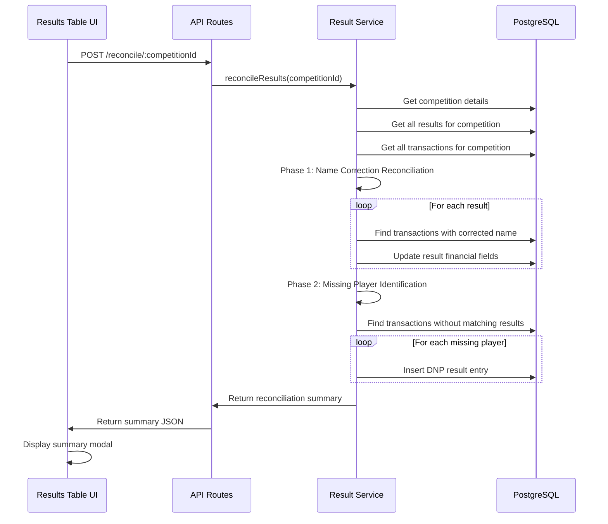

# Design Document: Competition Results Reconciliation

## Overview

The competition results reconciliation feature provides a mechanism to synchronize financial transaction data with competition results after manual edits. When administrators correct player names or when players with transactions don't appear in results, this feature ensures financial integrity by reassigning transactions and adding missing players as "Did Not Play" (DNP) entries.

This design builds upon the existing `populateFromTransactions` method in the CompetitionResultService, extending it to handle bidirectional reconciliation: not only populating financial fields from transactions, but also identifying and correcting mismatches between result names and transaction names, and adding missing players who have financial records but no result entries.

The reconciliation process is triggered manually by administrators through a UI button in the results table, providing transparency and control over when financial data is synchronized.

## Architecture

### System Components

The reconciliation feature integrates into the existing three-tier architecture:

1. **Frontend Layer** (resultsTable.js)
   - Adds reconciliation trigger button to results table header
   - Displays reconciliation summary modal with changes made
   - Handles user interaction and error display

2. **Backend API Layer** (competitionResult.routes.ts)
   - Exposes POST endpoint: `/api/competition-results/competitions/:competitionId/reconcile`
   - Validates competition existence
   - Returns reconciliation summary

3. **Service Layer** (competitionResult.service.ts)
   - Implements core reconciliation logic
   - Manages database transactions for atomic operations
   - Performs name matching and transaction reassignment
   - Identifies and adds missing players

4. **Data Layer** (PostgreSQL)
   - Queries transactions, competition_results, and flagged_transactions tables
   - Uses case-insensitive name matching (UPPER function)
   - Maintains referential integrity through foreign keys

### Data Flow



### Reconciliation Phases

The reconciliation process executes in two distinct phases within a single database transaction:

**Phase 1: Name Correction Reconciliation**
- Iterates through existing competition results
- For each result, queries transactions matching the current player name
- Recalculates entry_paid, competition_refund, and swindle_money_paid
- Updates result record with new financial values
- Tracks number of results updated

**Phase 2: Missing Player Reconciliation**
- Identifies all unique player names from transactions for the competition
- Compares against existing result player names (case-insensitive)
- For each missing player:
  - Calculates financial totals from their transactions
  - Creates new result entry with position "DNP"
  - Assigns next available finishing_position (max + 1)
  - Tracks number of DNP entries added

Both phases execute atomically - if any error occurs, all changes are rolled back.

## Components and Interfaces

### Frontend Component: ResultsTable

**New Method: `handleReconcile()`**
```javascript
async handleReconcile() {
  // Trigger reconciliation API call
  // Display loading state
  // Show summary modal on success
  // Handle errors with user-friendly messages
}
```

**UI Changes:**
- Add "Reconcile Results" button to results table header (next to "Add Manual Entry")
- Create reconciliation summary modal component
- Display summary with:
  - Number of name corrections processed
  - Number of DNP entries added
  - Total transaction value reconciled
  - List of errors (if any)

### Backend API Endpoint

**Route:** `POST /api/competition-results/competitions/:competitionId/reconcile`

**Request:**
- Path parameter: `competitionId` (number)
- No request body required

**Response:**
```typescript
{
  success: boolean;
  summary: {
    nameCorrections: number;
    dnpEntriesAdded: number;
    totalValueReconciled: number;
    errors: string[];
  };
}
```

**Status Codes:**
- 200: Reconciliation completed successfully
- 404: Competition not found
- 500: Server error during reconciliation

### Service Layer: CompetitionResultService

**New Method: `reconcileResults(competitionId: number)`**

```typescript
interface ReconciliationSummary {
  nameCorrections: number;
  dnpEntriesAdded: number;
  totalValueReconciled: number;
  errors: string[];
}

async reconcileResults(competitionId: number): Promise<ReconciliationSummary>
```

**Implementation Strategy:**

1. **Validation Phase**
   - Verify competition exists
   - Get competition name for transaction matching

2. **Phase 1: Name Correction Reconciliation**
   - Query all existing results for competition
   - For each result:
     - Query transactions matching result.playerName (case-insensitive)
     - Calculate entry_paid (sum of Sale transactions)
     - Calculate competition_refund (sum of Refund transactions)
     - Calculate swindle_money_paid (sum from flagged_transactions)
     - Update result with new financial values
     - Track total value reconciled

3. **Phase 2: Missing Player Reconciliation**
   - Query all distinct player names from transactions for competition
   - Query all distinct player names from results
   - Identify missing players (in transactions but not in results)
   - For each missing player:
     - Calculate financial totals
     - Determine next finishing_position (max + 1)
     - Insert new result with position "DNP"
     - Track DNP entries added

4. **Summary Generation**
   - Count name corrections (results updated in Phase 1)
   - Count DNP entries (results inserted in Phase 2)
   - Sum total transaction value reconciled
   - Collect any errors encountered

### Database Queries

**Query 1: Get Competition Details**
```sql
SELECT id, name FROM competitions WHERE id = $1
```

**Query 2: Get All Results for Competition**
```sql
SELECT * FROM competition_results 
WHERE competition_id = $1 
ORDER BY finishing_position ASC
```

**Query 3: Calculate Entry Paid for Player**
```sql
SELECT COALESCE(SUM(CAST(total AS NUMERIC)), 0) as sum
FROM transactions
WHERE UPPER(player) = UPPER($1)
  AND UPPER(competition) = UPPER($2)
  AND type = 'Sale'
```

**Query 4: Calculate Competition Refund for Player**
```sql
SELECT COALESCE(SUM(CAST(total AS NUMERIC)), 0) as sum
FROM transactions
WHERE UPPER(player) = UPPER($1)
  AND UPPER(competition) = UPPER($2)
  AND type = 'Refund'
```

**Query 5: Calculate Swindle Money for Player**
```sql
SELECT COALESCE(SUM(CAST(t.total AS NUMERIC)), 0) as sum
FROM flagged_transactions ft
JOIN transactions t ON ft.transaction_id = t.id
WHERE (UPPER(t.player) = UPPER($1) OR UPPER(t.member) = UPPER($1))
  AND ft.competition_id = $2
```

**Query 6: Get All Transaction Players for Competition**
```sql
SELECT DISTINCT 
  CASE 
    WHEN player != '' THEN player 
    ELSE member 
  END as player_name
FROM transactions
WHERE UPPER(competition) = UPPER($1)
  AND (player != '' OR member != '')
```

**Query 7: Update Result Financial Fields**
```sql
UPDATE competition_results
SET entry_paid = $1,
    competition_refund = $2,
    swindle_money_paid = $3,
    updated_at = CURRENT_TIMESTAMP
WHERE id = $4
```

**Query 8: Insert DNP Result**
```sql
INSERT INTO competition_results 
(competition_id, finishing_position, player_name, entry_paid, 
 competition_refund, swindle_money_paid)
VALUES ($1, $2, $3, $4, $5, $6)
RETURNING id
```

**Query 9: Get Max Finishing Position**
```sql
SELECT COALESCE(MAX(finishing_position), 0) as max_position
FROM competition_results
WHERE competition_id = $1
```

## Data Models

### Existing Models (No Changes Required)

**CompetitionResult**
```typescript
interface CompetitionResult {
  id: number;
  competitionId: number;
  finishingPosition: number | string; // number or "DNP"
  playerName: string;
  grossScore: number | null;
  handicap: number | null;
  nettScore: number | null;
  entryPaid: number;
  competitionRefund: number;
  swindleMoneyPaid: number;
  createdAt: Date;
  updatedAt: Date;
}
```

**Transaction**
```typescript
interface Transaction {
  id: number;
  date: string;
  time: string;
  till: string;
  type: string; // 'Sale', 'Refund', etc.
  member: string;
  player: string;
  competition: string;
  price: string;
  discount: string;
  subtotal: string;
  vat: string;
  total: string;
  sourceRowIndex: number;
  isComplete: boolean;
  createdAt: Date;
  updatedAt: Date;
}
```

**FlaggedTransaction**
```typescript
interface FlaggedTransaction {
  id: number;
  transactionId: number;
  competitionId: number | null;
  flaggedAt: Date;
  createdAt: Date;
  updatedAt: Date;
}
```

### New Models

**ReconciliationSummary**
```typescript
interface ReconciliationSummary {
  nameCorrections: number;        // Count of results updated in Phase 1
  dnpEntriesAdded: number;        // Count of DNP entries created in Phase 2
  totalValueReconciled: number;   // Sum of all transaction values processed
  errors: string[];               // List of error messages (if any)
}
```

**ReconciliationResponse**
```typescript
interface ReconciliationResponse {
  success: boolean;
  summary: ReconciliationSummary;
}
```

### Data Integrity Constraints

1. **Atomic Operations**: All reconciliation changes occur within a single database transaction
2. **Position Uniqueness**: DNP entries use string "DNP" for finishing_position to avoid conflicts
3. **Name Matching**: Case-insensitive matching (UPPER function) for player names
4. **Transaction Preservation**: Original transaction records are never modified
5. **Financial Accuracy**: Sum of all financial fields must equal sum of corresponding transactions


## Correctness Properties

A property is a characteristic or behavior that should hold true across all valid executions of a system - essentially, a formal statement about what the system should do. Properties serve as the bridge between human-readable specifications and machine-verifiable correctness guarantees.

### Property 1: Reconciliation Executes Both Phases

For any competition with results and transactions, when reconciliation is triggered, the system should execute both name correction reconciliation (Phase 1) and missing player reconciliation (Phase 2), updating existing results and adding DNP entries as needed.

**Validates: Requirements 1.2**

### Property 2: Summary Display After Reconciliation

For any reconciliation operation, when it completes, the system should display a summary containing the number of name corrections, number of DNP entries added, total value reconciled, and any errors encountered.

**Validates: Requirements 1.3, 6.1, 6.2, 6.3, 6.4, 6.5**

### Property 3: Name Correction Updates Financial Fields

For any competition result with a player name that matches transactions in the database, when reconciliation executes, the system should recalculate and update all three financial fields (entry_paid, competition_refund, swindle_money_paid) based on the sum of matching transactions.

**Validates: Requirements 2.1, 2.2, 2.3, 2.4**

### Property 4: No Match Preserves Financial Fields

For any competition result with a player name that has no matching transactions in the database, when reconciliation executes, the system should leave the financial fields unchanged.

**Validates: Requirements 2.5**

### Property 5: Missing Players Are Identified and Added

For any player name that appears in transactions for a competition but does not appear in the competition results, when reconciliation executes, the system should create a new result entry with position "DNP", calculate all financial fields from their transactions, and append it to the results list.

**Validates: Requirements 3.1, 3.2, 3.3, 3.4, 4.1, 4.2, 4.3, 4.5**

### Property 6: Existing Results Order Preserved

For any competition with existing results, when reconciliation executes and adds DNP entries, the finishing_position values of all pre-existing results should remain unchanged.

**Validates: Requirements 4.4**

### Property 7: Financial Conservation

For any competition, when reconciliation completes, the sum of all entry_paid fields across all results should equal the sum of all Sale transactions for that competition, the sum of all competition_refund fields should equal the sum of all Refund transactions, and the sum of all swindle_money_paid fields should equal the sum of all flagged transactions.

**Validates: Requirements 5.1, 5.2, 5.5**

### Property 8: Transaction Immutability

For any reconciliation operation, the transactions table should remain completely unchanged - no transaction records should be modified, deleted, or created.

**Validates: Requirements 5.4**

### Property 9: Error Reporting

For any reconciliation operation where errors occur during processing, the system should include error details in the returned summary with specific information about what failed.

**Validates: Requirements 5.3, 6.4**

### Property 10: Reconciliation Atomicity

For any reconciliation operation, if any error occurs during Phase 1 or Phase 2, all database changes should be rolled back, leaving the competition_results table in its original state.

**Validates: Requirements 5.1** (implicit - maintaining data integrity requires atomicity)


## Error Handling

### Error Categories

**1. Validation Errors**
- Competition not found (404)
- Invalid competition ID format
- Competition has no results

**2. Database Errors**
- Connection failures
- Query execution errors
- Transaction rollback failures
- Constraint violations

**3. Data Integrity Errors**
- Duplicate player names in transactions
- Missing required transaction fields
- Invalid transaction amounts (non-numeric)
- Orphaned flagged_transactions

**4. Business Logic Errors**
- Unable to calculate financial totals
- Position assignment conflicts
- Name matching ambiguities

### Error Handling Strategy

**Transaction Rollback**
- All reconciliation operations execute within a database transaction
- Any error triggers automatic rollback
- Database state returns to pre-reconciliation state
- Error details captured in summary.errors array

**User-Facing Error Messages**
```javascript
// Frontend error display
{
  "Competition not found": "The selected competition could not be found. Please refresh and try again.",
  "Database error": "A database error occurred during reconciliation. Please try again later.",
  "No results found": "This competition has no results to reconcile.",
  "Transaction calculation error": "Unable to calculate financial totals for some players. Check transaction data."
}
```

**Error Logging**
- Backend logs all errors with stack traces
- Includes competition ID, player names, and transaction IDs
- Logs query parameters for debugging
- Tracks reconciliation attempt timestamps

**Partial Success Handling**
- If Phase 1 completes but Phase 2 fails, entire operation rolls back
- No partial reconciliation states allowed
- Summary always reflects complete success or complete failure
- Errors array provides details for debugging

**Recovery Procedures**
1. User reviews error message in UI
2. Administrator checks backend logs for details
3. Data integrity verified through manual queries
4. Transaction data corrected if needed
5. Reconciliation re-attempted

### Error Response Format

```typescript
// Success response
{
  success: true,
  summary: {
    nameCorrections: 5,
    dnpEntriesAdded: 2,
    totalValueReconciled: 450.00,
    errors: []
  }
}

// Error response
{
  success: false,
  summary: {
    nameCorrections: 0,
    dnpEntriesAdded: 0,
    totalValueReconciled: 0,
    errors: [
      "Failed to calculate entry paid for player John Doe: Invalid transaction amount",
      "Database transaction rolled back"
    ]
  }
}
```

## Testing Strategy

### Dual Testing Approach

This feature requires both unit tests and property-based tests to ensure correctness:

- **Unit tests**: Verify specific examples, edge cases, and error conditions
- **Property tests**: Verify universal properties across all inputs using randomized data
- Together they provide comprehensive coverage: unit tests catch concrete bugs, property tests verify general correctness

### Unit Testing

**Frontend Tests (resultsTable.test.js)**
- Reconciliation button renders in results table header
- Button click triggers API call with correct competition ID
- Success modal displays with summary data
- Error messages display when API call fails
- Loading state shows during reconciliation
- Modal closes when user clicks close button

**Backend API Tests (competitionResult.routes.test.ts)**
- POST /reconcile/:competitionId returns 200 with valid ID
- Returns 404 when competition doesn't exist
- Returns 500 on database errors
- Response includes all required summary fields
- Validates competition ID parameter

**Service Layer Tests (competitionResult.service.test.ts)**

*Name Correction Tests:*
- Updates financial fields when player name matches transactions
- Leaves fields unchanged when no transactions match
- Handles multiple transactions for same player
- Calculates entry_paid from Sale transactions
- Calculates competition_refund from Refund transactions
- Calculates swindle_money_paid from flagged_transactions
- Handles case-insensitive name matching

*Missing Player Tests:*
- Identifies players in transactions but not in results
- Creates DNP entry for missing player
- Sets finishing_position to "DNP"
- Calculates correct financial totals for DNP entry
- Appends DNP entries after existing results
- Handles multiple missing players

*Error Handling Tests:*
- Rolls back transaction on Phase 1 error
- Rolls back transaction on Phase 2 error
- Returns errors in summary
- Logs error details
- Handles invalid transaction amounts
- Handles missing competition

*Edge Cases:*
- Empty results list
- Empty transactions list
- Player with only refunds (no entry)
- Player with negative refund (credit)
- Duplicate player names in transactions
- Special characters in player names
- Very long player names

### Property-Based Testing

Property-based tests use the **fast-check** library for JavaScript/TypeScript. Each test runs a minimum of 100 iterations with randomized inputs.

**Test Configuration:**
```javascript
fc.assert(
  fc.property(/* generators */, (/* inputs */) => {
    // Property assertion
  }),
  { numRuns: 100 }
);
```

**Property Test 1: Reconciliation Executes Both Phases**
```javascript
// Feature: competition-results-reconciliation, Property 1
// For any competition with results and transactions, reconciliation should execute both phases
```
- Generate: Random competition with results and transactions
- Execute: Reconciliation
- Assert: Summary shows nameCorrections > 0 OR dnpEntriesAdded > 0

**Property Test 2: Summary Display After Reconciliation**
```javascript
// Feature: competition-results-reconciliation, Property 2
// For any reconciliation, summary should contain all required fields
```
- Generate: Random competition
- Execute: Reconciliation
- Assert: Summary has nameCorrections, dnpEntriesAdded, totalValueReconciled, errors fields

**Property Test 3: Name Correction Updates Financial Fields**
```javascript
// Feature: competition-results-reconciliation, Property 3
// For any result with matching transactions, financial fields should be updated
```
- Generate: Random result with matching transactions
- Execute: Reconciliation
- Assert: entry_paid = sum of Sale transactions, competition_refund = sum of Refund transactions, swindle_money_paid = sum of flagged transactions

**Property Test 4: No Match Preserves Financial Fields**
```javascript
// Feature: competition-results-reconciliation, Property 4
// For any result with no matching transactions, financial fields should be unchanged
```
- Generate: Random result with no matching transactions
- Execute: Reconciliation
- Assert: Financial fields remain at original values

**Property Test 5: Missing Players Are Identified and Added**
```javascript
// Feature: competition-results-reconciliation, Property 5
// For any player in transactions but not in results, DNP entry should be created
```
- Generate: Random transactions with player not in results
- Execute: Reconciliation
- Assert: New result exists with player name, position = "DNP", correct financial totals

**Property Test 6: Existing Results Order Preserved**
```javascript
// Feature: competition-results-reconciliation, Property 6
// For any competition, existing result positions should not change
```
- Generate: Random competition with results
- Capture: Original finishing_position values
- Execute: Reconciliation
- Assert: All original finishing_position values unchanged

**Property Test 7: Financial Conservation**
```javascript
// Feature: competition-results-reconciliation, Property 7
// For any competition, sum of result financial fields should equal sum of transactions
```
- Generate: Random competition with results and transactions
- Execute: Reconciliation
- Assert: sum(entry_paid) = sum(Sale transactions), sum(competition_refund) = sum(Refund transactions), sum(swindle_money_paid) = sum(flagged transactions)

**Property Test 8: Transaction Immutability**
```javascript
// Feature: competition-results-reconciliation, Property 8
// For any reconciliation, transactions table should remain unchanged
```
- Generate: Random competition
- Capture: Snapshot of transactions table
- Execute: Reconciliation
- Assert: Transactions table identical to snapshot

**Property Test 9: Error Reporting**
```javascript
// Feature: competition-results-reconciliation, Property 9
// For any reconciliation with errors, errors should be in summary
```
- Generate: Random competition with invalid data (to trigger errors)
- Execute: Reconciliation
- Assert: summary.errors.length > 0 AND success = false

**Property Test 10: Reconciliation Atomicity**
```javascript
// Feature: competition-results-reconciliation, Property 10
// For any reconciliation that fails, all changes should be rolled back
```
- Generate: Random competition
- Capture: Snapshot of competition_results table
- Execute: Reconciliation with injected error
- Assert: competition_results table identical to snapshot

### Test Data Generators

**Competition Generator:**
```javascript
fc.record({
  id: fc.integer({ min: 1, max: 1000 }),
  name: fc.string({ minLength: 5, maxLength: 50 }),
  date: fc.date()
})
```

**Result Generator:**
```javascript
fc.record({
  id: fc.integer({ min: 1, max: 10000 }),
  competitionId: fc.integer({ min: 1, max: 1000 }),
  finishingPosition: fc.integer({ min: 1, max: 100 }),
  playerName: fc.string({ minLength: 3, maxLength: 50 }),
  entryPaid: fc.float({ min: 0, max: 100 }),
  competitionRefund: fc.float({ min: 0, max: 100 }),
  swindleMoneyPaid: fc.float({ min: 0, max: 100 })
})
```

**Transaction Generator:**
```javascript
fc.record({
  id: fc.integer({ min: 1, max: 10000 }),
  player: fc.string({ minLength: 3, maxLength: 50 }),
  competition: fc.string({ minLength: 5, maxLength: 50 }),
  type: fc.constantFrom('Sale', 'Refund'),
  total: fc.float({ min: 0, max: 100 }).map(n => n.toFixed(2))
})
```

### Integration Testing

**End-to-End Reconciliation Flow:**
1. Create competition with results
2. Create transactions for some players
3. Modify player names in results
4. Add transactions for players not in results
5. Trigger reconciliation via UI
6. Verify summary modal displays correct counts
7. Verify database reflects all changes
8. Verify financial totals are correct

**Database Integration:**
- Test with real PostgreSQL database
- Verify transaction rollback behavior
- Test concurrent reconciliation attempts
- Verify foreign key constraints maintained
- Test with large datasets (1000+ results)

### Performance Testing

**Benchmarks:**
- Reconciliation of 100 results: < 2 seconds
- Reconciliation of 1000 results: < 10 seconds
- Database transaction overhead: < 100ms
- UI response time: < 500ms

**Load Testing:**
- Multiple concurrent reconciliation requests
- Large transaction datasets (10,000+ records)
- Memory usage during reconciliation
- Database connection pool behavior

