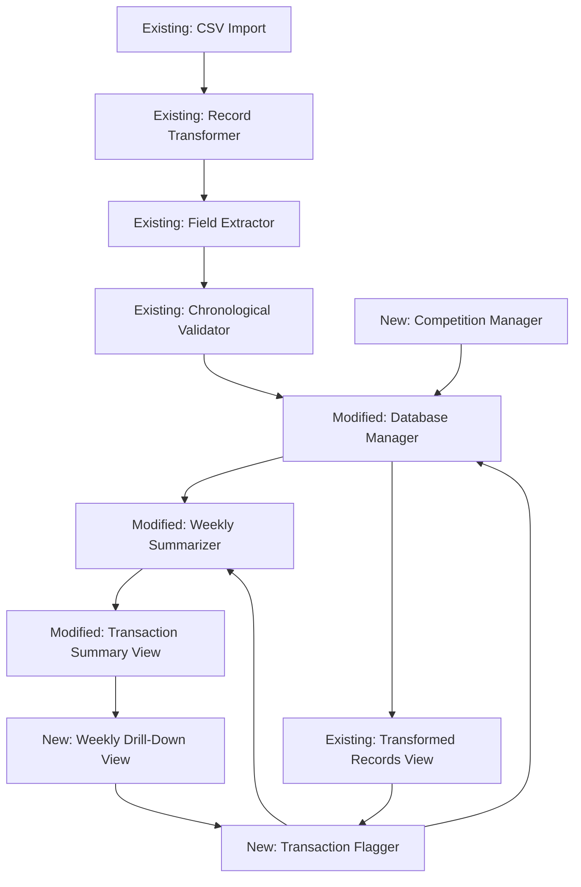

# Design Document: Competition Winnings Tracking

## Overview

This system extends the existing competition account management functionality by adding competition tracking and transaction flagging capabilities. The architecture introduces two new data models (Competition and enhanced Transaction with flagging fields), three new components (Competition Manager, Transaction Flagger, Weekly Drill-Down View), and modifications to existing components (Database Manager, Weekly Summarizer, Transaction Summary View).

The core challenge is maintaining data integrity across competition management, transaction flagging, and weekly summary calculations while providing an intuitive UI for retrospective data correction. The system must handle the relationship between competitions and transactions, prevent orphaned references, and efficiently recalculate rolling balances when historical data changes.

Key design decisions:
- Competition stored in separate IndexedDB table with auto-incrementing ID
- Transaction records extended with isWinning (boolean) and winningCompetitionId (foreign key)
- Database schema version bump triggers migration for existing records
- Weekly summaries recalculated from affected week forward (not entire dataset)
- UI provides inline flagging controls in both main view and drill-down view
- Competition deletion prevented when transactions reference it

## Architecture

### System Components



### Component Responsibilities

**Competition Manager** (New)
- CRUD operations for competition records
- Uniqueness validation for competition names
- Deletion protection when transactions are associated
- Provides competition list for selection interfaces

**Transaction Flagger** (New)
- Updates transaction records with isWinning and winningCompetitionId
- Validates only "Topup (Competitions)" can be flagged
- Triggers weekly summary recalculation after flag changes
- Provides UI controls for flagging/unflagging

**Weekly Drill-Down View** (New)
- Displays all transactions for a selected weekly period
- Provides inline flagging controls for "Topup (Competitions)" transactions
- Shows current flag status and associated competition
- Refreshes weekly summary after flag changes

**Database Manager** (Modified)
- Schema upgraded to version 2 with new fields
- Adds update() method for modifying existing records
- Adds getByCompetitionId() method for deletion checks
- Handles migration of existing records

**Weekly Summarizer** (Modified)
- Calculates Competition Winnings Paid from flagged transactions
- Recalculates affected weeks when flags change
- Maintains rolling balance consistency

**Transaction Summary View** (Modified)
- Makes weekly rows clickable for drill-down
- Displays actual Competition Winnings Paid values
- Refreshes when flag changes occur

**Transformed Records View** (Modified)
- Adds flag controls for "Topup (Competitions)" transactions
- Shows flag status and associated competition
- Provides competition selection interface

## Components and Interfaces

### Competition Manager Interface

```typescript
interface CompetitionManager {
  create(name: string): Promise<Competition>
  update(id: number, name: string): Promise<Competition>
  delete(id: number): Promise<DeleteResult>
  getAll(): Promise<Competition[]>
  getById(id: number): Promise<Competition | null>
  checkAssociatedTransactions(id: number): Promise<number>
}

interface Competition {
  id: number              // Auto-incrementing primary key
  name: string           // Unique competition name
  createdAt: Date        // Timestamp of creation
}

type DeleteResult = 
  | { success: true }
  | { success: false; reason: 'has_transactions'; count: number }
```

**Competition CRUD Operations:**

```
Function create(name: string) -> Competition:
  // Validate name
  If name is empty or only whitespace:
    Throw Error("Competition name cannot be empty")
  
  // Check uniqueness
  existingCompetitions = await getAll()
  If existingCompetitions contains competition with same name (case-insensitive):
    Throw Error("Competition name must be unique")
  
  // Create competition
  competition = {
    name: name.trim(),
    createdAt: new Date()
  }
  
  // Store in database
  transaction = db.transaction(["competitions"], "readwrite")
  store = transaction.objectStore("competitions")
  request = store.add(competition)
  
  Await request completion
  competition.id = request.result
  
  Return competition

Function update(id: number, name: string) -> Competition:
  // Validate name
  If name is empty or only whitespace:
    Throw Error("Competition name cannot be empty")
  
  // Get existing competition
  existing = await getById(id)
  If existing is null:
    Throw Error("Competition not found")
  
  // Check uniqueness (excluding current competition)
  allCompetitions = await getAll()
  If allCompetitions contains competition with same name AND different id:
    Throw Error("Competition name must be unique")
  
  // Update competition
  existing.name = name.trim()
  
  transaction = db.transaction(["competitions"], "readwrite")
  store = transaction.objectStore("competitions")
  store.put(existing)
  
  Await transaction completion
  Return existing

Function delete(id: number) -> DeleteResult:
  // Check for associated transactions
  count = await checkAssociatedTransactions(id)
  
  If count > 0:
    Return { success: false, reason: 'has_transactions', count: count }
  
  // Delete competition
  transaction = db.transaction(["competitions"], "readwrite")
  store = transaction.objectStore("competitions")
  store.delete(id)
  
  Await transaction completion
  Return { success: true }

Function checkAssociatedTransactions(id: number) -> number:
  transaction = db.transaction(["summarised_period_transactions"], "readonly")
  store = transaction.objectStore("summarised_period_transactions")
  
  // Get all records and count those with matching winningCompetitionId
  allRecords = await store.getAll()
  count = allRecords.filter(r => r.winningCompetitionId === id).length
  
  Return count
```

### Transaction Flagger Interface

```typescript
interface TransactionFlagger {
  flagTransaction(recordId: number, competitionId: number): Promise<void>
  unflagTransaction(recordId: number): Promise<void>
  updateFlag(recordId: number, competitionId: number): Promise<void>
  canFlag(record: EnhancedRecord): boolean
}

interface FlaggedTransaction extends EnhancedRecord {
  isWinning: boolean
  winningCompetitionId: number | null
  winningCompetitionName?: string  // Populated when displaying
}
```

**Flagging Operations:**

```
Function flagTransaction(recordId: number, competitionId: number) -> void:
  // Get transaction record
  transaction = await databaseManager.getById(recordId)
  
  If transaction is null:
    Throw Error("Transaction not found")
  
  // Validate transaction type
  If transaction.type !== "Topup (Competitions)":
    Throw Error("Only Topup (Competitions) transactions can be flagged")
  
  // Validate competition exists
  competition = await competitionManager.getById(competitionId)
  If competition is null:
    Throw Error("Competition not found")
  
  // Update transaction
  transaction.isWinning = true
  transaction.winningCompetitionId = competitionId
  
  await databaseManager.update(recordId, transaction)
  
  // Trigger recalculation
  await weeklySummarizer.recalculateFromDate(transaction.date)

Function unflagTransaction(recordId: number) -> void:
  // Get transaction record
  transaction = await databaseManager.getById(recordId)
  
  If transaction is null:
    Throw Error("Transaction not found")
  
  // Update transaction
  transaction.isWinning = false
  transaction.winningCompetitionId = null
  
  await databaseManager.update(recordId, transaction)
  
  // Trigger recalculation
  await weeklySummarizer.recalculateFromDate(transaction.date)

Function updateFlag(recordId: number, competitionId: number) -> void:
  // Get transaction record
  transaction = await databaseManager.getById(recordId)
  
  If transaction is null:
    Throw Error("Transaction not found")
  
  // Validate competition exists
  competition = await competitionManager.getById(competitionId)
  If competition is null:
    Throw Error("Competition not found")
  
  // Update transaction
  transaction.winningCompetitionId = competitionId
  
  await databaseManager.update(recordId, transaction)
  
  // Trigger recalculation
  await weeklySummarizer.recalculateFromDate(transaction.date)

Function canFlag(record: EnhancedRecord) -> boolean:
  Return record.type === "Topup (Competitions)"
```

### Weekly Drill-Down View Interface

```typescript
interface WeeklyDrillDownView {
  show(weekStart: Date, weekEnd: Date): Promise<void>
  hide(): void
  refresh(): Promise<void>
}
```

**Drill-Down Display:**

```
Function show(weekStart: Date, weekEnd: Date) -> void:
  // Query transactions for the week
  transactions = await databaseManager.getByDateRange(weekStart, weekEnd)
  
  // Enrich with competition names
  competitions = await competitionManager.getAll()
  competitionMap = new Map(competitions.map(c => [c.id, c.name]))
  
  enrichedTransactions = transactions.map(t => ({
    ...t,
    winningCompetitionName: t.winningCompetitionId 
      ? competitionMap.get(t.winningCompetitionId) 
      : null
  }))
  
  // Render UI
  container = document.getElementById('drill-down-container')
  container.innerHTML = renderDrillDownTable(enrichedTransactions, weekStart, weekEnd)
  container.style.display = 'block'
  
  // Attach event listeners for flagging
  attachFlagEventListeners(enrichedTransactions)

Function renderDrillDownTable(transactions, weekStart, weekEnd) -> string:
  html = `
    <div class="drill-down-overlay">
      <div class="drill-down-modal">
        <div class="drill-down-header">
          <h2>Transactions for Week ${formatDate(weekStart)} to ${formatDate(weekEnd)}</h2>
          <button class="close-btn" onclick="weeklyDrillDown.hide()">×</button>
        </div>
        <table class="drill-down-table">
          <thead>
            <tr>
              <th>Date</th>
              <th>Time</th>
              <th>Type</th>
              <th>Member</th>
              <th>Total</th>
              <th>Flag Status</th>
              <th>Actions</th>
            </tr>
          </thead>
          <tbody>
  `
  
  For each transaction in transactions:
    flagIcon = transaction.isWinning ? '🏆' : ''
    competitionInfo = transaction.winningCompetitionName 
      ? `<span class="competition-badge">${transaction.winningCompetitionName}</span>` 
      : ''
    
    actionButton = ''
    If transaction.type === "Topup (Competitions)":
      If transaction.isWinning:
        actionButton = `<button class="edit-flag-btn" data-id="${transaction.id}">Edit Flag</button>`
      Else:
        actionButton = `<button class="flag-btn" data-id="${transaction.id}">Flag as Winnings</button>`
    
    html += `
      <tr class="${transaction.isWinning ? 'flagged-row' : ''}">
        <td>${transaction.date}</td>
        <td>${transaction.time}</td>
        <td>${transaction.type}</td>
        <td>${transaction.member || transaction.player}</td>
        <td>£${parseFloat(transaction.total).toFixed(2)}</td>
        <td>${flagIcon} ${competitionInfo}</td>
        <td>${actionButton}</td>
      </tr>
    `
  
  html += `
          </tbody>
        </table>
      </div>
    </div>
  `
  
  Return html
```

### Database Manager Extensions

**Updated Schema (Version 2):**

```typescript
// Database name: "CompetitionAccountDB"
// Version: 2 (upgraded from 1)

interface DBSchemaV2 {
  summarised_period_transactions: {
    key: number
    value: {
      // Existing fields
      date: string
      time: string
      till: string
      type: string
      member: string
      player: string
      competition: string
      price: string
      discount: string
      subtotal: string
      vat: string
      total: string
      sourceRowIndex: number
      isComplete: boolean
      
      // New fields
      isWinning: boolean
      winningCompetitionId: number | null
    }
    indexes: {
      'by-date': string
      'by-datetime': [string, string]
      'by-isWinning': boolean  // New index
    }
  }
  
  competitions: {
    key: number
    value: {
      id: number
      name: string
      createdAt: Date
    }
    indexes: {
      'by-name': string
    }
  }
}
```

**Database Migration:**

```
Function initialize() -> void:
  request = indexedDB.open("CompetitionAccountDB", 2)  // Version 2
  
  request.onupgradeneeded = (event):
    db = event.target.result
    oldVersion = event.oldVersion
    
    // Upgrade from version 1 to 2
    If oldVersion < 2:
      // Add competitions table
      If not db.objectStoreNames.contains("competitions"):
        competitionsStore = db.createObjectStore("competitions", 
          { keyPath: "id", autoIncrement: true })
        competitionsStore.createIndex("by-name", "name", { unique: true })
      
      // Add index to transactions
      If db.objectStoreNames.contains("summarised_period_transactions"):
        // Note: Can't modify existing object store in same transaction
        // New fields (isWinning, winningCompetitionId) will be added on read
        // by treating missing fields as defaults
        
        transaction = event.target.transaction
        transactionStore = transaction.objectStore("summarised_period_transactions")
        
        If not transactionStore.indexNames.contains("by-isWinning"):
          transactionStore.createIndex("by-isWinning", "isWinning", { unique: false })
  
  Await request completion
  Return db connection

Function getById(id: number) -> EnhancedRecord:
  transaction = db.transaction(["summarised_period_transactions"], "readonly")
  store = transaction.objectStore("summarised_period_transactions")
  request = store.get(id)
  
  Await request completion
  record = request.result
  
  // Apply defaults for new fields if missing
  If record:
    If record.isWinning is undefined:
      record.isWinning = false
    If record.winningCompetitionId is undefined:
      record.winningCompetitionId = null
  
  Return record

Function update(id: number, record: EnhancedRecord) -> void:
  transaction = db.transaction(["summarised_period_transactions"], "readwrite")
  store = transaction.objectStore("summarised_period_transactions")
  
  // Ensure record has id
  record.id = id
  
  request = store.put(record)
  Await request completion
```

### Weekly Summarizer Modifications

**Updated Winnings Calculation:**

```
Function calculatePotComponents(records: EnhancedRecord[]) -> Object:
  // Winnings Paid: Sum of Total for flagged transactions
  winningsPaid = sumWhere(
    records,
    r => r.isWinning === true
  )
  
  // Competition Costs: Placeholder (0)
  costs = 0
  
  Return {
    winningsPaid,
    costs
  }

Function recalculateFromDate(startDate: string) -> void:
  // Get all records from database
  allRecords = await databaseManager.getAll()
  
  // Find the Monday of the week containing startDate
  affectedWeekStart = getMondayOfWeek(parseDate(startDate))
  
  // Filter records from affected week onward
  affectedRecords = allRecords.filter(r => 
    parseDate(r.date) >= affectedWeekStart
  )
  
  // Regenerate summaries from affected week
  // This will recalculate all rolling balances correctly
  summaries = generateSummaries(allRecords)
  
  // Update the Transaction Summary View
  transactionSummaryView.render(summaries)
```

### Transaction Summary View Modifications

**Clickable Rows:**

```
Function render(summaries: WeeklySummary[]) -> void:
  tbody = document.getElementById('summary-body')
  tbody.innerHTML = ''
  
  If summaries is empty:
    Show empty state
    Return
  
  For each summary in summaries:
    row = createTableRow()
    
    // Make row clickable
    row.classList.add('clickable-row')
    row.dataset.weekStart = summary.fromDate.toISOString()
    row.dataset.weekEnd = summary.toDate.toISOString()
    row.onclick = () => {
      weeklyDrillDown.show(summary.fromDate, summary.toDate)
    }
    
    // Date columns
    row.addCell(formatDate(summary.fromDate))
    row.addCell(formatDate(summary.toDate))
    
    // Competition Purse columns
    row.addCell(formatCurrency(summary.startingPurse))
    row.addCell(formatCurrency(summary.purseApplicationTopUp))
    row.addCell(formatCurrency(summary.purseTillTopUp))
    row.addCell(formatCurrency(summary.competitionEntries))
    row.addCell(formatCurrency(-summary.competitionRefunds))
    row.addCell(formatCurrency(summary.finalPurse))
    
    // Competition Pot columns
    row.addCell(formatCurrency(summary.startingPot))
    row.addCell(formatCurrency(summary.winningsPaid))  // Now shows actual value
    row.addCell(formatCurrency(summary.competitionCosts))
    row.addCell(formatCurrency(summary.finalPot))
    
    tbody.appendChild(row)
```

## Data Models

### Competition Model

```typescript
interface Competition {
  id: number              // Auto-incrementing primary key
  name: string           // Unique competition name (max 255 chars)
  createdAt: Date        // Timestamp of creation
}
```

**Validation Rules:**
- name: Required, non-empty, unique (case-insensitive), trimmed
- createdAt: Auto-generated on creation

### Enhanced Transaction Model

```typescript
interface EnhancedRecord {
  // Existing fields from competition-account-management
  id?: number            // Auto-incrementing primary key (added by IndexedDB)
  date: string
  time: string
  till: string
  type: string
  member: string
  player: string
  competition: string
  price: string
  discount: string
  subtotal: string
  vat: string
  total: string
  sourceRowIndex: number
  isComplete: boolean
  
  // New fields for winnings tracking
  isWinning: boolean                  // Default: false
  winningCompetitionId: number | null // Default: null, Foreign key to competitions.id
}
```

**Validation Rules:**
- isWinning can only be true if type === "Topup (Competitions)"
- winningCompetitionId must reference valid competition.id or be null
- If isWinning is false, winningCompetitionId must be null

### Data Flow

```
Existing Flow:
  CSV File → Parser → Transformer → Field Extractor → 
  Chronological Validator → Database Manager → IndexedDB → 
  Weekly Summarizer → Transaction Summary View

Extended Flow for Flagging:
  User clicks flag button → Transaction Flagger → 
  Competition Selection UI → User selects competition → 
  Database Manager.update() → IndexedDB → 
  Weekly Summarizer.recalculateFromDate() → 
  Transaction Summary View.render()

Extended Flow for Drill-Down:
  User clicks weekly row → Weekly Drill-Down View → 
  Database Manager.getByDateRange() → 
  Render transactions with flag controls → 
  User flags transaction → (follows flagging flow above) → 
  Refresh drill-down view
```

## UI Design

### Competition Management Interface

**Location:** Accessible via button in main application header

**Layout:**
```html
<div id="competition-manager-container">
  <h2>Manage Competitions</h2>
  
  <div class="competition-form">
    <input type="text" id="competition-name-input" placeholder="Competition Name" />
    <button id="add-competition-btn">Add Competition</button>
  </div>
  
  <div class="competition-list">
    <table>
      <thead>
        <tr>
          <th>Competition Name</th>
          <th>Actions</th>
        </tr>
      </thead>
      <tbody id="competition-list-body">
        <!-- Rows inserted dynamically -->
      </tbody>
    </table>
  </div>
</div>
```

**Interaction Flow:**
1. User clicks "Manage Competitions" button
2. Modal/panel opens showing competition list
3. User enters name and clicks "Add Competition"
4. System validates uniqueness and creates competition
5. List refreshes to show new competition
6. User can click "Edit" to rename or "Delete" to remove
7. If delete fails (has transactions), show error with count

### Transaction Flagging Interface

**Inline Flag Control (Transformed Records View):**
```html
<tr class="transaction-row">
  <td>26-08-2025</td>
  <td>18:19</td>
  <td>Topup (Competitions)</td>
  <td>Alastair REID</td>
  <td>£50.00</td>
  <td>
    <!-- Unflagged state -->
    <button class="flag-btn" data-record-id="123">
      <span class="flag-icon">🏳️</span> Flag as Winnings
    </button>
    
    <!-- OR Flagged state -->
    <div class="flagged-indicator">
      <span class="flag-icon">🏆</span>
      <span class="competition-badge">October Medal 2025</span>
      <button class="edit-flag-btn" data-record-id="123">Edit</button>
    </div>
  </td>
</tr>
```

**Competition Selection Modal:**
```html
<div class="competition-selection-modal">
  <div class="modal-content">
    <h3>Select Competition for Winnings</h3>
    <p>Transaction: £50.00 - Alastair REID - 26-08-2025</p>
    
    <div class="competition-list">
      <button class="competition-option" data-competition-id="1">
        October Medal 2025
      </button>
      <button class="competition-option" data-competition-id="2">
        Summer Cup 2025
      </button>
      <!-- More competitions -->
    </div>
    
    <div class="modal-actions">
      <button class="cancel-btn">Cancel</button>
      <a href="#" class="manage-competitions-link">Manage Competitions</a>
    </div>
  </div>
</div>
```

### Weekly Drill-Down Interface

**Overlay Modal:**
```html
<div class="drill-down-overlay">
  <div class="drill-down-modal">
    <div class="drill-down-header">
      <h2>Transactions for Week 25/08/2025 to 31/08/2025</h2>
      <button class="close-btn">×</button>
    </div>
    
    <div class="drill-down-summary">
      <div class="summary-item">
        <span class="label">Total Transactions:</span>
        <span class="value">47</span>
      </div>
      <div class="summary-item">
        <span class="label">Flagged Winnings:</span>
        <span class="value">£120.00</span>
      </div>
    </div>
    
    <table class="drill-down-table">
      <thead>
        <tr>
          <th>Date</th>
          <th>Time</th>
          <th>Type</th>
          <th>Member/Player</th>
          <th>Total</th>
          <th>Flag Status</th>
          <th>Actions</th>
        </tr>
      </thead>
      <tbody>
        <!-- Transaction rows with inline flag controls -->
      </tbody>
    </table>
  </div>
</div>
```

**Visual Indicators:**
- Flagged rows: Light gold background (#fff9e6)
- Flag icon: 🏆 for flagged, 🏳️ for unflagged
- Competition badge: Pill-shaped badge with competition name
- Clickable rows in summary: Hover effect with pointer cursor

## Error Handling

### Competition Management Errors

**Duplicate Name:**
```
Error: "Competition name 'October Medal 2025' already exists. Please choose a unique name."
Display: Toast notification or inline error below input field
Recovery: User edits name and retries
```

**Delete with Transactions:**
```
Error: "Cannot delete 'October Medal 2025'. It has 5 associated transactions. Please unflag these transactions first."
Display: Modal dialog with transaction count
Recovery: User navigates to transactions and unflags them
```

### Transaction Flagging Errors

**Invalid Transaction Type:**
```
Error: "Only 'Topup (Competitions)' transactions can be flagged as winnings."
Display: Toast notification
Recovery: Automatic - UI should prevent this scenario
```

**Competition Not Found:**
```
Error: "The selected competition no longer exists. Please refresh and try again."
Display: Modal dialog
Recovery: Refresh competition list and retry
```

**Database Update Failed:**
```
Error: "Failed to update transaction. Please try again."
Display: Toast notification
Recovery: User retries flagging operation
```

### Database Errors

**Migration Failed:**
```
Error: "Database upgrade failed. Please refresh the page."
Display: Full-page error message
Recovery: User refreshes browser
```

**IndexedDB Unavailable:**
```
Error: "Database is unavailable. Please use a modern browser with IndexedDB support."
Display: Full-page error message
Recovery: User switches browser
```

## Testing Strategy

### Unit Tests

**Competition Manager:**
- Test create() with valid name
- Test create() with duplicate name (should throw)
- Test create() with empty name (should throw)
- Test update() with valid name
- Test update() with duplicate name (should throw)
- Test delete() with no associated transactions (should succeed)
- Test delete() with associated transactions (should fail)
- Test checkAssociatedTransactions() returns correct count

**Transaction Flagger:**
- Test flagTransaction() with valid "Topup (Competitions)"
- Test flagTransaction() with non-"Topup (Competitions)" (should throw)
- Test flagTransaction() with invalid competition ID (should throw)
- Test unflagTransaction() clears isWinning and winningCompetitionId
- Test updateFlag() changes competition association
- Test canFlag() returns true only for "Topup (Competitions)"

**Database Manager:**
- Test schema migration from version 1 to 2
- Test getById() applies defaults for missing fields
- Test update() persists isWinning and winningCompetitionId
- Test getByDateRange() returns transactions for week
- Test index on isWinning field works correctly

**Weekly Summarizer:**
- Test calculatePotComponents() sums flagged transactions
- Test calculatePotComponents() ignores unflagged transactions
- Test recalculateFromDate() updates from affected week forward
- Test winningsPaid appears in weekly summaries

### Integration Tests

**End-to-End Flagging Flow:**
1. Create competition
2. Import CSV with "Topup (Competitions)" transactions
3. Flag transaction with competition
4. Verify weekly summary shows winnings
5. Unflag transaction
6. Verify weekly summary shows zero winnings

**Drill-Down Flow:**
1. Import CSV data
2. Click weekly summary row
3. Verify drill-down shows correct transactions
4. Flag transaction from drill-down
5. Verify drill-down refreshes
6. Verify weekly summary updates

**Competition Deletion Protection:**
1. Create competition
2. Flag transaction with competition
3. Attempt to delete competition
4. Verify deletion fails with error message
5. Unflag transaction
6. Delete competition successfully

### Property-Based Tests

**Property 1: Winnings sum equals flagged transaction totals**
*For any* set of transactions with some flagged, the Competition Winnings Paid for a week should equal the sum of Total fields for all transactions where isWinning is true within that week.

**Property 2: Competition name uniqueness**
*For any* set of competitions, no two competitions should have the same name (case-insensitive).

**Property 3: Flag state consistency**
*For any* transaction where isWinning is false, winningCompetitionId must be null.

**Property 4: Rolling balance consistency after flagging**
*For any* sequence of weekly summaries after flagging a transaction, each week's starting pot should equal the previous week's final pot.

**Property 5: Recalculation completeness**
*For any* transaction flagged in week N, all weekly summaries from week N onward should be recalculated.

## Performance Considerations

### Optimization Strategies

**Incremental Recalculation:**
- Only recalculate weekly summaries from affected week forward
- Cache competition list to avoid repeated database queries
- Use IndexedDB indexes for efficient querying

**UI Responsiveness:**
- Show loading indicators for operations > 100ms
- Debounce competition name validation during typing
- Lazy load drill-down view (only query when opened)

**Database Efficiency:**
- Index on isWinning field for fast filtering
- Index on winningCompetitionId for deletion checks
- Batch updates when multiple flags change

### Expected Performance

- Competition CRUD operations: < 50ms
- Transaction flagging: < 100ms
- Weekly summary recalculation: < 200ms for 50 weeks
- Drill-down view load: < 150ms for 100 transactions
- Competition deletion check: < 100ms for 1000 transactions

## Security Considerations

### Data Validation

- Sanitize competition names to prevent XSS
- Validate all foreign key references before updates
- Prevent SQL injection (not applicable - using IndexedDB)
- Validate transaction IDs before flagging operations

### Data Integrity

- Enforce foreign key constraints through application logic
- Prevent orphaned references through deletion protection
- Maintain transaction atomicity for flag updates
- Validate isWinning can only be true for "Topup (Competitions)"

## Future Enhancements

### Potential Features

1. **Bulk Flagging:** Select multiple transactions and flag them all at once
2. **Competition Details:** Add date, prize pool, and winner information to competitions
3. **Reporting:** Generate reports showing winnings by competition
4. **Export:** Export flagged transactions to CSV
5. **Audit Log:** Track who flagged/unflagged transactions and when
6. **Competition Templates:** Create recurring competitions with pre-filled details
7. **Auto-Flagging Rules:** Automatically flag transactions based on patterns
8. **Competition Archive:** Archive old competitions instead of deleting them

### Technical Debt

- Consider moving to a relational database for better foreign key support
- Implement proper transaction rollback for failed operations
- Add comprehensive error logging and monitoring
- Optimize recalculation algorithm for very large datasets (1000+ weeks)