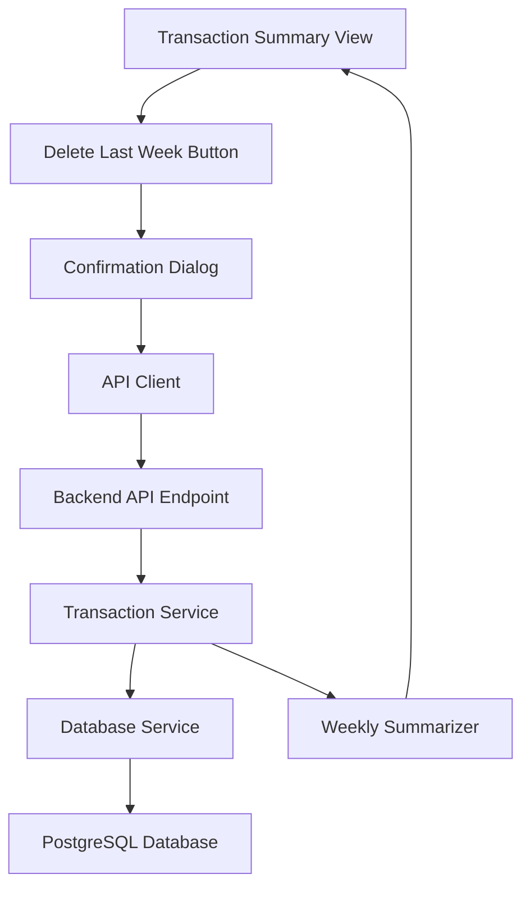
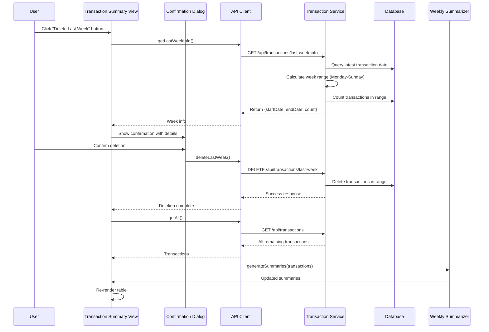

# Design Document: Delete Last Week Transactions

## Overview

This feature adds the ability to delete all transactions from the most recent week (Monday-Sunday) in the Aquarius Golf Competition Transaction Summary view. Users sometimes upload CSV files containing partial or incorrect data for the last week, and need a way to remove these transactions without affecting earlier weeks. The feature includes a confirmation dialog showing the date range and transaction count before deletion, and automatically refreshes the summary view after successful deletion.

## Architecture

The feature follows the existing client-server architecture with frontend UI components communicating with backend REST API endpoints.



## Main Algorithm/Workflow



## Components and Interfaces

### Component 1: TransactionSummaryView (Frontend)

**Purpose**: Display weekly transaction summaries and provide UI for deleting the last week

**Interface**:
```typescript
class TransactionSummaryView {
  constructor(containerId: string, weeklyDrillDownView?: WeeklyDrillDownView);
  render(summaries: WeeklySummary[]): void;
  clear(): void;
  
  // New methods
  addDeleteLastWeekButton(): void;
  handleDeleteLastWeek(): Promise<void>;
  refreshSummaries(): Promise<void>;
}
```

**Responsibilities**:
- Render weekly summaries table
- Add "Delete Last Week" button to UI
- Handle button click and show confirmation dialog
- Refresh summaries after deletion
- Disable button when no transactions exist

### Component 2: APIClient (Frontend)

**Purpose**: Communicate with backend API for transaction operations

**Interface**:
```typescript
class APIClient {
  // Existing methods
  getAll(): Promise<EnhancedRecord[]>;
  clearAll(): Promise<void>;
  
  // New methods
  getLastWeekInfo(): Promise<LastWeekInfo>;
  deleteLastWeek(): Promise<DeleteResult>;
}

interface LastWeekInfo {
  startDate: string;  // Monday date (YYYY-MM-DD)
  endDate: string;    // Sunday date (YYYY-MM-DD)
  count: number;      // Number of transactions
}

interface DeleteResult {
  deleted: number;
  message: string;
}
```

**Responsibilities**:
- Make HTTP requests to backend API
- Handle errors and retries
- Parse and return response data

### Component 3: TransactionService (Backend)

**Purpose**: Business logic for transaction operations

**Interface**:
```typescript
class TransactionService {
  constructor(db: DatabaseService);
  
  // Existing methods
  getAllTransactions(): Promise<TransactionRecord[]>;
  deleteAllTransactions(): Promise<void>;
  
  // New methods
  getLastWeekInfo(): Promise<LastWeekInfo | null>;
  deleteLastWeek(): Promise<number>;
}
```

**Responsibilities**:
- Calculate last week date range from latest transaction
- Validate week boundaries (Monday-Sunday)
- Count transactions in date range
- Delete transactions within date range
- Return deletion results

### Component 4: DatabaseService (Backend)

**Purpose**: Database access layer for transaction queries

**Interface**:
```typescript
class DatabaseService {
  // Existing methods
  query(sql: string, params: any[]): Promise<QueryResult>;
  
  // New methods (if needed)
  getLatestTransactionDate(): Promise<string | null>;
  countTransactionsByDateRange(startDate: string, endDate: string): Promise<number>;
  deleteTransactionsByDateRange(startDate: string, endDate: string): Promise<number>;
}
```

**Responsibilities**:
- Execute SQL queries against PostgreSQL
- Handle database connections and transactions
- Return query results

## Data Models

### LastWeekInfo

```typescript
interface LastWeekInfo {
  startDate: string;  // Monday date in YYYY-MM-DD format
  endDate: string;    // Sunday date in YYYY-MM-DD format
  count: number;      // Number of transactions in the week
}
```

**Validation Rules**:
- startDate must be a Monday
- endDate must be a Sunday
- endDate must be exactly 6 days after startDate
- count must be a non-negative integer

### DeleteResult

```typescript
interface DeleteResult {
  deleted: number;    // Number of transactions deleted
  message: string;    // Success message
}
```

**Validation Rules**:
- deleted must be a non-negative integer
- message must be a non-empty string

## Algorithmic Pseudocode

### Algorithm 1: Get Last Week Information

```pascal
ALGORITHM getLastWeekInfo()
INPUT: None
OUTPUT: LastWeekInfo or null

BEGIN
  // Step 1: Get the latest transaction date
  latestDate ← database.query("SELECT MAX(date) FROM transactions")
  
  IF latestDate IS NULL THEN
    RETURN null
  END IF
  
  // Step 2: Parse the date and find the Monday of that week
  parsedDate ← parseDate(latestDate)
  dayOfWeek ← parsedDate.getDayOfWeek()  // 0=Sunday, 1=Monday, ..., 6=Saturday
  
  IF dayOfWeek = 0 THEN
    daysToSubtract ← 6  // Sunday: go back 6 days to Monday
  ELSE
    daysToSubtract ← dayOfWeek - 1  // Go back to Monday
  END IF
  
  mondayDate ← parsedDate - daysToSubtract days
  mondayDate.setTime(00:00:00)
  
  // Step 3: Calculate Sunday of that week
  sundayDate ← mondayDate + 6 days
  sundayDate.setTime(23:59:59)
  
  // Step 4: Count transactions in the week
  count ← database.query(
    "SELECT COUNT(*) FROM transactions 
     WHERE date >= ? AND date <= ?",
    [formatDate(mondayDate), formatDate(sundayDate)]
  )
  
  // Step 5: Return week information
  RETURN {
    startDate: formatDate(mondayDate),
    endDate: formatDate(sundayDate),
    count: count
  }
END
```

**Preconditions**:
- Database connection is established
- Transactions table exists

**Postconditions**:
- Returns null if no transactions exist
- Returns valid LastWeekInfo with Monday-Sunday range if transactions exist
- startDate is always a Monday
- endDate is always a Sunday

**Loop Invariants**: N/A (no loops)

### Algorithm 2: Delete Last Week Transactions

```pascal
ALGORITHM deleteLastWeek()
INPUT: None
OUTPUT: Number of deleted transactions

BEGIN
  // Step 1: Get last week information
  weekInfo ← getLastWeekInfo()
  
  IF weekInfo IS NULL THEN
    THROW Error("No transactions to delete")
  END IF
  
  // Step 2: Begin database transaction
  database.beginTransaction()
  
  TRY
    // Step 3: Delete transactions in the date range
    deletedCount ← database.execute(
      "DELETE FROM transactions 
       WHERE date >= ? AND date <= ?",
      [weekInfo.startDate, weekInfo.endDate]
    )
    
    // Step 4: Commit transaction
    database.commit()
    
    // Step 5: Return count
    RETURN deletedCount
    
  CATCH error
    // Rollback on error
    database.rollback()
    THROW error
  END TRY
END
```

**Preconditions**:
- Database connection is established
- At least one transaction exists in the database
- weekInfo contains valid Monday-Sunday date range

**Postconditions**:
- All transactions within the date range are deleted
- Database transaction is committed on success
- Database transaction is rolled back on error
- Returns the number of deleted transactions

**Loop Invariants**: N/A (no loops)

### Algorithm 3: Handle Delete Button Click (Frontend)

```pascal
ALGORITHM handleDeleteLastWeek()
INPUT: None
OUTPUT: void (updates UI)

BEGIN
  // Step 1: Disable button to prevent double-clicks
  button.disabled ← true
  
  TRY
    // Step 2: Get last week information
    weekInfo ← apiClient.getLastWeekInfo()
    
    IF weekInfo IS NULL THEN
      DISPLAY "No transactions to delete"
      RETURN
    END IF
    
    // Step 3: Show confirmation dialog
    confirmed ← showConfirmationDialog(
      "Delete Last Week Transactions?",
      "This will permanently delete " + weekInfo.count + " transaction(s) " +
      "from " + formatDate(weekInfo.startDate) + " to " + formatDate(weekInfo.endDate) + ". " +
      "This action cannot be undone."
    )
    
    IF NOT confirmed THEN
      RETURN
    END IF
    
    // Step 4: Delete transactions
    result ← apiClient.deleteLastWeek()
    
    // Step 5: Show success message
    DISPLAY "Successfully deleted " + result.deleted + " transaction(s)"
    
    // Step 6: Refresh summaries
    refreshSummaries()
    
  CATCH error
    // Step 7: Show error message
    DISPLAY "Error: " + error.message
    
  FINALLY
    // Step 8: Re-enable button
    button.disabled ← false
  END TRY
END
```

**Preconditions**:
- UI is rendered
- API client is initialized
- Button exists in DOM

**Postconditions**:
- Button is re-enabled after operation completes
- Success or error message is displayed to user
- Summaries are refreshed if deletion succeeds
- No changes occur if user cancels confirmation

**Loop Invariants**: N/A (no loops)

## Key Functions with Formal Specifications

### Function 1: getMondayOfWeek()

```typescript
function getMondayOfWeek(date: Date): Date
```

**Preconditions:**
- `date` is a valid Date object
- `date` is not null or undefined

**Postconditions:**
- Returns a Date object representing Monday of the same week
- Returned date has time set to 00:00:00.000
- If input is already Monday, returns Monday at 00:00:00
- Week starts on Monday (ISO 8601 standard)

**Loop Invariants:** N/A

### Function 2: getSundayOfWeek()

```typescript
function getSundayOfWeek(date: Date): Date
```

**Preconditions:**
- `date` is a valid Date object
- `date` is not null or undefined

**Postconditions:**
- Returns a Date object representing Sunday of the same week
- Returned date has time set to 23:59:59.999
- Sunday is 6 days after the Monday of the same week

**Loop Invariants:** N/A

### Function 3: getLastWeekInfo()

```typescript
async function getLastWeekInfo(): Promise<LastWeekInfo | null>
```

**Preconditions:**
- Database connection is active
- Transactions table exists

**Postconditions:**
- Returns null if no transactions exist
- Returns LastWeekInfo with valid Monday-Sunday range if transactions exist
- `startDate` is always a Monday (day of week = 1)
- `endDate` is always a Sunday (day of week = 0)
- `count` is accurate count of transactions in the range
- No database modifications occur

**Loop Invariants:** N/A

### Function 4: deleteLastWeek()

```typescript
async function deleteLastWeek(): Promise<number>
```

**Preconditions:**
- Database connection is active
- At least one transaction exists
- User has confirmed deletion

**Postconditions:**
- All transactions in the last week are deleted
- Returns count of deleted transactions
- Database transaction is committed on success
- Database transaction is rolled back on error
- Throws error if no transactions exist

**Loop Invariants:** N/A

## Example Usage

### Frontend: Adding Delete Button

```typescript
// In TransactionSummaryView constructor or initialization
addDeleteLastWeekButton() {
  const buttonContainer = document.createElement('div');
  buttonContainer.className = 'delete-last-week-container';
  
  const button = document.createElement('button');
  button.id = 'delete-last-week-btn';
  button.className = 'delete-last-week-button';
  button.textContent = 'Delete Last Week';
  button.onclick = () => this.handleDeleteLastWeek();
  
  buttonContainer.appendChild(button);
  this.container.insertBefore(buttonContainer, this.container.firstChild);
}

// Handle delete button click
async handleDeleteLastWeek() {
  const button = document.getElementById('delete-last-week-btn');
  button.disabled = true;
  
  try {
    // Get week info
    const weekInfo = await this.apiClient.getLastWeekInfo();
    
    if (!weekInfo) {
      alert('No transactions to delete');
      return;
    }
    
    // Show confirmation
    const confirmed = confirm(
      `Delete Last Week Transactions?\n\n` +
      `This will permanently delete ${weekInfo.count} transaction(s) ` +
      `from ${weekInfo.startDate} to ${weekInfo.endDate}.\n\n` +
      `This action cannot be undone.`
    );
    
    if (!confirmed) return;
    
    // Delete transactions
    const result = await this.apiClient.deleteLastWeek();
    
    alert(`Successfully deleted ${result.deleted} transaction(s)`);
    
    // Refresh summaries
    await this.refreshSummaries();
    
  } catch (error) {
    alert(`Error: ${error.message}`);
  } finally {
    button.disabled = false;
  }
}
```

### Frontend: API Client Methods

```typescript
// In APIClient class

async getLastWeekInfo(): Promise<LastWeekInfo | null> {
  try {
    const result = await this.request('/api/transactions/last-week-info', {
      method: 'GET'
    });
    
    return result.weekInfo || null;
  } catch (error) {
    if (error.status === 404) {
      return null;
    }
    
    const wrappedError = new Error(`Failed to get last week info: ${error.message}`);
    wrappedError.code = error.code || 'QUERY_FAILED';
    throw wrappedError;
  }
}

async deleteLastWeek(): Promise<DeleteResult> {
  try {
    const result = await this.request('/api/transactions/last-week', {
      method: 'DELETE'
    });
    
    return {
      deleted: result.deleted || 0,
      message: result.message || 'Deletion successful'
    };
  } catch (error) {
    const wrappedError = new Error(`Failed to delete last week: ${error.message}`);
    wrappedError.code = error.code || 'DELETE_FAILED';
    throw wrappedError;
  }
}
```

### Backend: Transaction Routes

```typescript
// In transaction.routes.ts

router.get('/last-week-info', async (req: Request, res: Response, next: NextFunction) => {
  try {
    const db = req.app.locals.db as DatabaseService;
    const transactionService = new TransactionService(db);
    
    const weekInfo = await transactionService.getLastWeekInfo();
    
    if (!weekInfo) {
      return res.status(404).json({
        weekInfo: null,
        message: 'No transactions found'
      });
    }
    
    return res.status(200).json({ weekInfo });
  } catch (error) {
    next(error);
  }
});

router.delete('/last-week', async (req: Request, res: Response, next: NextFunction) => {
  try {
    const db = req.app.locals.db as DatabaseService;
    const transactionService = new TransactionService(db);
    
    const deleted = await transactionService.deleteLastWeek();
    
    return res.status(200).json({
      deleted,
      message: `Successfully deleted ${deleted} transaction(s) from last week`
    });
  } catch (error) {
    if (error instanceof Error && error.message === 'No transactions to delete') {
      return res.status(404).json({
        error: 'Not found',
        message: error.message
      });
    }
    next(error);
  }
});
```

### Backend: Transaction Service

```typescript
// In TransactionService class

async getLastWeekInfo(): Promise<LastWeekInfo | null> {
  // Get latest transaction date
  const result = await this.db.query(
    'SELECT MAX(date) as latest_date FROM transactions',
    []
  );
  
  if (!result.rows[0]?.latest_date) {
    return null;
  }
  
  const latestDate = this.parseDate(result.rows[0].latest_date);
  
  // Calculate Monday and Sunday of that week
  const monday = this.getMondayOfWeek(latestDate);
  const sunday = this.getSundayOfWeek(latestDate);
  
  // Count transactions in the week
  const countResult = await this.db.query(
    'SELECT COUNT(*) as count FROM transactions WHERE date >= $1 AND date <= $2',
    [this.formatDate(monday), this.formatDate(sunday)]
  );
  
  return {
    startDate: this.formatDate(monday),
    endDate: this.formatDate(sunday),
    count: parseInt(countResult.rows[0].count, 10)
  };
}

async deleteLastWeek(): Promise<number> {
  const weekInfo = await this.getLastWeekInfo();
  
  if (!weekInfo) {
    throw new Error('No transactions to delete');
  }
  
  const result = await this.db.query(
    'DELETE FROM transactions WHERE date >= $1 AND date <= $2',
    [weekInfo.startDate, weekInfo.endDate]
  );
  
  return result.rowCount || 0;
}
```

## Correctness Properties

*A property is a characteristic or behavior that should hold true across all valid executions of a system—essentially, a formal statement about what the system should do. Properties serve as the bridge between human-readable specifications and machine-verifiable correctness guarantees.*

### Property 1: Week Boundary Correctness

For any date, getMondayOfWeek returns a Monday with time 00:00:00.000, getSundayOfWeek returns a Sunday with time 23:59:59.999, and the Sunday is exactly 6 days after the Monday.

**Validates: Requirements 3.2, 3.3, 3.4, 3.5, 3.6, 15.1, 15.2, 15.3, 15.4**

### Property 2: Last Week Identification

For any database state with transactions, getLastWeekInfo returns the week range containing the most recent transaction date, with accurate start date (Monday), end date (Sunday), and transaction count.

**Validates: Requirements 3.1, 4.2, 4.4**

### Property 3: Deletion Completeness

For any database state, after deleteLastWeek executes successfully, no transactions exist in the database with dates within the deleted week range.

**Validates: Requirements 7.2, 8.1**

### Property 4: Deletion Isolation

For any database state, deleting the last week preserves all transactions with dates before the week start date and all transactions with dates after the week end date.

**Validates: Requirements 8.2, 8.3**

### Property 5: Deletion Atomicity

For any database state, if deletion fails for any reason, then no transactions are deleted (all-or-nothing).

**Validates: Requirements 7.3, 7.5, 12.2**

### Property 6: Deletion Count Accuracy

For any database state with transactions, the count returned by deleteLastWeek equals the number of transactions that existed in the last week range before deletion.

**Validates: Requirements 7.4, 14.4**

### Property 7: Button State Based on Data

For any database state, the delete button is disabled when no transactions exist and enabled when at least one transaction exists.

**Validates: Requirements 2.1, 2.2**

### Property 8: Button Disabled During Operation

For any deletion operation in progress, the delete button is disabled until the operation completes (success or failure).

**Validates: Requirements 2.3, 9.3, 12.3**

### Property 9: Cancellation Preserves State

For any database state, when the user cancels the confirmation dialog, no API delete calls are made, no transactions are modified, and the button is re-enabled.

**Validates: Requirements 6.1, 6.2, 6.3**

### Property 10: Confirmation Dialog Content

For any valid week information, the confirmation dialog displays the start date, end date, and transaction count.

**Validates: Requirements 5.2, 5.3, 5.4**

### Property 11: Success Message Content

For any successful deletion, the success message includes the count of deleted transactions.

**Validates: Requirements 9.2**

### Property 12: API Response Structure

For any successful getLastWeekInfo call with transactions, the response includes startDate, endDate, and count fields.

**Validates: Requirements 4.2, 13.4**

### Property 13: API Deletion Response Structure

For any successful deleteLastWeek call, the response includes the count of deleted transactions and a success message.

**Validates: Requirements 7.4, 14.4**

## Error Handling

### Error Scenario 1: No Transactions Exist

**Condition**: User clicks "Delete Last Week" when database is empty
**Response**: 
- Backend returns 404 status with null weekInfo
- Frontend displays message "No transactions to delete"
- Button remains enabled
**Recovery**: User can import transactions and try again

### Error Scenario 2: Database Connection Failure

**Condition**: Database connection is lost during operation
**Response**:
- Backend catches database error and returns 503 status
- Frontend displays error message "Unable to connect to database"
- Button is re-enabled
**Recovery**: User can retry after connection is restored

### Error Scenario 3: Partial Deletion Failure

**Condition**: Database transaction fails mid-deletion
**Response**:
- Backend rolls back transaction
- No transactions are deleted (atomic operation)
- Returns 500 status with error message
- Frontend displays error message
**Recovery**: User can retry deletion

### Error Scenario 4: User Cancels Confirmation

**Condition**: User clicks "Cancel" in confirmation dialog
**Response**:
- No API call is made
- No transactions are deleted
- Button remains enabled
**Recovery**: User can click button again to retry

## Testing Strategy

### Unit Testing Approach

Test each component in isolation with mocked dependencies:

**Frontend Tests**:
- TransactionSummaryView.addDeleteLastWeekButton() creates button with correct attributes
- TransactionSummaryView.handleDeleteLastWeek() calls API methods in correct order
- Button is disabled during operation and re-enabled after completion
- Confirmation dialog shows correct week information
- Error messages are displayed correctly

**Backend Tests**:
- TransactionService.getLastWeekInfo() returns correct Monday-Sunday range
- TransactionService.getLastWeekInfo() returns null when no transactions exist
- TransactionService.deleteLastWeek() deletes only transactions in the specified week
- TransactionService.deleteLastWeek() throws error when no transactions exist
- Date calculation functions (getMondayOfWeek, getSundayOfWeek) return correct dates

**API Tests**:
- GET /api/transactions/last-week-info returns 200 with valid data
- GET /api/transactions/last-week-info returns 404 when no transactions
- DELETE /api/transactions/last-week returns 200 with deletion count
- DELETE /api/transactions/last-week returns 404 when no transactions

### Property-Based Testing Approach

Use property-based testing to verify correctness properties across many random inputs:

**Property Test Library**: fast-check (for JavaScript/TypeScript)

**Properties to Test**:
1. Week boundary correctness: For any random date, getMondayOfWeek returns Monday and getSundayOfWeek returns Sunday
2. Week range consistency: Sunday is always 6 days after Monday
3. Deletion completeness: After deletion, no transactions remain in the deleted week
4. Deletion isolation: Transactions before the deleted week are unaffected
5. Count accuracy: getLastWeekInfo().count matches actual transaction count in the range

### Integration Testing Approach

Test the complete workflow from UI to database:

1. **Happy Path Test**: Import transactions spanning multiple weeks, click delete button, confirm deletion, verify last week is deleted and earlier weeks remain
2. **Empty Database Test**: Start with empty database, verify button is disabled, verify appropriate message is shown
3. **Single Week Test**: Import transactions for only one week, delete that week, verify database is empty
4. **Multiple Weeks Test**: Import 4 weeks of data, delete last week, verify 3 weeks remain
5. **Cancellation Test**: Click delete button, cancel confirmation, verify no changes occur

## Performance Considerations

- **Database Query Optimization**: Use indexed date column for fast range queries
- **Transaction Count**: Use COUNT(*) query instead of fetching all records
- **Database Transaction**: Wrap deletion in database transaction for atomicity
- **Button Debouncing**: Disable button during operation to prevent double-clicks
- **Batch Deletion**: Use single DELETE query with date range instead of deleting records one by one

Expected performance:
- getLastWeekInfo(): < 100ms for databases with up to 100,000 transactions
- deleteLastWeek(): < 500ms for deleting up to 1,000 transactions in a week
- UI refresh: < 1 second for recalculating summaries after deletion

## Security Considerations

- **Authorization**: Ensure only authenticated users can delete transactions (if authentication exists)
- **Confirmation Required**: Always show confirmation dialog before deletion
- **Audit Logging**: Consider logging deletion events with timestamp and user information
- **SQL Injection Prevention**: Use parameterized queries for all database operations
- **CSRF Protection**: Ensure DELETE endpoint has CSRF protection if applicable
- **Rate Limiting**: Consider rate limiting the delete endpoint to prevent abuse

## Dependencies

**Frontend**:
- Existing APIClient class
- Existing TransactionSummaryView class
- Existing WeeklySummarizer class
- Browser native confirm() dialog (or custom dialog component)

**Backend**:
- Express.js framework
- PostgreSQL database
- Existing DatabaseService class
- Existing TransactionService class
- Existing transaction.routes.ts

**No new external dependencies required** - feature uses existing infrastructure and libraries.
