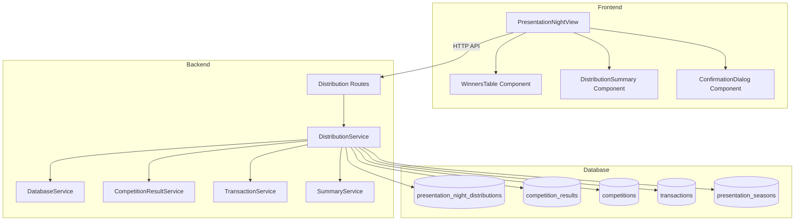

# Design Document: Presentation Night Winnings Distribution

## Overview

The Presentation Night Winnings Distribution feature enables users to distribute accumulated competition pot funds to winners at the end of each presentation season, and to record general competition costs throughout the season. This feature integrates with the existing competition results system and transaction tracking to provide a complete workflow for:

1. Viewing all competition winners from a presentation season
2. Assigning cash amounts to individual winners or winning pairs
3. Calculating the total distribution amount
4. Recording the distribution as a cost transaction that deducts from the competition pot
5. Recording general competition costs (engravings, stationery, equipment, etc.) with custom descriptions
6. Viewing competition cost history and totals

The feature follows the existing architectural patterns in the codebase, using a service-based backend with TypeScript and a component-based frontend with vanilla JavaScript.

### Key Design Decisions

- **Separate Distribution Records**: Winnings assignments are stored in a new `presentation_night_distributions` table rather than modifying competition results, maintaining data integrity and audit trail
- **Transaction-Based Recording**: The final distribution is recorded as a cost transaction in the existing transactions table, ensuring consistency with the competition pot calculation
- **Season-Level Locking**: Once a distribution is confirmed for a season, it cannot be modified (only voided and recreated), preventing accidental double-distributions
- **Support for Both Competition Types**: The system handles both singles (1 winner) and doubles (2 winners as a pair) competitions with appropriate UI distinctions

## Architecture

### System Components



### Data Flow

1. **Load Season Winners**: Frontend requests winners for a season → Backend queries competitions and results → Returns structured winner data
2. **Assign Winnings**: User enters amounts → Frontend validates and stores locally → User confirms → Backend creates distribution records
3. **Calculate Totals**: Frontend sums assignments in real-time
4. **Record Distribution**: Backend creates cost transaction → Updates distribution status → Deducts from competition pot

## Components and Interfaces

### Backend Components

#### 1. DistributionService

**Purpose**: Core business logic for managing presentation night winnings distributions

**Key Methods**:

```typescript
class DistributionService {
  constructor(private db: DatabaseService) {}
  
  // Get all winners for a presentation season
  async getSeasonWinners(seasonId: number): Promise<SeasonWinner[]>
  
  // Create distribution assignments for a season
  async createDistribution(dto: CreateDistributionDTO): Promise<Distribution>
  
  // Get distribution for a season (if exists)
  async getDistributionBySeason(seasonId: number): Promise<Distribution | null>
  
  // Void a distribution (marks as voided, doesn't delete)
  async voidDistribution(distributionId: number): Promise<void>
  
  // Create a competition cost entry
  async createCompetitionCost(dto: CreateCompetitionCostDTO): Promise<CompetitionCost>
  
  // Get all competition costs
  async getAllCompetitionCosts(): Promise<CompetitionCostSummary>
  
  // Get competition costs by date range
  async getCompetitionCostsByDateRange(startDate: string, endDate: string): Promise<CompetitionCostSummary>
}
```

#### 2. Distribution Routes

**Purpose**: HTTP API endpoints for distribution operations

**Endpoints**:

```typescript
// GET /api/distributions/season/:seasonId/winners
// Returns all winners for a season with competition details

// POST /api/distributions
// Creates a new distribution with assignments
// Body: { seasonId, assignments: [{competitionId, amount}], transactionDate }

// GET /api/distributions/season/:seasonId
// Returns existing distribution for a season

// DELETE /api/distributions/:id/void
// Voids a distribution

// POST /api/competition-costs
// Creates a new competition cost entry
// Body: { description, amount }

// GET /api/competition-costs
// Returns all competition costs with total

// GET /api/competition-costs/range
// Returns competition costs filtered by date range
// Query params: startDate, endDate
```

### Frontend Components

#### 1. PresentationNightView

**Purpose**: Main container component for the distribution interface

**Responsibilities**:
- Season selection
- Coordinate child components
- Handle confirmation workflow
- Display notifications

**Key Methods**:

```javascript
class PresentationNightView {
  constructor(apiClient)
  
  async initialize()
  render(containerId)
  async loadSeasonWinners(seasonId)
  handleConfirmDistribution()
  showNotification(message, type)
}
```

#### 2. WinnersTable Component

**Purpose**: Display and manage winnings assignments for each winner

**Responsibilities**:
- Render winners list with competition details
- Provide input fields for amount entry
- Validate input values
- Emit events on amount changes

**Key Methods**:

```javascript
class WinnersTable {
  constructor(apiClient)
  
  render(containerId, winners)
  handleAmountChange(competitionId, amount)
  getAssignments()
  validateAssignments()
}
```

#### 3. DistributionSummary Component

**Purpose**: Display financial summary

**Responsibilities**:
- Show total distribution amount

**Key Methods**:

```javascript
class DistributionSummary {
  render(containerId, totalDistribution)
  updateTotals(totalDistribution)
}
```

#### 4. CompetitionCostsManager Component

**Purpose**: Manage general competition costs

**Responsibilities**:
- Display form for entering new costs
- Validate cost descriptions (no duplicates) and amounts
- Display list of recorded costs
- Show total of all costs

**Key Methods**:

```javascript
class CompetitionCostsManager {
  constructor(apiClient)
  
  render(containerId)
  async loadCosts()
  async handleSubmitCost(description, amount)
  validateCostEntry(description, amount)
  displayCostHistory(costs)
}
```

## Data Models

### Database Schema

#### presentation_night_distributions Table

```sql
CREATE TABLE presentation_night_distributions (
  id SERIAL PRIMARY KEY,
  season_id INTEGER NOT NULL REFERENCES presentation_seasons(id) ON DELETE CASCADE,
  transaction_id INTEGER REFERENCES transactions(id) ON DELETE SET NULL,
  total_amount DECIMAL(10, 2) NOT NULL,
  transaction_date DATE NOT NULL,
  is_voided BOOLEAN DEFAULT false,
  voided_at TIMESTAMP,
  created_at TIMESTAMP DEFAULT CURRENT_TIMESTAMP,
  updated_at TIMESTAMP DEFAULT CURRENT_TIMESTAMP,
  
  CONSTRAINT check_total_amount CHECK (total_amount >= 0),
  CONSTRAINT unique_active_season UNIQUE (season_id) WHERE (is_voided = false)
);
```

#### distribution_assignments Table

```sql
CREATE TABLE distribution_assignments (
  id SERIAL PRIMARY KEY,
  distribution_id INTEGER NOT NULL REFERENCES presentation_night_distributions(id) ON DELETE CASCADE,
  competition_id INTEGER NOT NULL REFERENCES competitions(id) ON DELETE CASCADE,
  amount DECIMAL(10, 2) NOT NULL,
  created_at TIMESTAMP DEFAULT CURRENT_TIMESTAMP,
  updated_at TIMESTAMP DEFAULT CURRENT_TIMESTAMP,
  
  CONSTRAINT check_amount CHECK (amount >= 0),
  CONSTRAINT unique_competition_per_distribution UNIQUE (distribution_id, competition_id)
);
```

#### competition_costs Table

```sql
CREATE TABLE competition_costs (
  id SERIAL PRIMARY KEY,
  description VARCHAR(255) NOT NULL UNIQUE,
  amount DECIMAL(10, 2) NOT NULL,
  transaction_id INTEGER REFERENCES transactions(id) ON DELETE SET NULL,
  transaction_date DATE NOT NULL,
  created_at TIMESTAMP DEFAULT CURRENT_TIMESTAMP,
  updated_at TIMESTAMP DEFAULT CURRENT_TIMESTAMP,
  
  CONSTRAINT check_cost_amount CHECK (amount > 0)
);

CREATE INDEX idx_competition_costs_date ON competition_costs(transaction_date DESC);
```

### TypeScript Interfaces

```typescript
// Distribution types
export interface PresentationNightDistribution {
  id: number;
  seasonId: number;
  transactionId: number | null;
  totalAmount: number;
  transactionDate: string;
  isVoided: boolean;
  voidedAt: Date | null;
  createdAt: Date;
  updatedAt: Date;
}

export interface DistributionAssignment {
  id: number;
  distributionId: number;
  competitionId: number;
  amount: number;
  createdAt: Date;
  updatedAt: Date;
}

export interface CreateDistributionDTO {
  seasonId: number;
  assignments: {
    competitionId: number;
    amount: number;
  }[];
  transactionDate: string;
}

export interface SeasonWinner {
  competitionId: number;
  competitionName: string;
  competitionDate: string;
  competitionType: 'singles' | 'doubles';
  winners: {
    resultId: number;
    playerName: string;
    finishingPosition: number;
  }[];
}

export interface DistributionWithAssignments extends PresentationNightDistribution {
  assignments: DistributionAssignment[];
}

export interface CompetitionCost {
  id: number;
  description: string;
  amount: number;
  transactionId: number | null;
  transactionDate: string;
  createdAt: Date;
  updatedAt: Date;
}

export interface CreateCompetitionCostDTO {
  description: string;
  amount: number;
}

export interface CompetitionCostSummary {
  costs: CompetitionCost[];
  total: number;
}
```

## Low-Level Design

### Backend Implementation

#### DistributionService.getSeasonWinners()

**Algorithm**:

```typescript
async getSeasonWinners(seasonId: number): Promise<SeasonWinner[]> {
  // 1. Validate season exists
  const season = await this.db.query(
    'SELECT id FROM presentation_seasons WHERE id = $1',
    [seasonId]
  );
  
  if (season.rows.length === 0) {
    throw new Error(`Season ${seasonId} not found`);
  }
  
  // 2. Get all competitions for the season
  const competitions = await this.db.query<Competition>(
    `SELECT id, name, date, type 
     FROM competitions 
     WHERE season_id = $1 
     ORDER BY date ASC`,
    [seasonId]
  );
  
  // 3. For each competition, get position 1 results
  const seasonWinners: SeasonWinner[] = [];
  
  for (const comp of competitions.rows) {
    const results = await this.db.query<CompetitionResult>(
      `SELECT id, player_name as "playerName", finishing_position as "finishingPosition"
       FROM competition_results
       WHERE competition_id = $1 AND finishing_position = 1
       ORDER BY id ASC`,
      [comp.id]
    );
    
    // 4. Structure winner data
    const winners = results.rows.map(r => ({
      resultId: r.id,
      playerName: r.playerName,
      finishingPosition: r.finishingPosition
    }));
    
    seasonWinners.push({
      competitionId: comp.id,
      competitionName: comp.name,
      competitionDate: comp.date,
      competitionType: comp.type,
      winners: winners
    });
  }
  
  return seasonWinners;
}
```

**Complexity**: O(n * m) where n = competitions, m = avg results per competition

#### DistributionService.createDistribution()

**Algorithm**:

```typescript
async createDistribution(dto: CreateDistributionDTO): Promise<Distribution> {
  return await this.db.transaction(async (client: PoolClient) => {
    // 1. Validate season exists and has no active distribution
    const existingDist = await client.query(
      `SELECT id FROM presentation_night_distributions 
       WHERE season_id = $1 AND is_voided = false`,
      [dto.seasonId]
    );
    
    if (existingDist.rows.length > 0) {
      throw new Error('Distribution already exists for this season');
    }
    
    // 2. Validate all competitions belong to the season
    for (const assignment of dto.assignments) {
      const compCheck = await client.query(
        'SELECT id FROM competitions WHERE id = $1 AND season_id = $2',
        [assignment.competitionId, dto.seasonId]
      );
      
      if (compCheck.rows.length === 0) {
        throw new Error(`Competition ${assignment.competitionId} not in season`);
      }
    }
    
    // 3. Calculate total amount
    const totalAmount = dto.assignments.reduce((sum, a) => sum + a.amount, 0);
    
    // 4. Create cost transaction
    const transactionResult = await client.query<TransactionRecord>(
      `INSERT INTO transactions 
       (date, time, till, type, member, player, competition, 
        price, discount, subtotal, vat, total, source_row_index, is_complete)
       VALUES ($1, $2, $3, $4, $5, $6, $7, $8, $9, $10, $11, $12, $13, $14)
       RETURNING id`,
      [
        dto.transactionDate,
        '00:00:00',
        '',
        'Presentation Night Winnings',
        'Presentation Night Winnings',
        '',
        '',
        totalAmount.toFixed(2),
        '0.00',
        totalAmount.toFixed(2),
        '0.00',
        totalAmount.toFixed(2),
        0,
        true
      ]
    );
    
    const transactionId = transactionResult.rows[0].id;
    
    // 5. Create distribution record
    const distResult = await client.query<PresentationNightDistribution>(
      `INSERT INTO presentation_night_distributions 
       (season_id, transaction_id, total_amount, transaction_date)
       VALUES ($1, $2, $3, $4)
       RETURNING id, season_id as "seasonId", transaction_id as "transactionId",
                 total_amount as "totalAmount", transaction_date as "transactionDate",
                 is_voided as "isVoided", voided_at as "voidedAt",
                 created_at as "createdAt", updated_at as "updatedAt"`,
      [dto.seasonId, transactionId, totalAmount, dto.transactionDate]
    );
    
    const distribution = distResult.rows[0];
    
    // 6. Create assignment records
    for (const assignment of dto.assignments) {
      await client.query(
        `INSERT INTO distribution_assignments 
         (distribution_id, competition_id, amount)
         VALUES ($1, $2, $3)`,
        [distribution.id, assignment.competitionId, assignment.amount]
      );
    }
    
    return distribution;
  });
}
```

**Transaction Safety**: All operations wrapped in database transaction - if any step fails, entire distribution is rolled back

### Frontend Implementation

#### WinnersTable.render()

**Pseudocode**:

```javascript
render(containerId, winners) {
  const container = document.getElementById(containerId);
  
  // Create table structure
  const table = document.createElement('table');
  table.className = 'winners-table';
  
  // Add header
  const thead = document.createElement('thead');
  thead.innerHTML = `
    <tr>
      <th>Competition</th>
      <th>Date</th>
      <th>Type</th>
      <th>Winner(s)</th>
      <th>Amount (£)</th>
    </tr>
  `;
  table.appendChild(thead);
  
  // Add body
  const tbody = document.createElement('tbody');
  
  for (const winner of winners) {
    const row = document.createElement('tr');
    
    // Competition name
    const nameCell = document.createElement('td');
    nameCell.textContent = winner.competitionName;
    row.appendChild(nameCell);
    
    // Date
    const dateCell = document.createElement('td');
    dateCell.textContent = winner.competitionDate;
    row.appendChild(dateCell);
    
    // Type
    const typeCell = document.createElement('td');
    typeCell.textContent = winner.competitionType;
    row.appendChild(typeCell);
    
    // Winners
    const winnersCell = document.createElement('td');
    if (winner.winners.length === 0) {
      winnersCell.textContent = 'No winner recorded';
      winnersCell.className = 'no-winner';
    } else if (winner.competitionType === 'doubles') {
      // Show both names for doubles
      winnersCell.textContent = winner.winners
        .map(w => w.playerName)
        .join(' & ');
    } else {
      // Show single name for singles
      winnersCell.textContent = winner.winners[0].playerName;
    }
    row.appendChild(winnersCell);
    
    // Amount input
    const amountCell = document.createElement('td');
    if (winner.winners.length > 0) {
      const input = document.createElement('input');
      input.type = 'number';
      input.step = '0.01';
      input.min = '0';
      input.className = 'amount-input';
      input.dataset.competitionId = winner.competitionId;
      
      input.addEventListener('input', (e) => {
        this.handleAmountChange(winner.competitionId, e.target.value);
      });
      
      amountCell.appendChild(input);
    } else {
      amountCell.textContent = 'N/A';
    }
    row.appendChild(amountCell);
    
    tbody.appendChild(row);
  }
  
  table.appendChild(tbody);
  container.appendChild(table);
}
```

#### PresentationNightView.handleConfirmDistribution()

**Pseudocode**:

```javascript
async handleConfirmDistribution() {
  // 1. Get assignments from WinnersTable
  const assignments = this.winnersTable.getAssignments();
  
  // 2. Validate completeness
  const validation = this.winnersTable.validateAssignments();
  if (!validation.valid) {
    const proceed = confirm(validation.warning + '\n\nProceed anyway?');
    if (!proceed) return;
  }
  
  // 3. Prompt for transaction date
  const transactionDate = prompt('Enter transaction date (YYYY-MM-DD):');
  if (!transactionDate) return;
  
  // Validate date format
  if (!/^\d{4}-\d{2}-\d{2}$/.test(transactionDate)) {
    this.showNotification('Invalid date format', 'error');
    return;
  }
  
  // 4. Confirm action
  const totalAmount = assignments.reduce((sum, a) => sum + a.amount, 0);
  const confirmed = confirm(
    `Confirm distribution of £${totalAmount.toFixed(2)}?\n\n` +
    `This will create a cost transaction and cannot be undone.`
  );
  
  if (!confirmed) return;
  
  // 5. Submit to backend
  try {
    await this.apiClient.createDistribution({
      seasonId: this.selectedSeasonId,
      assignments: assignments,
      transactionDate: transactionDate
    });
    
    this.showNotification('Distribution recorded successfully', 'success');
    
    // Refresh view to show read-only state
    await this.loadSeasonWinners(this.selectedSeasonId);
  } catch (error) {
    this.showNotification(`Error: ${error.message}`, 'error');
  }
}
```

### API Client Methods

```javascript
class ApiClient {
  // Get winners for a season
  async getSeasonWinners(seasonId) {
    const response = await fetch(
      `${this.baseUrl}/api/distributions/season/${seasonId}/winners`
    );
    return await response.json();
  }
  
  // Create distribution
  async createDistribution(dto) {
    const response = await fetch(
      `${this.baseUrl}/api/distributions`,
      {
        method: 'POST',
        headers: { 'Content-Type': 'application/json' },
        body: JSON.stringify(dto)
      }
    );
    
    if (!response.ok) {
      const error = await response.json();
      throw new Error(error.message || 'Failed to create distribution');
    }
    
    return await response.json();
  }
  
  // Get existing distribution for season
  async getDistributionBySeason(seasonId) {
    const response = await fetch(
      `${this.baseUrl}/api/distributions/season/${seasonId}`
    );
    
    if (response.status === 404) {
      return null;
    }
    
    return await response.json();
  }
  
  // Void distribution
  async voidDistribution(distributionId) {
    const response = await fetch(
      `${this.baseUrl}/api/distributions/${distributionId}/void`,
      { method: 'DELETE' }
    );
    
    if (!response.ok) {
      const error = await response.json();
      throw new Error(error.message || 'Failed to void distribution');
    }
  }
}
```


## Correctness Properties

*A property is a characteristic or behavior that should hold true across all valid executions of a system-essentially, a formal statement about what the system should do. Properties serve as the bridge between human-readable specifications and machine-verifiable correctness guarantees.*

### Property Reflection

After analyzing all acceptance criteria, I identified the following redundancies:

- **Criteria 1.4 and 8.5**: Both test that doubles competitions display both player names together. These can be combined into one property.
- **Criteria 7.2 and 7.4**: Both test that only competitions with winners are included in the total calculation. These are logically identical and can be combined.
- **Criteria 1.3, 8.1, and 8.2**: These all relate to winner identification logic and can be combined into comprehensive properties about winner identification based on competition type.

### Property 1: Season Competition Display

*For any* presentation season, when selected in the Distribution UI, all competitions belonging to that season should be displayed with their name, date, and type fields.

**Validates: Requirements 1.1, 1.2**

### Property 2: Winner Identification for Singles

*For any* singles competition with at least one result at finishing position 1, exactly one winner should be identified and displayed.

**Validates: Requirements 1.3, 8.1**

### Property 3: Winner Identification for Doubles

*For any* doubles competition with results at finishing position 1, exactly two winners should be identified and displayed together as a pair.

**Validates: Requirements 1.3, 1.4, 8.2, 8.5**

### Property 4: Singles Winner Display

*For any* singles competition with a winner, the displayed winner information should contain exactly one player name.

**Validates: Requirements 1.5**

### Property 5: Input Field Rendering

*For any* competition with at least one winner, the Distribution UI should render an input field for entering a cash amount.

**Validates: Requirements 2.1**

### Property 6: Amount Validation

*For any* cash amount input, the system should accept non-negative decimal numbers with up to two decimal places and reject negative numbers, non-numeric values, and values with more than two decimal places.

**Validates: Requirements 2.2, 2.3, 2.4**

### Property 7: Assignment Round Trip

*For any* valid winnings assignment (competition ID and amount), storing the assignment then retrieving it should return the same competition ID and amount.

**Validates: Requirements 2.5**

### Property 8: Assignment Update

*For any* existing winnings assignment, modifying the amount and saving should result in the stored amount being updated to the new value.

**Validates: Requirements 2.6**

### Property 9: Total Calculation

*For any* set of winnings assignments, the displayed total distribution amount should equal the sum of all assignment amounts.

**Validates: Requirements 3.1, 3.2**

### Property 10: Date Format Validation

*For any* transaction date string, the system should accept strings matching the format YYYY-MM-DD (where YYYY is a 4-digit year, MM is a 2-digit month, and DD is a 2-digit day) and reject all other formats.

**Validates: Requirements 4.3**

### Property 14: Transaction Creation

*For any* confirmed distribution with total amount T, the system should create a transaction record with type "Presentation Night Winnings" and total field equal to T.

**Validates: Requirements 4.4, 4.6**

### Property 15: Transaction Date Assignment

*For any* distribution confirmed with user-specified date D, the created transaction should have its date field set to D.

**Validates: Requirements 4.5**

### Property 13: Pot Balance Deduction

*For any* distribution with amount A, the competition pot balance after confirmation should equal the pot balance before confirmation minus A.

**Validates: Requirements 4.7**

### Property 14: Distribution Immutability

*For any* confirmed distribution for a season, subsequent attempts to modify assignment amounts for that season should be rejected by the system.

**Validates: Requirements 4.8, 6.3**

### Property 15: Completeness Validation

*For any* distribution where at least one winner has no assigned amount (empty field), the validation should fail and display a warning message.

**Validates: Requirements 5.1, 5.2**

### Property 16: Completeness Indicator

*For any* distribution where all winners have assigned amounts (including zero for physical prizes), the system should display an indicator that the distribution is complete.

**Validates: Requirements 5.4, 5.5**

### Property 17: Distribution Status Display

*For any* presentation season with an existing non-voided distribution, the Distribution UI should indicate that the season has already had winnings distributed.

**Validates: Requirements 6.1**

### Property 18: Read-Only Display

*For any* season with a completed distribution, the Distribution UI should display the previously assigned amounts in a non-editable format.

**Validates: Requirements 6.2**

### Property 19: Winner Exclusion from Total

*For any* set of competitions including some without position 1 results, the total distribution calculation should only sum amounts from competitions that have at least one position 1 result.

**Validates: Requirements 7.2, 7.4**

### Property 20: Pair Amount Assignment

*For any* doubles competition, the winnings amount should be assigned to the competition (pair) as a single value, not as separate amounts for each individual player.

**Validates: Requirements 8.3**

### Property 21: Competition Type Display

*For any* competition displayed in the Distribution UI, the competition type (singles or doubles) should be clearly shown.

**Validates: Requirements 8.4**

## Error Handling

### Input Validation Errors

**Scenario**: User enters invalid amount (negative, non-numeric, too many decimals)
**Handling**: 
- Display inline error message next to input field
- Prevent form submission
- Highlight invalid field in red
- Clear error when valid input is entered

**Scenario**: User enters invalid date format
**Handling**:
- Display error message in dialog
- Prompt user to re-enter date
- Provide format example (YYYY-MM-DD)

### Business Logic Errors

**Scenario**: Attempt to create distribution for season that already has one
**Handling**:
- Return 409 Conflict HTTP status
- Error message: "Distribution already exists for this season. Void the existing distribution first."
- Frontend displays error notification

**Scenario**: Competition doesn't belong to selected season
**Handling**:
- Return 400 Bad Request HTTP status
- Error message: "Competition {id} does not belong to season {seasonId}"
- This should not occur in normal UI flow (defensive check)

**Scenario**: Season not found
**Handling**:
- Return 404 Not Found HTTP status
- Error message: "Season {id} not found"
- Frontend displays error notification

### Database Errors

**Scenario**: Transaction creation fails mid-distribution
**Handling**:
- Database transaction rollback ensures no partial state
- Return 500 Internal Server Error
- Error message: "Failed to create distribution. Please try again."
- Log full error details server-side

**Scenario**: Unique constraint violation (duplicate distribution)
**Handling**:
- Caught by database constraint
- Return 409 Conflict
- Error message: "Distribution already exists for this season"

### Network Errors

**Scenario**: API request fails or times out
**Handling**:
- Frontend displays error notification
- Provide retry option
- Don't clear user's entered amounts (preserve form state)

## Testing Strategy

### Unit Testing

Unit tests will focus on specific examples, edge cases, and error conditions:

**Backend Unit Tests**:
- DistributionService.getSeasonWinners() with empty season
- DistributionService.getSeasonWinners() with season containing only competitions without winners
- DistributionService.createDistribution() with invalid season ID
- DistributionService.createDistribution() with competition from different season
- Date validation with various invalid formats
- Amount validation with edge cases (0, negative, very large numbers)

**Frontend Unit Tests**:
- WinnersTable rendering with empty winners array
- WinnersTable rendering with mix of singles and doubles
- DistributionSummary calculation with zero amounts
- Input validation for various invalid inputs
- Confirmation dialog flow

### Property-Based Testing

Property tests will verify universal properties across all inputs using a property-based testing library. Each test will run a minimum of 100 iterations with randomized inputs.

**Backend Property Tests** (using fast-check for TypeScript):

```typescript
// Property 2: Winner Identification for Singles
test('Property 2: Singles competitions identify exactly one winner', async () => {
  await fc.assert(
    fc.asyncProperty(
      fc.record({
        seasonId: fc.integer({ min: 1, max: 1000 }),
        competitions: fc.array(
          fc.record({
            type: fc.constant('singles'),
            results: fc.array(
              fc.record({
                finishingPosition: fc.constant(1),
                playerName: fc.string({ minLength: 1 })
              }),
              { minLength: 1, maxLength: 1 }
            )
          })
        )
      }),
      async ({ seasonId, competitions }) => {
        // Setup: Create season and competitions with results
        // Test: Call getSeasonWinners
        // Assert: Each singles competition has exactly 1 winner
      }
    ),
    { numRuns: 100 }
  );
});
// Feature: presentation-night-winnings-distribution, Property 2: Singles competitions identify exactly one winner

// Property 3: Winner Identification for Doubles
test('Property 3: Doubles competitions identify exactly two winners', async () => {
  await fc.assert(
    fc.asyncProperty(
      fc.record({
        seasonId: fc.integer({ min: 1, max: 1000 }),
        competitions: fc.array(
          fc.record({
            type: fc.constant('doubles'),
            results: fc.array(
              fc.record({
                finishingPosition: fc.constant(1),
                playerName: fc.string({ minLength: 1 })
              }),
              { minLength: 2, maxLength: 2 }
            )
          })
        )
      }),
      async ({ seasonId, competitions }) => {
        // Setup: Create season and competitions with results
        // Test: Call getSeasonWinners
        // Assert: Each doubles competition has exactly 2 winners
      }
    ),
    { numRuns: 100 }
  );
});
// Feature: presentation-night-winnings-distribution, Property 3: Doubles competitions identify exactly two winners

// Property 7: Assignment Round Trip
test('Property 7: Storing and retrieving assignments preserves values', async () => {
  await fc.assert(
    fc.asyncProperty(
      fc.record({
        seasonId: fc.integer({ min: 1, max: 1000 }),
        assignments: fc.array(
          fc.record({
            competitionId: fc.integer({ min: 1, max: 1000 }),
            amount: fc.float({ min: 0, max: 10000, noNaN: true }).map(n => 
              Math.round(n * 100) / 100
            )
          }),
          { minLength: 1, maxLength: 20 }
        ),
        transactionDate: fc.date().map(d => d.toISOString().split('T')[0])
      }),
      async ({ seasonId, assignments, transactionDate }) => {
        // Setup: Create season and competitions
        // Test: Create distribution with assignments
        // Retrieve: Get distribution by season
        // Assert: Retrieved assignments match original
      }
    ),
    { numRuns: 100 }
  );
});
// Feature: presentation-night-winnings-distribution, Property 7: Storing and retrieving assignments preserves values

// Property 9: Total Calculation
test('Property 9: Total equals sum of all assignments', async () => {
  await fc.assert(
    fc.asyncProperty(
      fc.array(
        fc.float({ min: 0, max: 1000, noNaN: true }).map(n => 
          Math.round(n * 100) / 100
        ),
        { minLength: 1, maxLength: 50 }
      ),
      async (amounts) => {
        // Calculate expected total
        const expectedTotal = amounts.reduce((sum, a) => sum + a, 0);
        
        // Test: Create assignments with these amounts
        // Assert: Distribution total equals expectedTotal
      }
    ),
    { numRuns: 100 }
  );
});
// Feature: presentation-night-winnings-distribution, Property 9: Total equals sum of all assignments

// Property 13: Date Format Validation
test('Property 13: Valid YYYY-MM-DD dates accepted, invalid rejected', async () => {
  await fc.assert(
    fc.property(
      fc.oneof(
        // Valid dates
        fc.date().map(d => ({ 
          date: d.toISOString().split('T')[0], 
          shouldAccept: true 
        })),
        // Invalid formats
        fc.string().map(s => ({ 
          date: s, 
          shouldAccept: /^\d{4}-\d{2}-\d{2}$/.test(s) 
        }))
      ),
      ({ date, shouldAccept }) => {
        const isValid = /^\d{4}-\d{2}-\d{2}$/.test(date);
        return isValid === shouldAccept;
      }
    ),
    { numRuns: 100 }
  );
});
// Feature: presentation-night-winnings-distribution, Property 10: Valid YYYY-MM-DD dates accepted, invalid rejected

// Property 13: Pot Balance Deduction
test('Property 13: Pot balance decreases by distribution amount', async () => {
  await fc.assert(
    fc.asyncProperty(
      fc.record({
        initialPot: fc.float({ min: 0, max: 100000, noNaN: true }).map(n => 
          Math.round(n * 100) / 100
        ),
        distributionAmount: fc.float({ min: 0, max: 10000, noNaN: true }).map(n => 
          Math.round(n * 100) / 100
        )
      }),
      async ({ initialPot, distributionAmount }) => {
        // Setup: Create transactions to establish initial pot balance
        // Test: Create distribution with distributionAmount
        // Assert: New pot balance = initialPot - distributionAmount
      }
    ),
    { numRuns: 100 }
  );
});
// Feature: presentation-night-winnings-distribution, Property 13: Pot balance decreases by distribution amount

// Property 19: Winner Exclusion from Total
test('Property 19: Only competitions with winners included in total', async () => {
  await fc.assert(
    fc.asyncProperty(
      fc.record({
        competitionsWithWinners: fc.array(
          fc.record({
            hasWinner: fc.constant(true),
            amount: fc.float({ min: 0, max: 1000, noNaN: true }).map(n => 
              Math.round(n * 100) / 100
            )
          }),
          { minLength: 1, maxLength: 10 }
        ),
        competitionsWithoutWinners: fc.array(
          fc.record({
            hasWinner: fc.constant(false),
            amount: fc.constant(0)
          }),
          { maxLength: 5 }
        )
      }),
      async ({ competitionsWithWinners, competitionsWithoutWinners }) => {
        // Expected total: sum of only competitions with winners
        const expectedTotal = competitionsWithWinners.reduce(
          (sum, c) => sum + c.amount, 
          0
        );
        
        // Test: Create distribution with mixed competitions
        // Assert: Total equals expectedTotal (excludes competitions without winners)
      }
    ),
    { numRuns: 100 }
  );
});
// Feature: presentation-night-winnings-distribution, Property 19: Only competitions with winners included in total
```

**Frontend Property Tests** (using fast-check for JavaScript):

```javascript
// Property 6: Amount Validation
test('Property 6: Amount validation accepts valid, rejects invalid', () => {
  fc.assert(
    fc.property(
      fc.oneof(
        // Valid amounts
        fc.float({ min: 0, max: 100000, noNaN: true })
          .map(n => Math.round(n * 100) / 100)
          .map(n => ({ value: n.toString(), shouldAccept: true })),
        // Invalid amounts (negative)
        fc.float({ min: -10000, max: -0.01, noNaN: true })
          .map(n => ({ value: n.toString(), shouldAccept: false })),
        // Invalid amounts (non-numeric)
        fc.string()
          .filter(s => isNaN(parseFloat(s)))
          .map(s => ({ value: s, shouldAccept: false })),
        // Invalid amounts (too many decimals)
        fc.float({ min: 0, max: 1000, noNaN: true })
          .map(n => n.toFixed(3))
          .filter(s => s.endsWith('1') || s.endsWith('2'))
          .map(s => ({ value: s, shouldAccept: false }))
      ),
      ({ value, shouldAccept }) => {
        const isValid = validateAmount(value);
        return isValid === shouldAccept;
      }
    ),
    { numRuns: 100 }
  );
});
// Feature: presentation-night-winnings-distribution, Property 6: Amount validation accepts valid, rejects invalid
```

### Integration Testing

Integration tests will verify the complete workflow:

1. **Full Distribution Workflow**:
   - Create season with multiple competitions (singles and doubles)
   - Add results with position 1 winners
   - Load season in Distribution UI
   - Assign amounts to all winners
   - Confirm distribution
   - Verify transaction created
   - Verify distribution marked as complete

2. **Duplicate Prevention**:
   - Create and confirm distribution for season
   - Attempt to create another distribution for same season
   - Verify rejection with appropriate error

3. **Void and Recreate**:
   - Create and confirm distribution
   - Void the distribution
   - Create new distribution for same season
   - Verify success

4. **Mixed Winners Scenario**:
   - Create season with some competitions having winners, some without
   - Verify only competitions with winners show input fields
   - Verify total excludes competitions without winners

### Test Configuration

- **Property test iterations**: Minimum 100 runs per property
- **Test data generators**: Use fast-check for TypeScript/JavaScript
- **Database**: Use test database with isolated transactions
- **Cleanup**: Reset database state between tests
- **Coverage target**: 90% code coverage for distribution service and components
