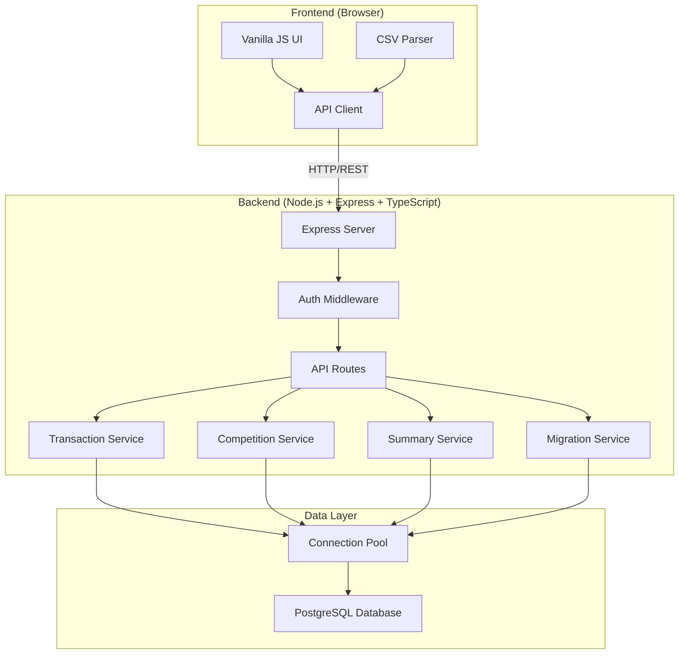

# Design Document: Server-Side Migration

## Overview

This design specifies the migration of the competition-account-management application from a client-side IndexedDB architecture to a server-side architecture with PostgreSQL database and Node.js + Express + TypeScript backend. The migration transforms a single-user browser application into a multi-user production system while preserving all existing functionality and business logic.

The architecture follows a client-server model where the frontend remains vanilla JavaScript but replaces IndexedDB calls with REST API calls. The backend handles all data persistence, business logic execution, and multi-user coordination. The core challenges are maintaining data integrity during migration, preserving existing calculation logic, supporting concurrent users, and ensuring secure authentication.

Key design decisions:
- Backend: Node.js + Express + TypeScript (consistent with golf-handicap-tracker pattern)
- Database: PostgreSQL with connection pooling
- Authentication: JWT-based session management
- API: RESTful endpoints with consistent JSON responses
- Migration: Export/import tooling for IndexedDB to PostgreSQL transition
- Frontend: Minimal changes - replace Database_Manager with API_Client
- Real-time: Optional WebSocket support for concurrent update notifications

## Architecture

### System Architecture Diagram



### Component Responsibilities

**Frontend Components:**

**API Client** (Modified)
- Replaces IndexedDB Database_Manager interface
- Sends HTTP requests to backend REST API
- Handles authentication token management
- Manages network error handling and retries
- Provides same interface as existing Database_Manager for minimal code changes

**CSV Parser** (Existing - Unchanged)
- Parses CSV files in browser
- Transforms records using existing logic
- Sends parsed data to backend via API Client

**UI Components** (Existing - Minimal Changes)
- Transaction Summary View
- Data Viewer
- Competition Management UI
- Flagging UI
- Only change: replace Database_Manager calls with API_Client calls

**Backend Components:**

**Express Server**
- HTTP server setup and configuration
- Middleware registration (CORS, body-parser, helmet, auth)
- Route registration
- Error handling middleware
- Graceful shutdown handling

**Auth Middleware**
- JWT token validation
- Session management
- User authentication
- Protected route enforcement

**Transaction Service**
- Transaction CRUD operations
- Field extraction logic (migrated from frontend)
- Chronological validation (migrated from frontend)
- Batch import handling
- Date range queries

**Competition Service**
- Competition CRUD operations
- Competition-transaction associations
- Cascade delete handling

**Summary Service**
- Weekly summary calculation (migrated from frontend)
- Period generation and grouping
- Rolling balance calculations
- Date range filtering

**Migration Service**
- IndexedDB export utilities
- PostgreSQL import utilities
- Data validation and reconciliation
- Migration status tracking

**Database Service**
- PostgreSQL connection management
- Connection pooling
- Query execution
- Transaction management
- Migration script execution


## Components and Interfaces

### Backend API Server Interface

```typescript
// server.ts - Main server setup
interface ServerConfig {
  port: number
  databaseUrl: string
  jwtSecret: string
  corsOrigins: string[]
  nodeEnv: 'development' | 'production' | 'test'
}

class APIServer {
  private app: Express
  private server: Server
  private db: DatabaseService
  
  constructor(config: ServerConfig)
  async initialize(): Promise<void>
  async start(): Promise<void>
  async shutdown(): Promise<void>
}
```

**Server Initialization:**

```typescript
async function initialize(): Promise<void> {
  // Initialize database connection
  await this.db.connect()
  await this.db.runMigrations()
  
  // Setup middleware
  this.app.use(helmet())
  this.app.use(cors({ origin: this.config.corsOrigins }))
  this.app.use(express.json({ limit: '10mb' }))
  this.app.use(express.static('public'))
  
  // Setup routes
  this.app.use('/api/auth', authRoutes)
  this.app.use('/api/transactions', authenticateJWT, transactionRoutes)
  this.app.use('/api/competitions', authenticateJWT, competitionRoutes)
  this.app.use('/api/flagged-transactions', authenticateJWT, flaggedTransactionRoutes)
  this.app.use('/api/summaries', authenticateJWT, summaryRoutes)
  this.app.use('/api/export', authenticateJWT, exportRoutes)
  this.app.use('/api/import', authenticateJWT, importRoutes)
  this.app.use('/health', healthRoutes)
  
  // Error handling middleware
  this.app.use(errorHandler)
  
  // Setup graceful shutdown
  process.on('SIGTERM', () => this.shutdown())
  process.on('SIGINT', () => this.shutdown())
}

async function shutdown(): Promise<void> {
  console.log('Shutting down gracefully...')
  
  // Stop accepting new connections
  this.server.close()
  
  // Wait for in-flight requests (max 30 seconds)
  await Promise.race([
    new Promise(resolve => this.server.on('close', resolve)),
    new Promise(resolve => setTimeout(resolve, 30000))
  ])
  
  // Close database connections
  await this.db.disconnect()
  
  console.log('Shutdown complete')
  process.exit(0)
}
```

### Database Service Interface

```typescript
// database.service.ts
interface DatabaseService {
  connect(): Promise<void>
  disconnect(): Promise<void>
  runMigrations(): Promise<void>
  getPool(): Pool
  query<T>(sql: string, params?: any[]): Promise<QueryResult<T>>
  transaction<T>(callback: (client: PoolClient) => Promise<T>): Promise<T>
}

class DatabaseService {
  private pool: Pool
  
  constructor(connectionString: string)
  async connect(): Promise<void>
  async disconnect(): Promise<void>
  async runMigrations(): Promise<void>
  getPool(): Pool
  async query<T>(sql: string, params?: any[]): Promise<QueryResult<T>>
  async transaction<T>(callback: (client: PoolClient) => Promise<T>): Promise<T>
}
```

**Database Connection:**

```typescript
async function connect(): Promise<void> {
  this.pool = new Pool({
    connectionString: this.connectionString,
    min: 2,
    max: 10,
    idleTimeoutMillis: 30000,
    connectionTimeoutMillis: 5000
  })
  
  // Test connection
  try {
    const client = await this.pool.connect()
    await client.query('SELECT NOW()')
    client.release()
    console.log('Database connected successfully')
  } catch (error) {
    console.error('Database connection failed:', error)
    throw new Error('Unable to connect to database')
  }
}

async function transaction<T>(callback: (client: PoolClient) => Promise<T>): Promise<T> {
  const client = await this.pool.connect()
  
  try {
    await client.query('BEGIN')
    const result = await callback(client)
    await client.query('COMMIT')
    return result
  } catch (error) {
    await client.query('ROLLBACK')
    throw error
  } finally {
    client.release()
  }
}
```

### Transaction Service Interface

```typescript
// transaction.service.ts
interface TransactionService {
  importTransactions(records: TransactionRecord[]): Promise<ImportResult>
  getAllTransactions(): Promise<TransactionRecord[]>
  getTransactionsByDateRange(startDate: string, endDate: string): Promise<TransactionRecord[]>
  getLatestTimestamp(): Promise<{ date: string; time: string } | null>
  deleteAllTransactions(): Promise<void>
}

interface ImportResult {
  imported: number
  errors: ImportError[]
}

interface ImportError {
  record: TransactionRecord
  message: string
}

interface TransactionRecord {
  id?: number
  date: string
  time: string
  till: string
  type: string
  member: string
  player: string
  competition: string
  price: string
  discount: string
  subtotal: string
  vat: string
  total: string
  sourceRowIndex: number
  isComplete: boolean
  createdAt?: Date
  updatedAt?: Date
}
```

**Transaction Import Logic:**

```typescript
async function importTransactions(records: TransactionRecord[]): Promise<ImportResult> {
  // Step 1: Extract fields (migrate from frontend)
  const enhancedRecords = records.map(r => extractFields(r))
  
  // Step 2: Validate chronology
  const validation = await validateChronology(enhancedRecords)
  if (!validation.valid) {
    throw new ValidationError(validation.error, 409)
  }
  
  // Step 3: Store in database (atomic transaction)
  return await this.db.transaction(async (client) => {
    const imported = 0
    const errors: ImportError[] = []
    
    for (const record of enhancedRecords) {
      try {
        await client.query(
          `INSERT INTO transactions 
           (date, time, till, type, member, player, competition, price, discount, 
            subtotal, vat, total, source_row_index, is_complete)
           VALUES ($1, $2, $3, $4, $5, $6, $7, $8, $9, $10, $11, $12, $13, $14)`,
          [record.date, record.time, record.till, record.type, record.member,
           record.player, record.competition, record.price, record.discount,
           record.subtotal, record.vat, record.total, record.sourceRowIndex, record.isComplete]
        )
        imported++
      } catch (error) {
        errors.push({ record, message: error.message })
      }
    }
    
    return { imported, errors }
  })
}

function extractFields(record: TransactionRecord): TransactionRecord {
  const memberValue = record.member
  const hasAmpersand = memberValue.includes(' &')
  const hasColon = memberValue.includes(':')
  
  if (hasAmpersand && hasColon) {
    const ampersandPos = memberValue.indexOf(' &')
    const colonPos = memberValue.indexOf(':')
    
    const player = ampersandPos >= 0 
      ? memberValue.substring(0, ampersandPos).trim() 
      : ''
    
    const competition = ampersandPos >= 0 && colonPos > ampersandPos
      ? memberValue.substring(ampersandPos + 2, colonPos).trim()
      : ''
    
    return { ...record, member: '', player, competition }
  } else {
    return { ...record, player: '', competition: '' }
  }
}

async function validateChronology(records: TransactionRecord[]): Promise<ValidationResult> {
  if (records.length === 0) {
    return { valid: true }
  }
  
  // Find earliest in new batch
  const earliestNew = findEarliestTimestamp(records)
  
  // Query database for latest existing
  const latestExisting = await this.getLatestTimestamp()
  
  if (!latestExisting) {
    return { valid: true }  // Empty database
  }
  
  const earliestNewTs = parseDateTime(earliestNew.date, earliestNew.time)
  const latestExistingTs = parseDateTime(latestExisting.date, latestExisting.time)
  
  if (earliestNewTs < latestExistingTs) {
    return {
      valid: false,
      error: `Import rejected: New data contains transactions from ${earliestNew.date} ${earliestNew.time} which is before the latest existing transaction at ${latestExisting.date} ${latestExisting.time}`,
      earliestNew,
      latestExisting
    }
  }
  
  return { valid: true }
}
```

### Competition Service Interface

```typescript
// competition.service.ts
interface CompetitionService {
  createCompetition(competition: CreateCompetitionDTO): Promise<Competition>
  getAllCompetitions(): Promise<Competition[]>
  getCompetitionById(id: number): Promise<Competition | null>
  updateCompetition(id: number, updates: UpdateCompetitionDTO): Promise<Competition>
  deleteCompetition(id: number): Promise<void>
}

interface Competition {
  id: number
  name: string
  date: string
  description: string
  prizeStructure: string
  createdAt: Date
  updatedAt: Date
}

interface CreateCompetitionDTO {
  name: string
  date: string
  description?: string
  prizeStructure?: string
}

interface UpdateCompetitionDTO {
  name?: string
  date?: string
  description?: string
  prizeStructure?: string
}
```

**Competition Operations:**

```typescript
async function createCompetition(dto: CreateCompetitionDTO): Promise<Competition> {
  const result = await this.db.query(
    `INSERT INTO competitions (name, date, description, prize_structure)
     VALUES ($1, $2, $3, $4)
     RETURNING *`,
    [dto.name, dto.date, dto.description || '', dto.prizeStructure || '']
  )
  return result.rows[0]
}

async function deleteCompetition(id: number): Promise<void> {
  await this.db.transaction(async (client) => {
    // Delete flagged transaction associations first
    await client.query(
      'DELETE FROM flagged_transactions WHERE competition_id = $1',
      [id]
    )
    
    // Delete competition
    await client.query(
      'DELETE FROM competitions WHERE id = $1',
      [id]
    )
  })
}
```

### Summary Service Interface

```typescript
// summary.service.ts
interface SummaryService {
  calculateWeeklySummaries(startDate?: string, endDate?: string): Promise<WeeklySummary[]>
}

interface WeeklySummary {
  fromDate: string
  toDate: string
  startingPurse: number
  purseApplicationTopUp: number
  purseTillTopUp: number
  competitionEntries: number
  competitionRefunds: number
  finalPurse: number
  startingPot: number
  winningsPaid: number
  competitionCosts: number
  finalPot: number
}
```

